# Nazwa modułu
Moduł administracyjny

## Projektanci: 
```
Maciej Walczak 251655
Mikita Karabeika 252496
```
# Dokumentacja techniczna

## Opis funkcjonalny

### Opis przeznaczenia modułu
Moduł administracyjny ma za zadanie zarządzać działaniem programu oraz urządzeń podczas użytkowania.

### Opis możliwości funkcjonalnych modułu
Co realizuje dany moduł, wypunktowanie przypadków użycia wraz z opisami, trzeba podzielić fragmentami co może robić dany aktor

## Aktor - Użytkownik niezalogowany

- logowanie użytkowników w systemie.

Użytkownik niezalogowany może zalogować się do systemu przy użyciu login oraz hasła. Po poprawnym uwierzytelnieniu uzyskuje dostęp do funkcjonalności zgodnych z przypisaną rolą. 

- Odzyskiwanie/Zmiana hasła poprzez wysłanie linku do zresetowania hasła poprzez pocztę elektroniczną.

Użytkownik niezalogowany może skorzystać z funkcji odzyskiwania hasła. System wysyła na podany adres e-mail link umożliwiający zresetowanie hasła.

- rejestracja mieszkańca w systemie

Tylko mieszkaniec może samodzielnie stworzyć konto w systemie, które musi być aktywowany przez adminstratora, żeby mieszkaniec mógł się uwierzytelnić.


## Aktor - Administrator

- Zarządzanie kontami użytkowników.

Administrator może:
- tworzyć konta użytkowników (mieszkańców, administratorów, inżynierów),
- edytować konta użytkowników (zmienić hasło oraz informacje o użytkowniku).
- usuwać konta użytkowników,
- aktywować i dezaktywować konta.

- Nadawanie uprawnień do korzystania z urządzeń (przez administratora).

Administrator zatwierdza dodanie lub usunięcie urządzenia przez Mieszkańca.

### Opis możliwości niefunkcjonalnych modułu

- Dane użytkowników będą szyfrowane korzystając z biblioteki BcryptPasswordEncoder.

- Wymóg silnych haseł (minimum 8 znaków, kombinacja małych i wielkich liter, cyfr oraz znaków specjalnych).

- Sesje użytkowników będą wygasać po 15 minutach nieaktywności.

- System informuje użytkownika o błędach logowania w sposób zrozumiały, nie ujawniając szczegółów bezpieczeństwa.

# Diagramy przypadków użycia


## Przypadki użycia dla użytkownika niezalogowanego


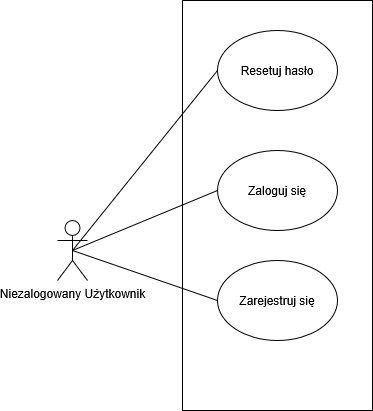

Diagram 1.

Opis diagramu

Diagram przypadków użycia przedstawia system logowania do aplikacji. Aktorem jest Użytkownik niezalogowany, który może zalogować się do systemu, zarejestrować się (tylko jako mieszkaniec) oraz zresetować swoje hasło. Diagram pokazuje sposób, w jaki użytkownik uwierzytelnia się do systemu.

## Przypdaki użycia dla Mieszkańca, Inżyniera oraz Administratora

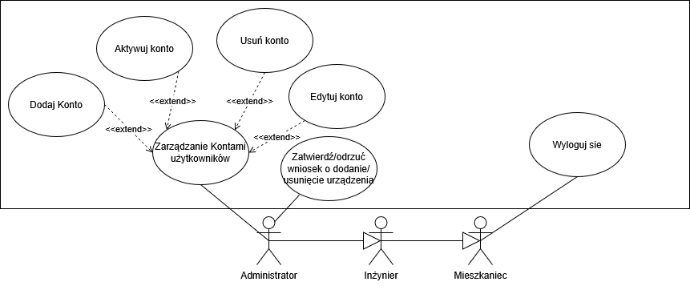

Diagram 2.

Opis diagramu 

Diagram przypadków użycia przedstawia system zarządzania uprawnieniami oraz użytkownikami w aplikacji. Aktorami są Mieszkaniec, Inżynier oraz Administrator, którzy mogą się wylogować, tylko Administrator może dodać, usunąć, aktywować, edytować konta użytkowników. Administrator również może zatwierdzać dodanie lub usuniecie urządzenia systemu przez Mieszkańca. Digram pokazuje, w jaki sposób Administrator zarządza systemem.


# Diagramy klas

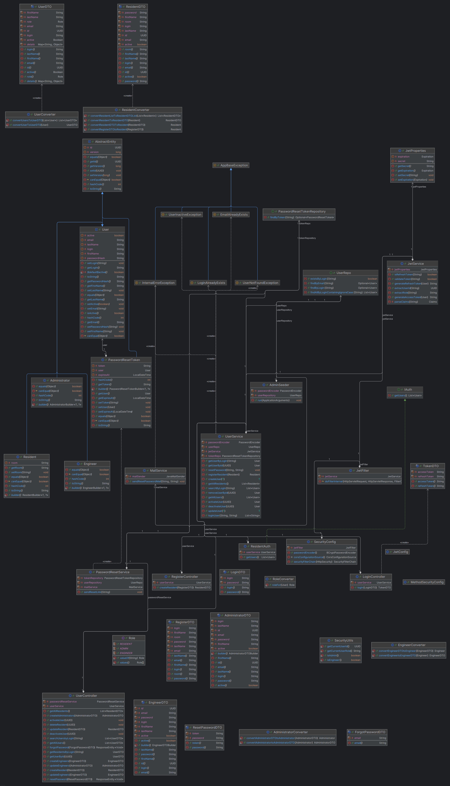

Diagram 3.

Diagram klas przedstawia aplikacje REST, która umożliwia, resetowanie hasła, poprzez wysłanie linku na poczte, tworzenie, usuwanie, edycje użytkowników o różnym dostępie do systemu, tworzenie Tokena JWT oraz filtrowanie wg. niego dostępu do poszczególnych metod, hashowanie haseł, logowanie oraz rejestracje do aplikacji. 

# Diagramy interakcji


## Scenariusz 1

[do wypełnienia szablon scenariusza]

| Pole                                | Treść                                                                                                                                                                                                                                                                                                                               |
|:------------------------------------|:------------------------------------------------------------------------------------------------------------------------------------------------------------------------------------------------------------------------------------------------------------------------------------------------------------------------------------|
| **Nazwa:**                          | Logowanie użytkownika do systemu                                                                                                                                                                                                                                                                                                    |
| **Numer:**                          | 1                                                                                                                                                                                                                                                                                                                                   |
| **Twórca:**                         | Mikita Karabeika 252496, Maciej Walczak 251655 - projektanci                                                                                                                                                                                                                                                                        |
| **Poziom ważności:**                | Wysoki                                                                                                                                                                                                                                                                                                                              |
| **Typ przypadku użycia:**           | Szczegółowy niezbędny                                                                                                                                                                                                                                                                                                               |
| **Aktorzy:**                        | Użytkownik niezalogowany                                                                                                                                                                                                                                                                                                            |
| **Krótki opis:**                    | Użytkownik loguje się do systemu za pomocą loginu lub e-maila i hasła, a system weryfikuje dane.                                                                                                                                                                                                                                    |
| **Warunki wstępne:**                | 1. Konto użytkownika istnieje w systemie.<br/>2. Konto użytkownika jest aktywne.                                                                                                                                                                                                                                                      |
| **Warunki końcowe:**                | Użytkownik zostaje zalogowany i może korzystać z systemu zgodnie ze swoimi uprawnieniami, lub logowanie nie powiodło się i użytkownik otrzymuje odpowiedni komunikat                                                                                                                                                                |
| **Główny przepływ zdarzeń:**        | 1. Użytkownik wprowadza login/e-mail i hasło.<br> 2. System weryfikuje poprawność danych. <br>3.Jeśli dane są poprawne, generuje unikalne ID sesji. <br> 4. System zapisuje informacje o logowaniu (czas, ID sesji, adres IP).<br> 5. Użytkownik uzyskuje dostęp do swojego pulpitu i modułów systemu, do których ma uprawnienia. |
| **Alternatywne przepływy zdarzeń:** | 1. Jeśli login/e-mail lub hasło są niepoprawne, system wyświetla komunikat o błędzie i zapisuje próbę logowania. <br> 2. Jeśli konto jest dezaktywowane, system blokuje logowanie i wyświetla odpowiedni komunikat.                                                                                                                 |
| **Specjalne wymagania:**            | Hasła muszą być bezpiecznie przechowywane w postaci hash-u. <br> Sesja musi mieć limit czasu bezczynności (20 min). <br> System musi logować wszystkie próby logowania i generować ID sesji                                                                                                                                         |
| **Notatki i kwestie:**              | Scenariusz 1 odpowiada diagramowi sekwencji 1.                                                                                                                                                                                                                                                                                      |

## Diagram interakcji 1

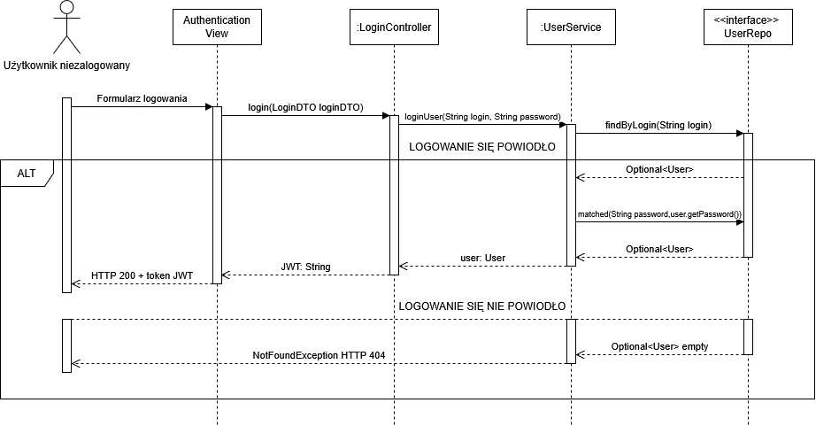

Diagram 4.

Diagram przedstawia przebieg procesu logowania użytkownika. Pokazuje komunikację pomiędzy widokiem uwierzytelniania, kontrolerem logowania, serwisem użytkownika oraz repozytorium. Diagram uwzględnia również alternatywny przebieg w przypadku błędnych danych logowania.

## Scenariusz 2

| Pole | Treść                                                                                                                                                                                                                    |
| :--- |:-------------------------------------------------------------------------------------------------------------------------------------------------------------------------------------------------------------------------|
| **Nazwa:** | Dodanie konta inżyniera                                                                                                                                                                                                  |
| **Numer:** | 2                                                                                                                                                                                                                        |
| **Twórca:** | Mikita Karabeika 252496, Maciej Walczak 251655 - projektanci                                                                                                                                                             |
| **Poziom ważności:** | Wysoki                                                                                                                                                                                                                   |
| **Typ przypadku użycia:** | Szczegółowy niezbędny                                                                                                                                                                                                    |
| **Aktorzy:** | Administrator, Inżynier                                                                                                                                                                                                  |
| **Krótki opis:** | Administrator próbuje dodać konto inżyniera, a system weryfikuje wszystkie warunki przed dokonaniem dodania.                                                                                                             |
| **Warunki wstępne:** | 1. Administrator jest zalogowany do systemu. <br> 2. login konta inżyniera jest unikalny w systemie.                                                                                                                     |
| **Warunki końcowe:** | Konto inżyniera jest dodane do systemu, lub operacja jest zablokowana z powodu niespełnienia warunków.                                                                                                                   |
| **Główny przepływ zdarzeń:** | 1. Administrator wypełnia formularz dodania inżyniera. <br> 2. System sprawdza, czy login inżyniera jest unikalny i czy wszystkie pola w formularzu są wypełnione. <br> 3. System dodaje konto inżyniera do bazy danych. |
| **Alternatywne przepływy zdarzeń:** | System blokuje operację, jeżeli login przypisany do konta inżyniera jest nieunikalny.                                                                                                                                    |
| **Specjalne wymagania:** | Operacja powinna być atomowa — w przypadku błędu żadne częściowe dane nie powinny pozostać.                                                                                                                              |
| **Notatki i kwestie:** | Scenariusz 2 odpowiada diagramowi sekwencji 2                                                                                                                                                                            |

## Diagram interakcji 2

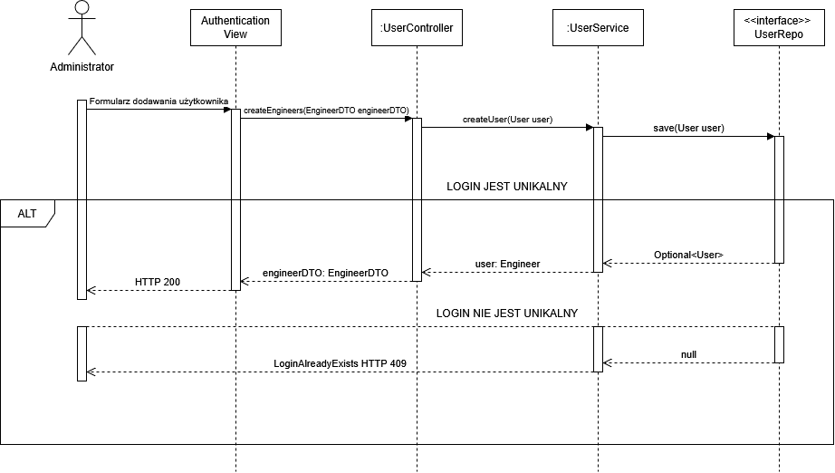

Diagram 5.

Diagram obrazuje proces obsługi operacji użytkownika po poprawnym uwierzytelnieniu. Przedstawia wymianę komunikatów pomiędzy warstwą interfejsu, kontrolerem oraz logiką biznesową. Diagram uwzględnia warianty alternatywne w zależności od wyniku operacji.

# Diagram czynności - Rejestracja 

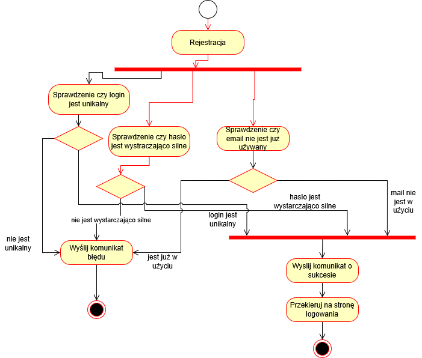

Diagram 6.

Diagram przedstawia proces rejestracji użytkownika w systemie. Obejmuje on weryfikację unikalności loginu i adresu e-mail oraz sprawdzenie poprawności hasła. Po spełnieniu wszystkich warunków konto zostaje utworzone.

# Diagram maszyny stanowej

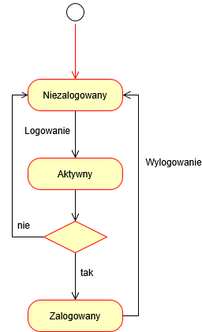

Diagram 7.

Diagram pokazuje stany użytkownika oraz przejścia pomiędzy nimi. Użytkownik może znajdować się w stanie niezalogowanym lub zalogowanym. Przejścia zależą od wykonania operacji logowania lub wylogowania.

# Diagram komponentów

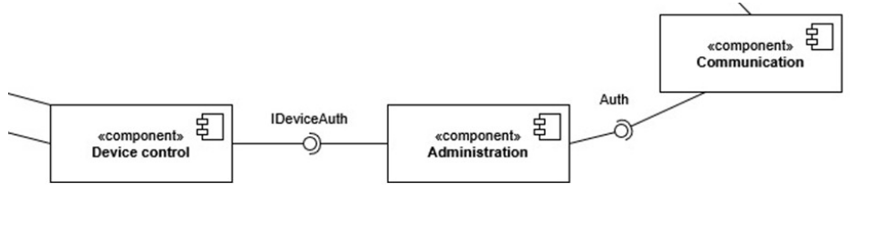

Diagram 8.

Diagram prezentuje podział systemu na główne komponenty oraz ich zależności. Komponent administracyjny zarządza autoryzacją i komunikacją między pozostałymi elementami. Struktura umożliwia modularną budowę systemu.

# Diagram pakietów

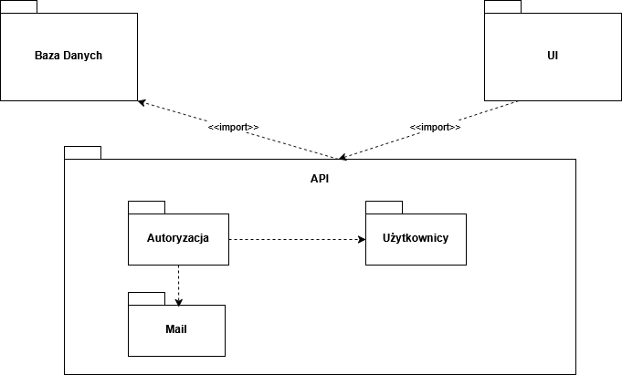

Diagram 9.

Diagram pakietów obrazuje logiczny podział systemu na pakiety funkcjonalne. Każdy pakiet grupuje elementy o podobnym przeznaczeniu.

# Diagram przeglądu interakcji

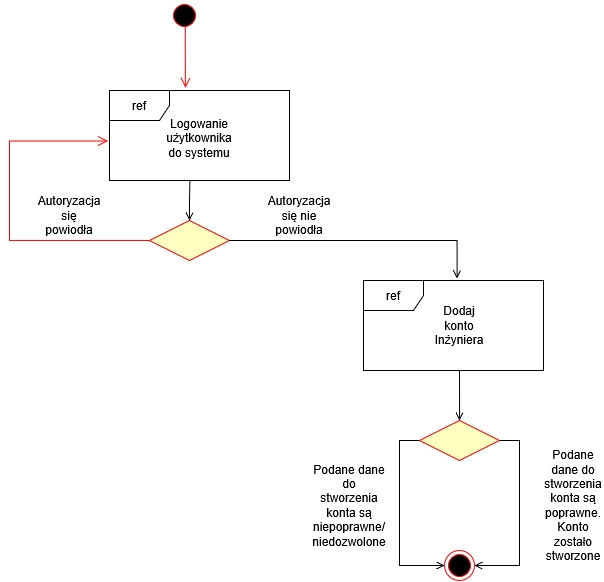

Diagram 10.

Diagram przedstawia ogólny przebieg interakcji użytkownika z systemem. Pokazuje główne decyzje oraz alternatywne ścieżki procesu.

# Diagram strukturalny - Dodanie konta inżyniera

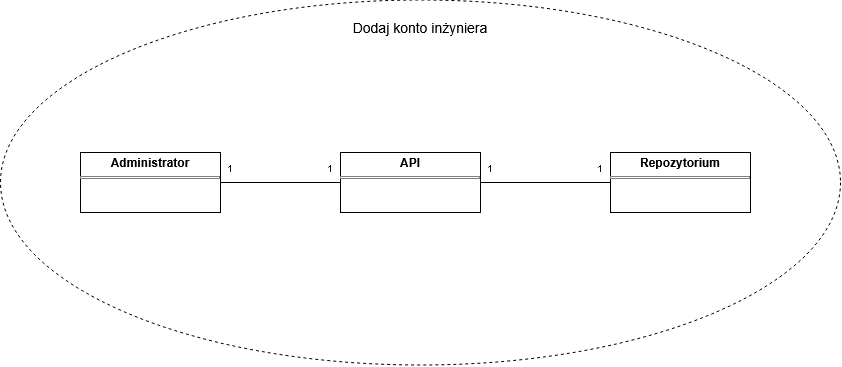

Diagram 11.

Diagram obrazuje strukturę elementów biorących udział w procesie dodania konta inżyniera. Przedstawia zależności pomiędzy administratorem, API oraz repozytorium.

# Diagram harmonogramowania - Dodanie konta inżyniera

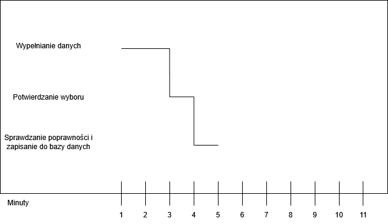

Diagram 12.

Diagram pokazuje kolejność wykonywania działań w czasie podczas dodawania konta inżyniera. Obejmuje etapy wprowadzania danych, walidacji oraz zapisu do bazy danych.

# Dokumentacja użytkownika

## Przypadek użycia 1 - Zaloguj się

Po otwarciu strony wciśnij przycisk "Zaloguj się", w celu wyświetlenia formularza logowania.

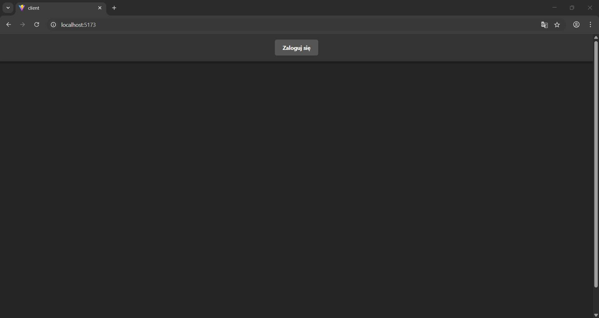

Zrzut ekranu 1.

Następnie wypełniamy formularz (Wszystkie pola musza być wypełnione) i klikamy niebieski przycisk "Zaloguj się".

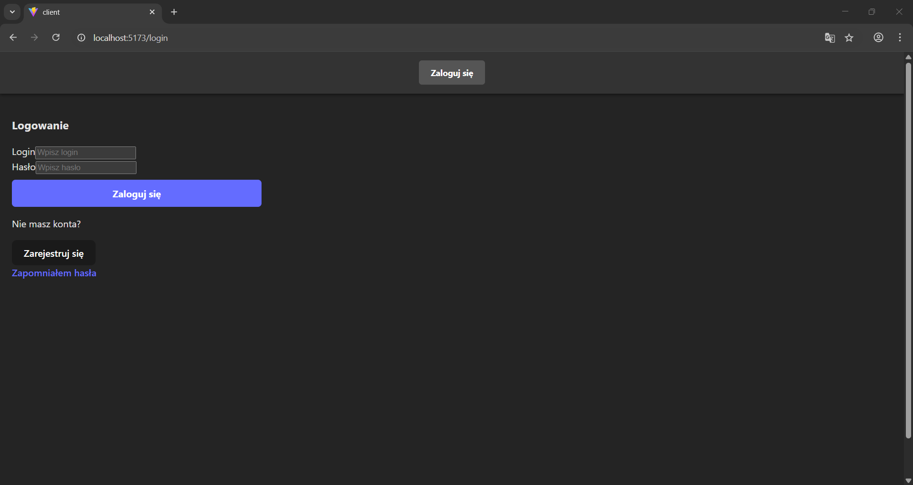

Zrzut ekranu 2.

Jeśli dane podane w formularzu logowania zgadzają się, to aplikacja przekieruje na strone główną użytkownika.

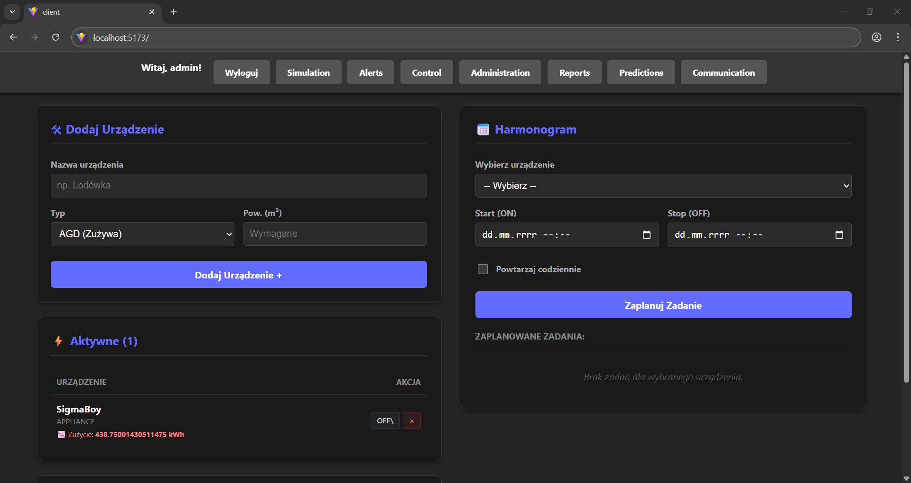

Zrzut ekranu 3.


## Przypadek użycia 2 - Resetuj hasło

Po otwarciu strony wciśnij przycisk "Zaloguj się", w celu wyświetlenia formularza logowania, na którym będzie można też zresetować hasło.


Zrzut ekranu 4.

Wciskamy link "zapomniałem hasła", w celu wyświetlenia formularzu resetowania hasła. 


Zrzut ekranu 5.

Podajemy e-mail naszego konta użytkownika (podanego podczas rejestracji), jeśli konto z takim adresem email istnieje to, na pocztę elektroniczną zostanie przesłany link do resetowania hasła.

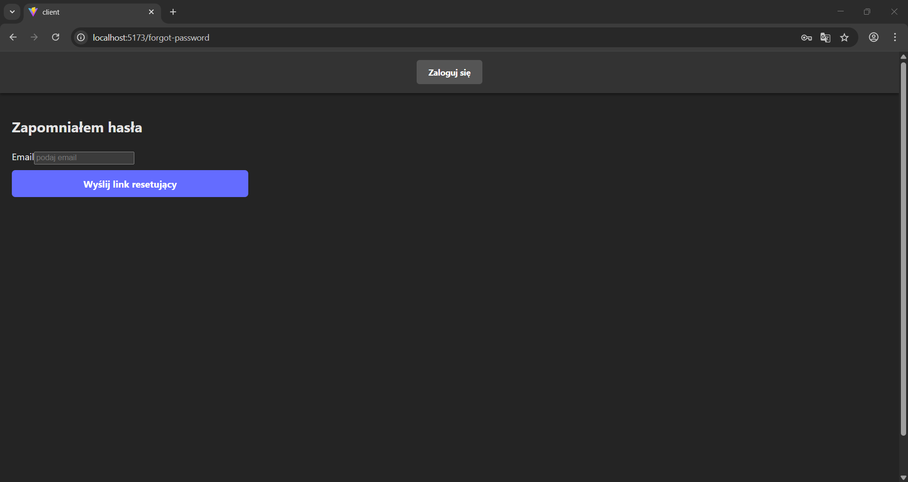

Zrzut ekranu 6.

Wiadomość na poczcie elektronicznej będzie wyglądać w następujący sposób.

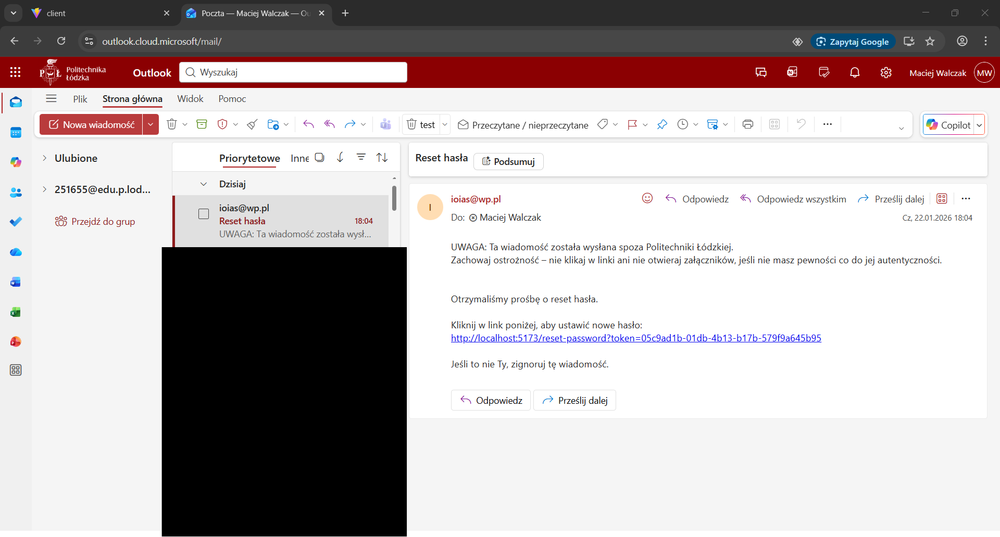

Zrzut ekranu 7.

Po wciśnięciu linku z treści emailu (spójrz Zrzut ekranu 7), przekieruje nas na strone z formularzem resetowania hasła.

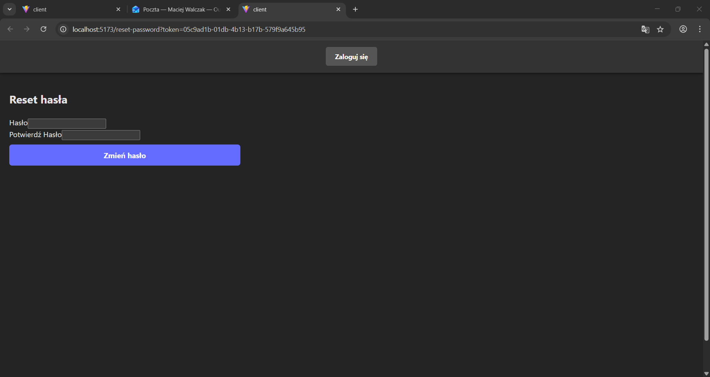

Zrzut ekranu 8.

Udane resetowanie hasła będzie potwierdzone komunikatem (spójrz Zrzut ekranu 9).

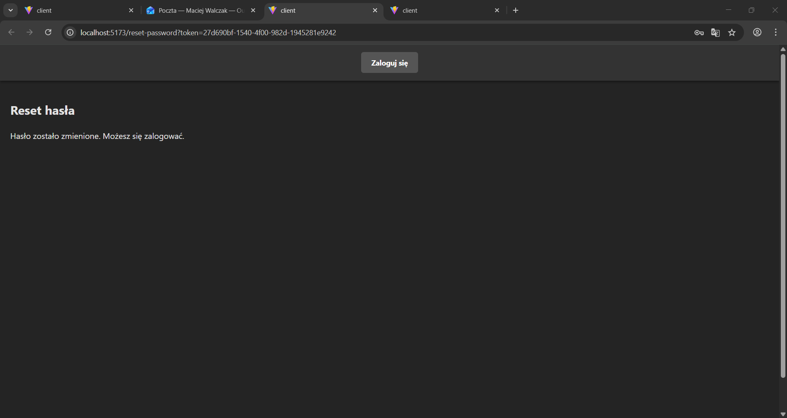

Zrzut ekranu 9.

## Przypadek użycia 3 - Dodaj konto

Po otwarciu strony wciśnij przycisk "Zaloguj się", w celu wyświetlenia formularza logowania.


Zrzut ekranu 10.

Następnie wypełniamy formularz (danymi konta z uprawnieniami Administratora) i klikamy niebieski przycisk "Zaloguj się".


Zrzut ekranu 11.

Z głównego widoku przechodzimy do panelu administratora poprzez wciśnięcie przycisku "Administration".


Zrzut ekranu 12.

W panelu administratora przechodzimy do formularza tworzenia konta poprzez wciśnięcie przycisku "Stwórz użytkownika".

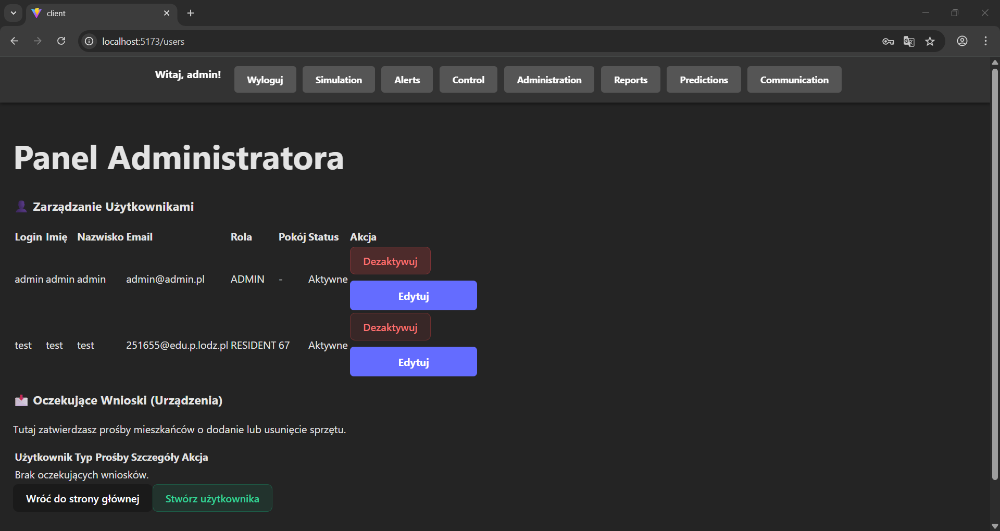

Po wypełnieniu każdego pola oraz wybraniu uprawnień nowego konta wciskamy przycisk "Utwórz użytkownika".

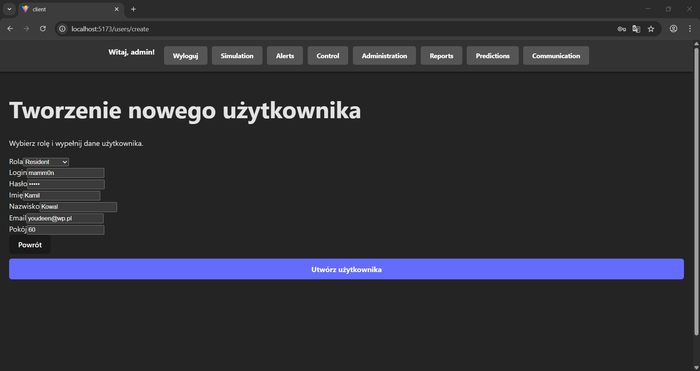

Zrzut ekranu 13.

Jeśli utworzenie konta powiodło się, wyświetli się odpowiedni komunikat.

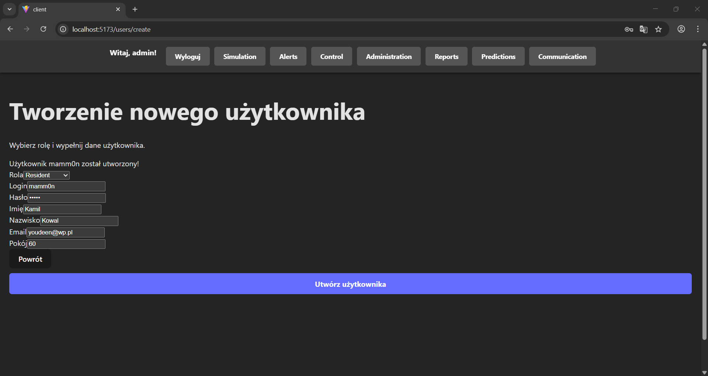

Zrzut ekranu 14.

Można jeszcze potwierdzić stworzenie konta poprzez wyświetlenie listy użytkowników, poprzez powrót do panelu administratora, aby powrócić do panelu, można wcisnąć przycisk "Powrót" (Spójrz Zrzut ekranu 13).

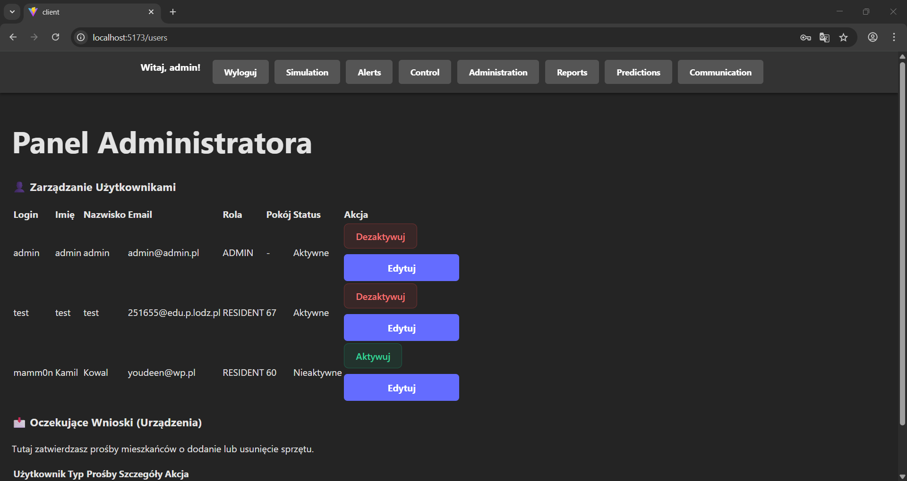

Zrzut ekranu 15.

## Obsługa błędów, sytuacji wyjątkowych

Dostęp do funkcji systemu został zabezpieczony poprzez użycie tokena JWT, który realizuje podział na różne poziomy dostępu do aplikacji oraz zabezpiecza punkty końcowe warstwy logiki naszej aplikacji. Hasła w bazie danych są haszowane przez co, wyciek danych nie umożliwia logowania na konta systemu. Hasła podawane podczas rejestracji podlegają walidacji, hasło nie może być krótsze niż 8 znaków i musi się składać z przynajmniej jednej małej, jednej dużej litery oraz z jednego znaku specjalnego. Login nie może mieć mniej niż 8 znaków oraz musi być unikalny również, Email musi być unikalny.  

## Podsumowanie

Opracowany moduł zapewnia funkcjonalności rejestracji, logowania oraz resetowania hasła użytkowników. Administrator posiada możliwość pełnego zarządzania użytkownikami (CRUD), ich aktywacji oraz dezaktywacji. Moduł umożliwia również obsługę i potwierdzanie zgłoszeń użytkowników dotyczących dodania urządzeń. Zarządzanie odbywa się poprzez interfejs administracyjny oraz udostępnione punkty końcowe warstwy logiki. Moduł został zaprojektowany w sposób umożliwiający łatwą rozbudowę i integrację z innymi częściami systemu.

