# Moduł Alarmowania i Alertów

## Projektanci: 
```
Mateusz Chodulski 252929
Karol Dawid 252931
```
# Dokumentacja techniczna

## Opis funkcjonalny

### Opis przeznaczenia modułu
Moduł Alarmowania i Alertów odbiera dane od użytkownika (SOS alert), modułu Symulacji oraz modułu Analizy Danych, pozwala administratorowi zarządzać regułami oraz sprawdzać dziennik zdarzeń. Moduł sprawdza, czy doszło do naruszenia reguł i w odpowiednich przypadkach wystawia stosowny Alert. 

### Opis możliwości funkcjonalnych modułu

* Moduł cyklicznie pobiera i przetwarza dane z Modułu Analizy Danych w celu wykrywania anomalii.
* Moduł cyklicznie pobiera dane z Modułu Prognozowania w celu weryfikacji przyszłych zagrożeń.
* System automatycznie zapisuje historię wszystkich wykrytych alertów w Dzienniku zdarzeń.
* System powiadamia asynchronicznie zarejestrowanych subskrybentów o wystąpieniu nowego alertu.
* Użytkownik ma możliwość manualnego wysłania zgłoszenia SOS wraz z lokalizacją i treścią wiadomości.
* Administrator może definiować nowe reguły alertowe, określając metrykę, operator, wartość graniczną i poziom alertu.
* Administrator i Inżynier ma możliwość przeglądania pełnego dziennika zdarzeń.
* Administrator i Inżynier może usuwać nieaktualne reguły z systemu i tworzyć nowe w czasie rzeczywistym.


### Opis możliwości niefunkcjonalnych modułu
* Moduł wykorzystuje wewnętrzny Silnik Reguł do analizy danych, oddzielony od warstwy pobierania danych.
* Każda reguła definiuje metrykę, operator logiczny, wartość progową oraz poziom alertu (INFO, WARNING, CRITICAL, SOS).
* Po wykryciu naruszenia reguły, moduł generuje ustandaryzowany obiekt Alert zawierający znacznik czasowy, źródło i poziom zagrożenia.
* Komunikacja wewnętrzna realizowana jest na podstawie wzorca projektowy Obserwator (Wydawca-Subskrybent).
* Moduł wystawia publiczny interfejs `IAlertObserver` umożliwiający łatwe rozszerzanie systemu o nowych słuchaczy zdarzeń.
* Proces powiadamiania subskrybentów (notify) jest wykonywany asynchronicznie (`CompletableFuture`), aby nie blokować głównego wątku przetwarzania danych.
* Mechanizm publikacji jest odporny na błędy – wyjątek w jednym z subskrybentów nie przerywa procesu powiadamiania pozostałych.
* Konfiguracja reguł jest przechowywana w bazie danych, co pozwala na ich modyfikację bez konieczności ponownej kompilacji lub restartu aplikacji.
* Endpoint `reportSOS` waliduje kompletność danych wejściowych przed ich przetworzeniem.

# Diagramy przypadków użycia
## Przypadek użycia dla Mieszkańca

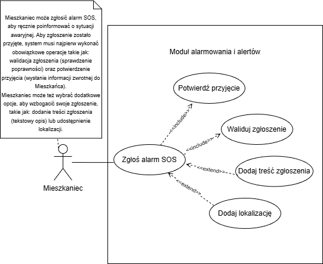
Diagram 1. Przypadki użycia dla aktora Mieszkaniec

Diagram przypadków użycia przedstawia funkcjonalność Modułu Alarmowania skierowaną do użytkownika końcowego. Aktorem jest Mieszkaniec, który może zainicjować proces poprzez zgłoszenie alarmu SOS. System automatycznie realizuje niezbędne operacje walidacji zgłoszenia oraz wysyłki potwierdzenia przyjęcia, co oznaczono relacją "include". Diagram uwzględnia również opcjonalne rozszerzenia ("extend"), pozwalające Mieszkańcowi na wzbogacenie alertu o dodatkową treść tekstową oraz precyzyjną lokalizację zdarzenia.


## Przypadek użycia dla Inżyniera

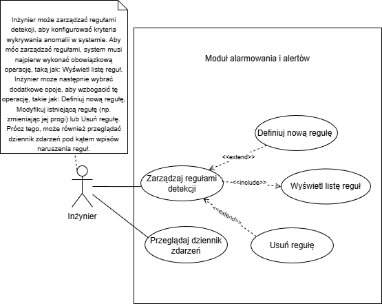
Diagram 2. Przypadki użycia dla aktora Inżynier

Diagram przypadków użycia prezentuje możliwości konfiguracji i monitoringu systemu, dostępne dla aktora Inżynier. Aktor ten posiada uprawnienia do zarządzania regułami detekcji. Inżynier może opcjonalnie rozszerzyć swoje działanie o zdefiniowanie nowej reguły lub usunięcie istniejącej, co oznaczono relacjami "extend". Ponadto diagram uwzględnia przypadek użycia polegający na przeglądaniu dziennika zdarzeń w celu weryfikacji historii wygenerowanych alertów.


## Przypadek użycia dla Administratora


Diagram 3. Przypadki użycia dla aktora Administrator

Opis diagramu
Diagram przypadków użycia prezentuje możliwości konfiguracji i monitoringu systemu, dostępne dla aktora Administrator. Aktor ten posiada uprawnienia do zarządzania regułami detekcji. Administrator może opcjonalnie rozszerzyć swoje działanie o zdefiniowanie nowej reguły lub usunięcie istniejącej, co oznaczono relacjami "extend". Ponadto diagram uwzględnia przypadek użycia polegający na przeglądaniu dziennika zdarzeń w celu weryfikacji historii wygenerowanych alertów.


# Diagramy klas
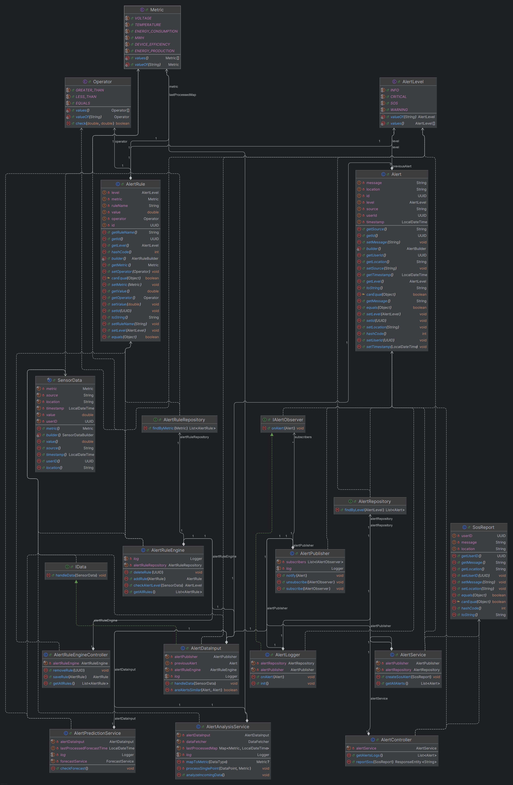
Diagram 4.

Diagram klas Modułu Alarmowania i Alertów przedstawia wszystkie klasy znajdujące się w warstwie logiki biznesowej. Moduł odbiera dane od Użytkownika (`SosReport`), Modułu Analizy Danych (`AlertAnalysisService`) oraz Modułu Prognozowania danych (`AlertPredictionService`). Przekazuje zebrane dane do silnika reguł, jeżeli silnik reguł wykryje naruszenie zasad, to wtedy dane o naruszeniu reguł są przekazywane do kolejnych klas widocznych na diagramie, które konstruują alert i wysyłają go do wszystkich subskrybentów. 

-------

# Diagramy interakcji

## Scenariusz 1


| Pole | Treść                                                                                                                                                                                                                                                                                                                                                                                                                                                                                                                                                                                                                                                                                                                                                     |
| :--- |:----------------------------------------------------------------------------------------------------------------------------------------------------------------------------------------------------------------------------------------------------------------------------------------------------------------------------------------------------------------------------------------------------------------------------------------------------------------------------------------------------------------------------------------------------------------------------------------------------------------------------------------------------------------------------------------------------------------------------------------------------------|
| **Nazwa:** | Zgłoś alarm SOS                                                                                                                                                                                                                                                                                                                                                                                                                                                                                                                                                                                                                                                                                                                                           |
| **Numer:** | 1                                                                                                                                                                                                                                                                                                                                                                                                                                                                                                                                                                                                                                                                                                                                                         |
| **Twórca:** | Karol Dawid 252931, Mateusz Chodulski 252929 - projektanci                                                                                                                                                                                                                                                                                                                                                                                                                                                                                                                                                                                                                                                                                                |
| **Poziom ważności:** | Wysoki                                                                                                                                                                                                                                                                                                                                                                                                                                                                                                                                                                                                                                                                                                                                                    |
| **Typ przypadku użycia:** | Szczegółowy, Niezbędny                                                                                                                                                                                                                                                                                                                                                                                                                                                                                                                                                                                                                                                                                                                                    |
| **Aktorzy:** | Mieszkaniec                                                                                                                                                                                                                                                                                                                                                                                                                                                                                                                                                                                                                                                                                                                                               |
| **Krótki opis:** | Mieszkaniec wysyła zgłoszenie awaryjne. System waliduje dane, natychmiast potwierdza przyjęcie zgłoszenia użytkownikowi, a następnie asynchronicznie przetwarza alert i zapisuje go w bazie danych.                                                                                                                                                                                                                                                                                                                                                                                                                                                                                                                                                       |
| **Warunki wstępne:** | 1. Mieszkaniec jest uwierzytelniony (posiada userID). <br/>2. System (API) jest dostępny.                                                                                                                                                                                                                                                                                                                                                                                                                                                                                                                                                                                                                                                                 |
| **Warunki końcowe:** | 1. Mieszkaniec otrzymał potwierdzenie HTTP 200 OK.<br/>2. Obiekt Alert został przekazany do asynchronicznego przetwarzania.<br/>3. AlertLogger zapisał trwale alert w AlertRepository.<br/>                                                                                                                                                                                                                                                                                                                                                                                                                                                                                                                                                               |
| **Główny przepływ zdarzeń:** | 1. Mieszkaniec: Wysyła żądanie POST /api/alerts/sos z obiektem SosReport (zawierającym userID, opcjonalnie treść i lokalizację). <br/> 2. AlertController: Waliduje poprawność danych zgłoszenia (sprawdza czy userID nie jest pusty).<br/> 3. AlertService: Tworzy obiekt Alert o poziomie SOS na podstawie przesłanych danych.<br/> 4. AlertPublisher: Zleca asynchroniczne powiadomienie obserwatorów (metoda notify uruchamia zadania w tle).<br/> 5. AlertController: Natychmiast zwraca do Mieszkańca odpowiedź 200 OK z komunikatem "Zgłoszenie zostało poprawnie przyjęte" (nie czekając na zapis w bazie).<br/> 6. AlertLogger (w tle): Odbiera powiadomienie asynchronicznie i wywołuje AlertRepository w celu zapisania alertu w bazie danych. |
| **Alternatywne przepływy zdarzeń:** | 2a. Walidacja zgłoszenia nie powiodła się:  <br/> 2b. W kroku 2c. AlertController wykrywa brak userID lub błędne dane.  <br/> 2d. System zwraca odpowiedź 400 Bad Request z komunikatem błędu.<br/> 2e. Przypadek użycia kończy się, alert nie jest tworzony ani zapisywany.<br/> 1a. Wzbogacenie zgłoszenia (Dane opcjonalne): <br/>1b. Przed krokiem 1. Mieszkaniec może dodać tekstowy opis (message) lub lokalizację (location) do obiektu SosReport. Te dane są przekazywane w żądaniu i zapisywane w kroku 3 w obiekcie Alert.                                                                                                                                                                                                                |
| **Specjalne wymagania:** | 1. Odpowiedź dla użytkownika (krok 5) musi nastąpić natychmiast, niezależnie od obciążenia bazy danych (dzięki asynchroniczności). <br/>  2. Mechanizm asynchroniczny (CompletableFuture) musi gwarantować uruchomienie logowania w oddzielnym wątku.                                                                                                                                                                                                                                                                                                                                                                                                                                                                                                          |
| **Notatki i kwestie:** | Scenariusz odpowiada zaktualizowanemu diagramowi sekwencji uwzględniającemu architekturę warstwową (Controller -> Service -> Repository) oraz asynchroniczne logowanie zdarzeń.                                                                                                                                                                                                                                                                                                                                                                                                                                                                                                                                                                           |

## Diagram interakcji 1

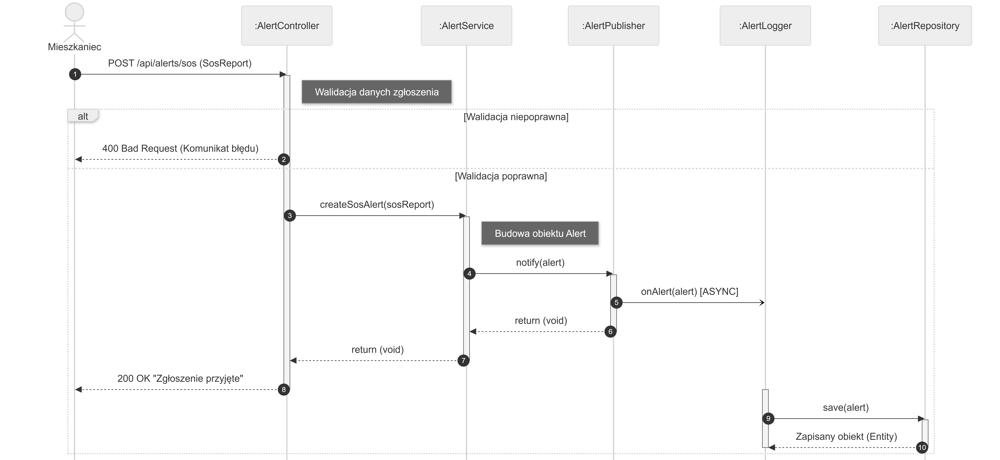
Diagram 5. Diagram interakcji dla Mieszkańca dla przypadku użycia "Zgłoś SOS"

Proces inicjowany jest przez aktora (Mieszkańca) poprzez wysłanie żądania HTTP POST do kontrolera REST (AlertController).

Kluczowe elementy przepływu sterowania:
1. Zastosowano blok alternatywny (alt), aby obsłużyć scenariusz niepoprawnych danych wejściowych. W przypadku błędu walidacji kontroler natychmiast przerywa przetwarzanie i zwraca kod 400 Bad Request.

2. Po pomyślnej weryfikacji, żądanie trafia do AlertService, gdzie następuje utworzenie obiektu biznesowego alertu.

3. Diagram eksponuje mechanizm asynchroniczności (oznaczony adnotacją [ASYNC] i strzałką otwartą). Komponent AlertPublisher zleca logowanie alertu (onAlert) do osobnego wątku, co pozwala na natychmiastowe zwrócenie odpowiedzi 200 OK do użytkownika, bez konieczności oczekiwania na operację zapisu w bazie danych.

4. Operacja zapisu do bazy danych (AlertRepository.save) realizowana jest w tle przez komponent AlertLogger, co zwiększa responsywność systemu w sytuacjach krytycznych.

## Scenariusz 2

| Pole | Treść                                                                                                                                                                                                                                                                                                                                                                                                                                                                                                                                                                                                                                                      |
| :--- |:-----------------------------------------------------------------------------------------------------------------------------------------------------------------------------------------------------------------------------------------------------------------------------------------------------------------------------------------------------------------------------------------------------------------------------------------------------------------------------------------------------------------------------------------------------------------------------------------------------------------------------------------------------------|
| **Nazwa:** | Definiuj nową regułę                                                                                                                                                                                                                                                                                                                                                                                                                                                                                                                                                                                                                                       |
| **Numer:** | 2                                                                                                                                                                                                                                                                                                                                                                                                                                                                                                                                                                                                                                                          |
| **Twórca:** | Karol Dawid 252931, Mateusz Chodulski 252929 - projektanci                                                                                                                                                                                                                                                                                                                                                                                                                                                                                                                                                                                                 |
| **Poziom ważności:** | Średni                                                                                                                                                                                                                                                                                                                                                                                                                                                                                                                                                                                                                                                     |
| **Typ przypadku użycia:** | Szczegółowy                                                                                                                                                                                                                                                                                                                                                                                                                                                                                                                                                                                                                                                |
| **Aktorzy:** | Inżynier                                                                                                                                                                                                                                                                                                                                                                                                                                                                                                                                                                                                                                                   |
| **Krótki opis:** | Inżynier dodaje nową regułę (np. próg temperatury) do silnika alertów. System weryfikuje dane wejściowe, a następnie zapisuje regułę w bazie danych.                                                                                                                                                                                                                                                                                                                                                                                                                                                                                                       |
| **Warunki wstępne:** | 1. Inżynier jest uwierzytelniony w systemie.<br/>     2. Inżynier posiada dane nowej reguły (nazwa, metryka, wartość graniczna, operator).                                                                                                                                                                                                                                                                                                                                                                                                                                                                                                                 |
| **Warunki końcowe:** | Sukces: Nowa reguła jest zapisana w bazie danych i aktywna w systemie.<br/>  Porażka: Reguła nie została utworzona (w przypadku błędu walidacji).                                                                                                                                                                                                                                                                                                                                                                                                                                                                                                          |
| **Główny przepływ zdarzeń:** | 1. Inżynier: Wysyła żądanie POST /api/rules z obiektem JSON zawierającym definicję reguły.<br/> 2. AlertRuleEngineController: Odbiera żądanie i przeprowadza deserializację oraz wstępną walidację danych (sprawdzenie formatu).<br/> 3. AlertRuleEngine (Serwis): Otrzymuje poprawny obiekt reguły i przetwarza go zgodnie z logiką biznesową.<br/> 4. AlertRuleRepository: Wykonuje operację INSERT, trwale zapisując regułę w bazie danych.<br/> 5. AlertRuleEngineController: Zwraca Inżynierowi odpowiedź 200 OK wraz z utworzonym obiektem reguły (zawierającym nadane ID).                                                                          |
| **Alternatywne przepływy zdarzeń:** | 2a. Walidacja danych nie powiodła się (Blok alt na diagramie):<br/>                                                                                                                                                                                                                                                                                                           2b. W kroku 2. AlertRuleEngineController wykrywa błąd walidacji (np. brak wymaganej metryki lub błędny format JSON).<br/> 2c. System przerywa przetwarzanie (nie wywołuje serwisu ani bazy danych).<br/> 2d. System zwraca odpowiedź 400 Bad Request z komunikatem błędu.<br/> 2e. Przypadek użycia kończy się niepowodzeniem. |
| **Specjalne wymagania:** |   API musi zwracać standardowe kody HTTP (200 dla sukcesu, 400 dla błędu klienta), co pozwala na łatwą integrację z frontendem.                                                                                                                                                                                                                                                                                                                                                                                                                                                                                                                                                                                                                                                         |
| **Notatki i kwestie:** |    Scenariusz odpowiada diagramowi sekwencji nr 2. Logika walidacji odbywa się synchronicznie w warstwie kontrolera.                                                                                                                                                                                                                                                                                                                                                                                                                                                                                                                                                                                                                                                        |

## Diagram interakcji 2

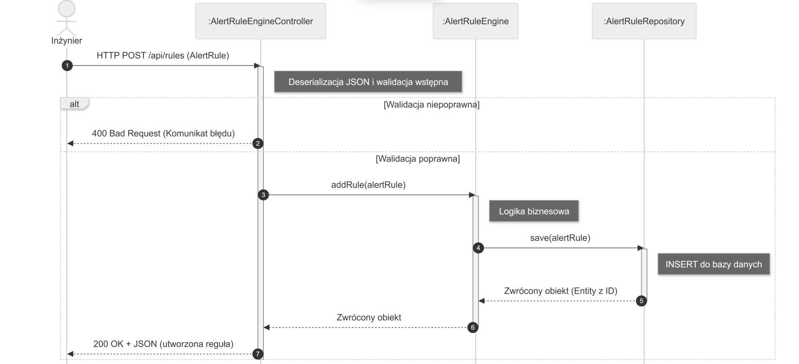
Diagram 6. Diagram interakcji dla Inżyniera dla przypadku użycia "Definiuj nową regułę"

Proces inicjowany jest przez Inżyniera poprzez wysłanie żądania HTTP POST z definicją reguły (obiekt JSON).

Kluczowe elementy przepływu sterowania:
1. Diagram uwzględnia alternatywną ścieżkę wykonania w przypadku niepowodzenia walidacji wstępnej (np. błędny format danych). Kontroler przerywa wówczas przetwarzanie, zwracając kod 400 Bad Request, co zapobiega obciążaniu warstwy biznesowej.
2. W ścieżce pozytywnej sterowanie przekazywane jest sekwencyjnie w dół stosu: od kontrolera, przez serwis AlertRuleEngine (logika biznesowa), aż do repozytorium AlertRuleRepository.
3. Operacja save() w repozytorium skutkuje wykonaniem polecenia INSERT do bazy danych.
4. Po pomyślnym zapisie, system zwraca pełny obiekt reguły (uzupełniony o nadane przez bazę ID) wraz z kodem sukcesu 200 OK.

# Diagram czynności 

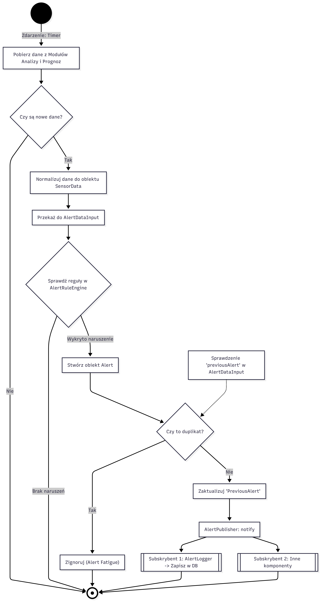
Diagram 7.

Diagram czynności przedstawia algorytm automatycznego monitorowania Modułów, z których są pobierane dane. Proces jest inicjowany cyklicznie (Timer) i rozpoczyna się od pobrania oraz normalizacji danych z modułów analitycznych i prognostycznych do wspólnego formatu `SensorData`.

Następnie silnik reguł (`AlertRuleEngine`) weryfikuje dane pod kątem przekroczenia zdefiniowanych progów. W przypadku wykrycia anomalii, mechanizm deduplikacji w `AlertDataInput` sprawdza, czy identyczne zdarzenie nie zostało już przetworzone, aby uniknąć redundancji. Jeśli alert jest unikalny, zostaje przekazany do `AlertPublisher`, który asynchronicznie dystrybuuje go do zarejestrowanych subskrybentów, w tym do komponentu `AlertLogger` odpowiedzialnego za trwały zapis w bazie danych.

# Diagram maszyny stanowej

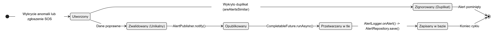
Diagram 8.

Diagram przedstawia cykl życia kluczowego obiektu biznesowego Alert w systemie. Proces rozpoczyna się w momencie utworzenia instancji obiektu w wyniku wykrycia anomalii przez reguły systemowe lub ręcznego zgłoszenia SOS przez użytkownika.

Kluczowym elementem przepływu jest weryfikacja unikalności w stanie Utworzony, gdzie system sprawdza, czy identyczny alert nie został już zgłoszony (mechanizm deduplikacji w `AlertDataInput`).

Ścieżka negatywna: W przypadku wykrycia duplikatu, obiekt przechodzi w stan Zignorowany i kończy swój cykl życia, aby nie obciążać systemu.
Ścieżka pozytywna: Unikalny alert przechodzi w stan Zwalidowany, a następnie jest publikowany przez komponent `AlertPublisher`.

Dalsze przetwarzanie odbywa się w modelu asynchronicznym (stan Przetwarzany w tle), co realizowane jest przy użyciu CompletableFuture. Ostatecznie, komponent `AlertLogger` przechwytuje zdarzenie i trwale zapisuje obiekt w bazie danych, co prowadzi do stanu końcowego Zapisany w bazie.

# Diagram komponentów 

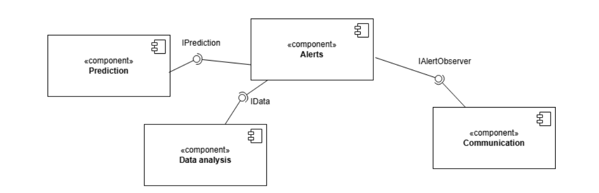
Diagram 9.

Diagram komponentów przedstawia osadzenie modułu `Alerts` w ekosystemie całej aplikacji oraz jego zależności względem sąsiednich modułów.

* **Alerts (Centralny):** Pełni rolę koordynatora. Agreguje dane wejściowe i decyduje o wystawieniu alertu.
* **Prediction & Data Analysis (Dostawcy):** Moduł Alertów występuje tu w roli konsumenta. Pobiera prognozy poprzez interfejs `IPrediction` (w kodzie: `ForecastService`) oraz dane historyczne poprzez interfejs `IData` (w kodzie: `DataFetcher`).
* **Communication (Odbiorca):** Moduł Alertów pełni rolę dostawcy zdarzeń. Wystawia publiczny interfejs `IAlertObserver`, który pozwala modułowi Komunikacji subskrybować się na nowe alerty i przesyłać je dalej (np. mailowo lub SMS-em).
# Diagram pakietów

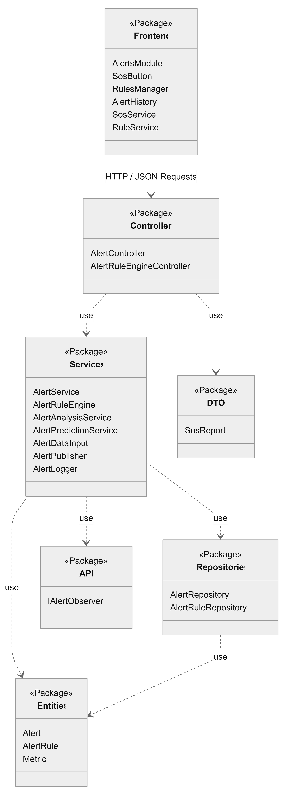
Diagram 10.

Diagram pakietów ilustruje pełną architekturę modułu `Alerts`, z podziałem na warstwę prezentacji (Client-Side) oraz warstwę aplikacji (Server-Side). Komunikacja między tymi środowiskami odbywa się za pośrednictwem protokołu HTTP/REST.

1.  **Warstwa Frontend (Prezentacja):**
    Zrealizowana w oparciu o bibliotekę React. Głównym kontenerem jest pakiet `Frontend`, zawierający widoki (`AlertsModule`, `AlertHistory`) oraz komponenty interaktywne (`SosButton`). Logika komunikacji z API została zaimplementowana do serwisów (`SosService`, `RuleService`), co zapewnia separację widoku od warstwy transportowej.

2.  **Warstwa Backend (Aplikacja):**
    Zaprojektowana zgodnie z architekturą trójwarstwową:
    * **Controllers:** Warstwa brzegowa API, odpowiedzialna za odbieranie żądań HTTP, walidację danych wejściowych (DTO) oraz zwracanie odpowiedzi do klienta.
    * **Services:** Warstwa logiki biznesowej. Tutaj znajdują się mechanizmy systemu: silnik reguł (`AlertRuleEngine`), serwis analizy (`AlertAnalysisService`) oraz obsługa powiadomień (`AlertPublisher`). Warstwa ta orkiestruje przepływ danych między kontrolerami a bazą danych.
    * **Repositories:** Warstwa dostępu do danych (DAO). Odpowiada wyłącznie za bezpośrednią komunikację z bazą danych i mapowanie obiektowo-relacyjne.

3.  **Współdzielone modele danych:**
    Pakiety `Entities` oraz `DTO` definiują struktury danych używane w całym systemie – odpowiednio do zapisu trwałego (np. `Alert`, `AlertRule`) oraz do transferu danych między warstwami (np. `SosReport`).

# Diagram przeglądu interakcji

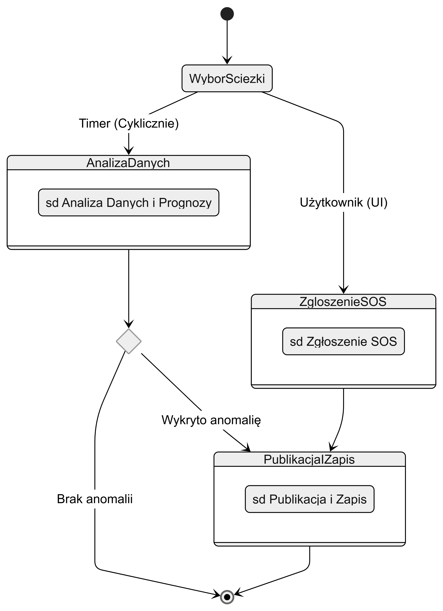
Diagram 11.

Diagram prezentuje wysokopoziomowy przepływ sterowania w module alertowania, integrujący różne scenariusze zachowań systemu. Ukazuje on mechanizm współbieżnej obsługi dwóch niezależnych źródeł zdarzeń, co odzwierciedla wielowątkową naturę aplikacji (osobny wątek harmonogramu @Scheduled oraz wątek obsługi żądań HTTP).

Wyróżniono dwie główne ścieżki inicjacji procesu:

Analiza Automatyczna (sd Analiza Danych): Proces cykliczny realizowany przez serwis AlertAnalysisService, który monitoruje strumień danych z czujników. Ścieżka ta zawiera punkt decyzyjny – przejście do publikacji następuje wyłącznie w momencie wykrycia anomalii (spełnienia warunków reguły logicznej). W przeciwnym razie proces kończy się bez skutku.

Zgłoszenie Manualne (sd Zgłoszenie SOS): Proces inicjowany na żądanie użytkownika (Mieszkańca) poprzez API. Ścieżka ta posiada priorytet i po pomyślnej walidacji bezwarunkowo prowadzi do utworzenia alertu.

Obie ścieżki zbiegają się we wspólnym scenariuszu Publikacja i Zapis (sd Publikacja i Zapis), gdzie następuje asynchroniczne powiadomienie subskrybentów oraz trwała archiwizacja zdarzenia w bazie danych. Diagram ten obrazuje, jak system unifikuje obsługę zdarzeń pochodzących z różnych źródeł.

# Diagram strukturalny
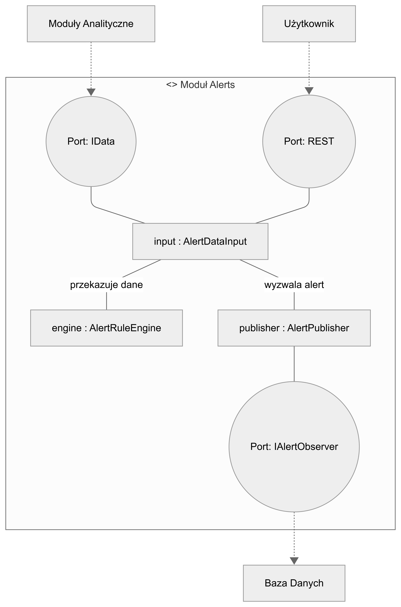
Diagram 12.

Diagram strukturalny obrazuje wewnętrzną architekturę modułu Alerts, prezentując go jako złożony element składający się z trzech współpracujących części. Centralną rolę pełni komponent `AlertDataInput`, który działa jako koordynator, delegując zadania do pozostałych elementów. Weryfikacja reguł odbywa się w odizolowanej części `AlertRuleEngine`, natomiast za komunikację z otoczeniem odpowiada część `AlertPublisher`, uruchamiana wyłącznie na żądanie koordynatora. Widoczne linie łączące symbolizują stałe relacje definiowane w kodzie aplikacji.

# Diagram harmonogramowania
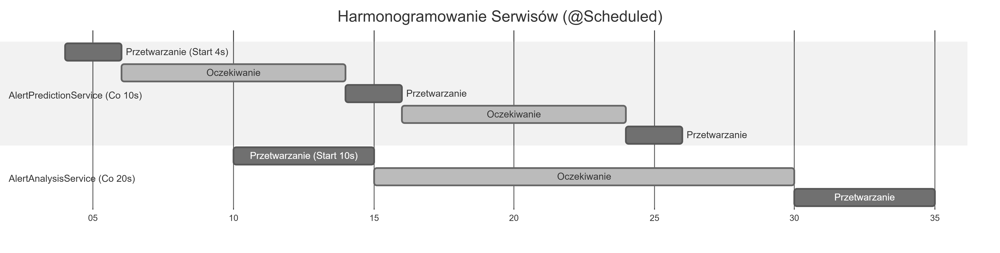
Diagram 13.

Diagram obrazuje dynamikę działania mechanizmu harmonogramowania zadań (Scheduler) dla dwóch kluczowych serwisów systemowych, skonfigurowanych przy użyciu adnotacji @Scheduled. Zastosowano notację zdarzeniową (zadaniową), aby czytelnie przedstawić okresy aktywności procesora oraz czasy oczekiwania wątków.

Na diagramie wyszczególniono dwa niezależne tory przetwarzania:

AlertPredictionService: Serwis inicjowany w 4. sekundzie działania systemu. Charakteryzuje się wysoką częstotliwością uruchamiania (fixedRate = 10s) oraz krótkim czasem przetwarzania (symulowane 2s), co odpowiada naturze szybkich predykcji.

AlertAnalysisService: Serwis inicjowany w 10. sekundzie. Jest to proces bardziej złożony obliczeniowo (symulowane 5s), uruchamiany rzadziej (fixedRate = 20s).

Wykres wizualizuje momenty współbieżności logicznej, w których oba serwisy rywalizują o zasoby procesora (np. w przedziale 30–32 sekundy), oraz potwierdza poprawność zdefiniowanych interwałów czasowych i opóźnień początkowych (initialDelay).

# Dokumentacja użytkownika

## Przypadek użycia 1 - Zgłoś Alarm SOS

Instrukcja z zrzutami ekranu jak wygląda GUI (jeśli jest):

I kroki opisane np.
Zaloguj się do projektu jako dowolny użytkownik (Admin, Mieszkaniec, Inżynier).
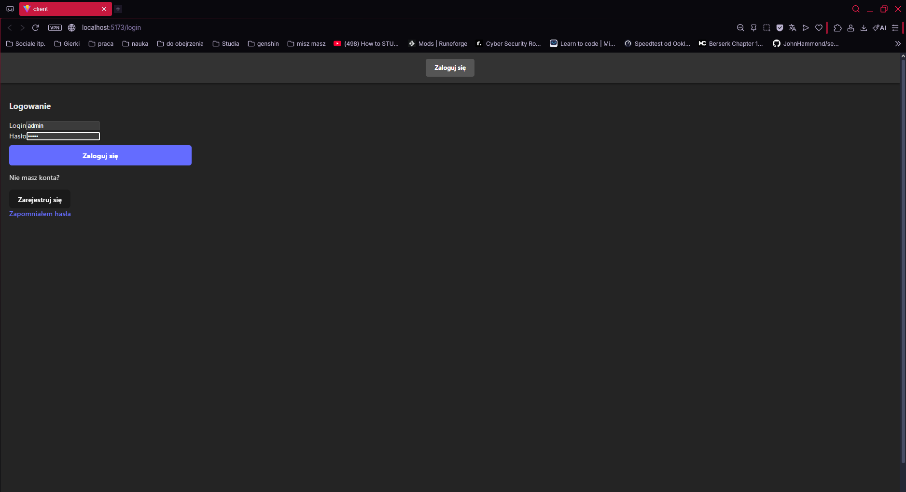
Zrzut ekranu 1.

W głównym panelu
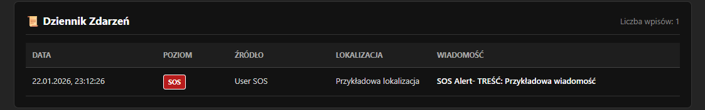
Zrzut ekranu 2.

 kliknij przycisk Alerts.

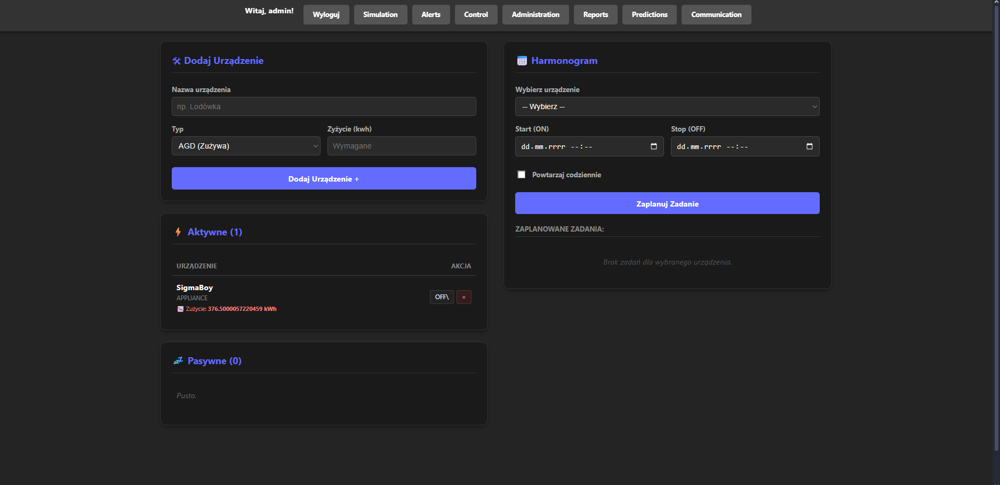
Zrzut ekranu 3.

Po kliknięciu w przycisk Alerts pownieneś zobaczyć panel modułu Alertów

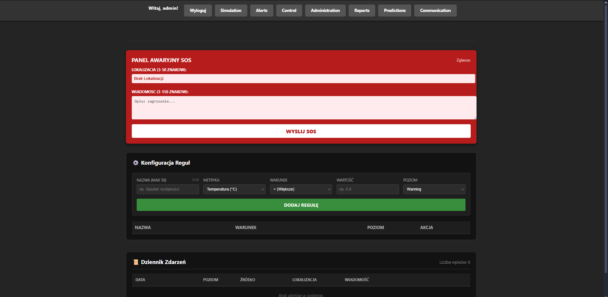
Zrzut ekranu 4.

Do "PANEL AWARYJNY SOS" podaj lokalizację wraz z wiadomością co sie stało 

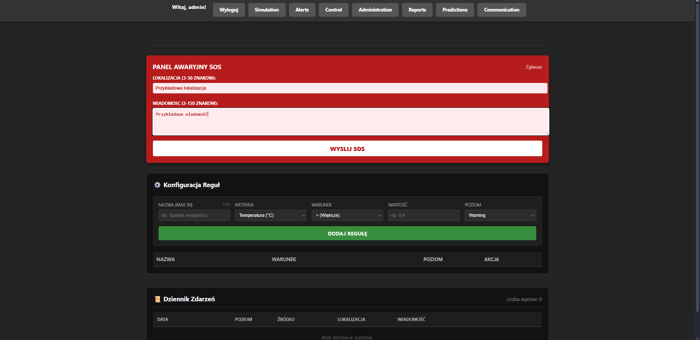
Zrzut ekranu 5.

Po przycisku "WYSLIJ SOS" powinienes zobaczyc napis "WYSLANO ZGLOSZENIE"

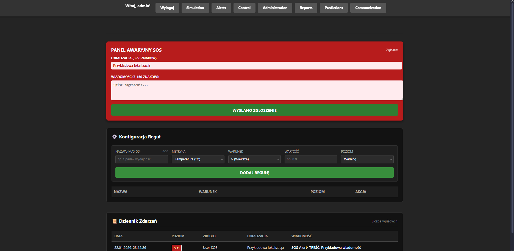
Zrzut ekranu 6.

Adminisrtratorzy i Inżynierowie automatycznie powinni zobaczyć twoje zgłoszenie w Dzienniku Zdarzeń

Zrzut ekranu 7.

## Przypadek użycia 2 - Dodaj nową regułę

Zaloguj się do projektu jako dowolny użytkownik (Admin, Inżynier).

Zrzut ekranu 8.

W głównym panelu kliknij przycisk Alerts.


Zrzut ekranu 9.

Po kliknięciu w przycisk Alerts pownieneś zobaczyć panel modułu Alertów


Zrzut ekranu 10.

W sekcji "Konfiguracja Reguł" powinieneś zobaczyć okienko do dodawania reguł. Możesz wpisać nazwe reguły, wybrać metryke, wybrać warunek, wpisać wartość oraz wybrać poziom zagrożenia.

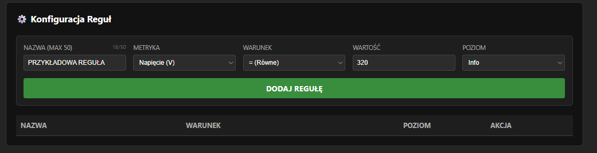
Zrzut ekranu 11.

Po kliknięciu w przycisk "DODAJ REGUŁĘ" powinieneś zobaczyć nową regułę zapisaną w bazie danych.

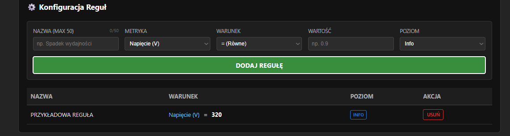
Zrzut ekranu 12.

Super, udało ci się dodać regułę! Gdy silnik reguł zobaczy naruszenie zasad to utworzy nowy alert, który zostanie zapisany i który bedzie widoczy w dzienniku zdarzeń :)


## Obsługa błędów, sytuacji wyjątkowych
1. Warstwa prezentacji
   * Blokada wysyłki błędnych danych na poziomie UI. Przykładowo, moduł zgłoszeń SOS wymusza długość lokalizacji (3–50 znaków) i treści wiadomości, a menedżer reguł weryfikuje typy liczbowe oraz bezpieczne zakresy wartości.
   * Serwisy komunikacyjne (`SosService`, `RuleService`) implementują bloki try-catch oraz weryfikację flagi response.ok. W przypadku błędu serwera (np. 500) lub awarii sieci, aplikacja przechwytuje wyjątek i wyświetla stosowny komunikat w interfejsie (np. zmiana stanu przycisku na "BŁĄD WYSYŁANIA"), nie dopuszczając do awarii całej strony.
   * Zaimplementowano mechanizm fail-safe przy przetwarzaniu odpowiedzi JSON. W przypadku otrzymania nieprawidłowego formatu, system nie ulega awarii, lecz dokumentuje ostrzeżenie i przetwarza odpowiedź jako tekst.

2. Warstwa logiki i danych
   * Kontrolery REST (`AlertController`) walidują przychodzące obiekty DTO. Próba przesłania niekompletnych lub zmanipulowanych danych skutkuje natychmiastowym przerwaniem przetwarzania i zwróceniem kodu 400 Bad Request.
   * Błędy biznesowe są przechwytywane w warstwie usług, co zapobiega wyciekom stack trace'u do klienta i gwarantuje zwrócenie ustrukturyzowanej odpowiedzi błędu.
   * Operacje krytyczne (metoda subscirbe()) wykonywane są asynchronicznie – błąd zapisu do bazy w wątku pobocznym nie blokuje głównego wątku obsługi użytkownika.

## Podsumowanie
Moduł Alarmowania i Alertów stanowi punkt nadzoru bezpieczeństwa w systemie, integrując dane pochodzące z trzech niezależnych źródeł: bieżącej analizy sensorów, predykcji przyszłych awarii oraz zgłoszeń manualnych od personelu. Dzięki zastosowaniu architektury opartej na usługach działających w tle (`AlertAnalysisService`, `AlertPredictionService`), system zapewnia ciągły, 24-godzinny monitoring bez konieczności stałej ingerencji operatora.

**Kluczowe filary działania systemu:**
* Dzięki modułowi prognozowania, system jest w stanie ostrzec o potencjalnych problemach, zanim one faktycznie wystąpią. Pozwala to na podjęcie działań serwisowych w dogodnym terminie, minimalizując ryzyko kosztownych przestojów produkcyjnych.
* System odchodzi od sztywnych reguł zaszytych w kodzie. Panel "Konfiguracja Reguł" daje Administratorowi pełną kontrolę nad parametrami granicznymi. Zmiany progów są aplikowane natychmiastowo i nie wymagają restartu serwera, co zapewnia wysoką dostępność usługi.
* Zastosowane w warstwie logicznej mechanizmy deduplikacji (AlertDataInput) chronią operatorów przed duplikatami Alertów i przepełnieniem dziennika zdarzeń. System inteligentnie grupuje powtarzające się zdarzenia, dzięki czemu historia alertów pozostaje czytelna i zawiera tylko istotne zmiany statusu.
