# Moduł analizy danych i raportowania

## Projektanci: 
```
Remigiusz Bartczak 251677, 252926
Jan Kozłowski 251562
```
# Dokumentacja techniczna

## Opis funkcjonalny

### Opis przeznaczenia modułu
Moduł pobiera, przetwarza i analizuje, a następnie wizualizuje dane. Dotyczą one zużycia i produkcji energii poszczególnych lub wszystkich urządzeń w budynku na przestrzeni danego okresu w czasie. Dostarcza on Administratorom i Inżynierom niezbędne informacje do monitorowania oraz optymalizacji działania poszczególnych urządzeń.


### Opis możliwości funkcjonalnych modułu
* Generowanie raportu zużycia energii (w kWh) w wybranym zakresie dat dla np. Lodówki.
* Generowanie raportu produkcji energii (w kWh) np. dla paneli słonecznych w wybranym zakresie dat.
* Wybranie rodzaju raportu (liniowy, słupkowy, kołowy) oraz filtrowanie po odpowiednik okresie w czasie, oraz po poszczególnych urządzeniach.
* Zapis dowolnie wygenerowanego raportu analitycznego do pliku w formacie PDF na dysk użytkownika.
* Interfejs udostępniający generowanie oraz pobieranie raportów wraz z odpowiednimi opcjami wybranymi przez użytkownika.

### Opis możliwości niefunkcjonalnych modułu
* Złożone zapytania raportowe (np. roczne zestawienie zużycia wg urządzenia) muszą być przetworzone i zwrócone z bazy danych PostgreSQL w czasie skończonym (raport musi zostać wygenerowany, o ile dane istnieją).
* Wartości zużycia i produkcji energii (w kWh) prezentowane w raporcie muszą być zgodne w 100% z danymi źródłowymi zapisanymi przez Moduł Symulacji.
* W przypadku błędu zapisu pliku PDF system musi wyświetlić dedykowany komunikat o błędzie (np. "Błąd zapisu: ścieżka niedostępna" lub "Brak wolnego miejsca") zamiast ogólnej awarii aplikacji.
* Dostęp do raportów musi być ściśle ograniczony wyłącznie dla ról Administratora oraz Inżyniera. Pozostali użytkownicy nie mają dostępu do tej funkcjonalności.

# Diagramy przypadków użycia

## Diagram 1 - przypadki użycia dla inżyniera

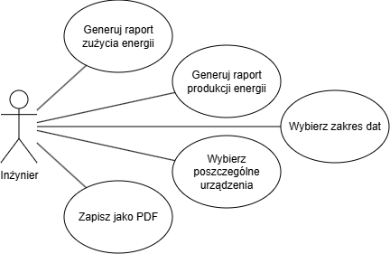
Diagram 1.

Diagram przypadków użycia przedstawia system zarządzania energią w budynkach inteligentnych. Aktorem jest inżynier, który może generować raport zużycia lub produkcji energii, wybrać do niego odpowiedni zakres dat i urządzenia, dla których ma zostać wygenerowany raport. Ma też możliwość zapisu raportu na dysku jako plik PDF.

## Diagram 2 - przypadki użycia dla administratora

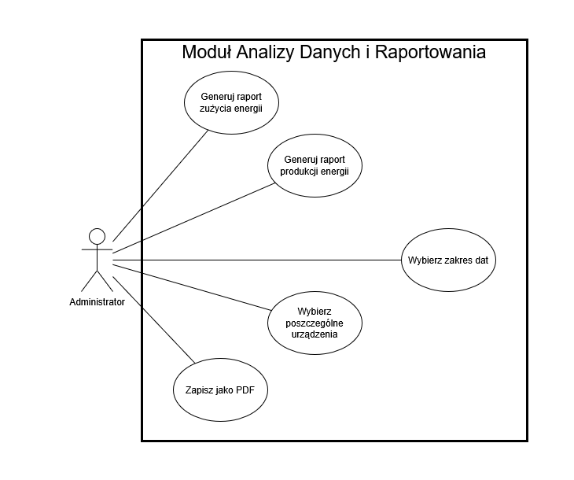
Diagram 2.

Diagram przypadków użycia przedstawia system zarządzania energią w budynkach inteligentnych. Aktorem jest administrator, który bardzo podobnie do inżyniera może generować raport zużycia lub produkcji energii, wybrać do niego odpowiedni zakres dat i urządzenia, dla których ma zostać wygenerowany raport. Ma też możliwość zapisu raportu na dysku jako plik PDF.

# Diagramy klas

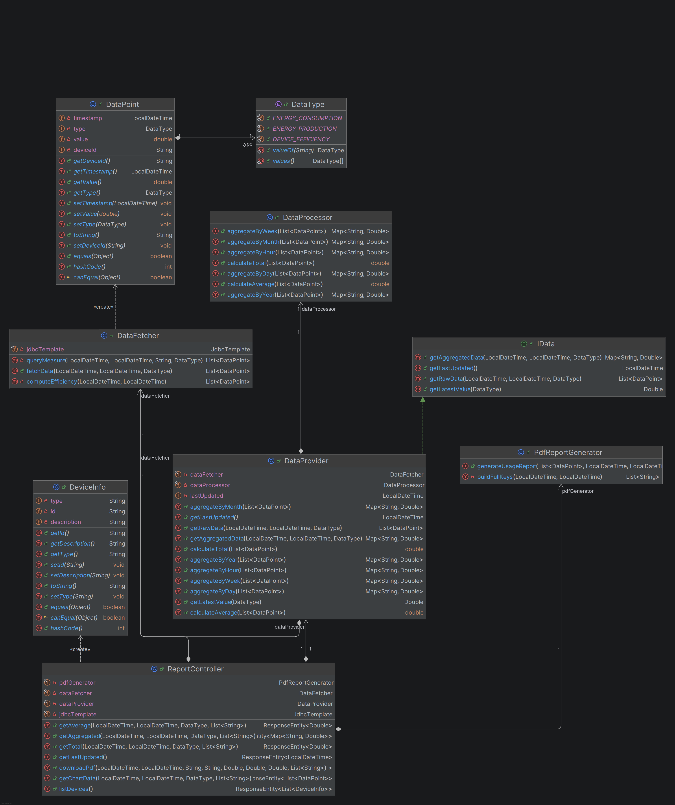
Diagram 3.

Diagram klas przedstawia architekturę systemu raportowania, którego fundamentem są klasy modelu DataPoint i DeviceInfo oraz definiujący rodzaj pomiaru typ wyliczeniowy DataType.

Za warstwę danych i logiki odpowiadają: DataFetcher, który pobiera surowe informacje z bazy, oraz DataProcessor, który wykonuje na nich obliczenia matematyczne i agregacje. Te dwa komponenty są wykorzystywane przez główny serwis DataProvider (implementujący interfejs IData), który integruje pobieranie z przetwarzaniem.

Całością steruje ReportController, który udostępnia dane poprzez API i – przy wsparciu klasy PdfReportGenerator – generuje gotowe raporty w formacie PDF.

# Diagramy interakcji

## Scenariusz 1

| Pole                                | Treść                                                                                                                                                                                                                                                                       |
|:------------------------------------|:----------------------------------------------------------------------------------------------------------------------------------------------------------------------------------------------------------------------------------------------------------------------------|
| **Nazwa:**                          | Generowanie raportu zużycia energii                                                                                                                                                                                                                                         |
| **Numer:**                          | 1                                                                                                                                                                                                                                                                           |
| **Twórca:**                         | Remigiusz Bartczak 251677, 252926, Jan Kozłowski 251562 - projektanci                                                                                                                                                                                                                    |
| **Poziom ważności:**                | Wysoki                                                                                                                                                                                                                                                                      |
| **Typ przypadku użycia:**           | Ogólny                                                                                                                                                                                                                                                                      |
| **Aktorzy:**                        | Administrator, inżynier                                                                                                                                                                                                                                                     |
| **Krótki opis:**                    | Generowanie raportu zużycia energii dla wybranego okresu w czasie.                                                                                                                                                                                                          |
| **Warunki wstępne:**                | Użytkownik bazodanowy jest zalogowany i posiada uprawnienia (jest administratorem lub inżynierem). W bazie danych PostgreSQL istnieją dane dotyczące zużycia energii w danym okresie czasu z Modułu Symulacji.                                                              |
| **Warunki końcowe:**                | Raport zostaje wygenerowany i wyświetlony.                                                                                                                                                                                                                                  |
| **Główny przepływ zdarzeń:**        | 1. Administrator/inżynier wybiera raport zużycia energii. <br> 2. Zalogowany użytkownik wybiera dany okres czasu. <br> 3. Użytkownik wybiera opcję "Generuj raport" <br/> 4. System pobiera dane z bazy PostgreSQL, przetwarza je. <br/> 5. System wyświetla gotowy raport. |
| **Alternatywne przepływy zdarzeń:** | 5a. Użytkownik pobiera raport jako plik PDF.                                                                                                                                                                                                                                |
| **Specjalne wymagania:**            | -                                                                                                                                                                                                                                                                           |
| **Notatki i kwestie:**              | Scenariusz ten będzie zilustrowany na Diagramie Sekwencji 1.                                                                                                                                                                                                                |

## Diagram interakcji 1

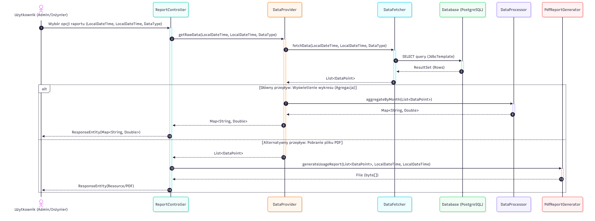
Diagram 4.


Diagram 1: Generowanie raportu zużycia energii

Diagram ten ilustruje przepływ danych rozpoczynający się od żądania użytkownika w ReportController. Proces rozpoczyna się od wspólnego kroku pobrania surowych danych z bazy PostgreSQL za pośrednictwem DataFetcher. Następnie zastosowano blok alternatywny (alt), który rozdziela logikę na dwie ścieżki:

Wyświetlenie wykresu: Dane trafiają do DataProcessor w celu agregacji (np. miesięcznej), a wynik jest zwracany jako JSON.

Pobranie PDF: Surowe dane są przekazywane do PdfReportGenerator, który tworzy i zwraca plik dokumentu.

## Scenariusz 2

| Pole                                | Treść                                                                                                                                                                                                                                                                             |
|:------------------------------------|:----------------------------------------------------------------------------------------------------------------------------------------------------------------------------------------------------------------------------------------------------------------------------------|
| **Nazwa:**                          | Generowanie raportu produkcji energii                                                                                                                                                                                                                                             |
| **Numer:**                          | 2                                                                                                                                                                                                                                                                                 |
| **Twórca:**                         | Remigiusz Bartczak 251677, 252926, Jan Kozłowski 251562 - projektanci                                                                                                                                                                                                                            |
| **Poziom ważności:**                | Wysoki                                                                                                                                                                                                                                                                            |
| **Typ przypadku użycia:**           | Ogólny                                                                                                                                                                                                                                                                            |
| **Aktorzy:**                        | Administrator, inżynier                                                                                                                                                                                                                                                           |
| **Krótki opis:**                    | Generowanie raportu produkcji energii dla wybranych urządzeń.                                                                                                                                                                                                                     |
| **Warunki wstępne:**                | Użytkownik bazodanowy jest zalogowany i posiada uprawnienia (jest administratorem lub inżynierem). W bazie danych PostgreSQL istnieją dane dotyczące produkcji energii dla danych urządzeń z Modułu Symulacji.                                                                    |
| **Warunki końcowe:**                | Raport zostaje wygenerowany i wyświetlony.                                                                                                                                                                                                                                        |
| **Główny przepływ zdarzeń:**        | 1. Administrator/inżynier wybiera raport produkcji energii. <br> 2. Zalogowany użytkownik wybiera konkretne urządzenie. <br> 3. Użytkownik wybiera opcję "Generuj raport" <br/> 4. System pobiera dane z bazy PostgreSQL, przetwarza je. <br/> 5. System wyświetla gotowy raport. |
| **Alternatywne przepływy zdarzeń:** | 2a. Zalogowany użytkownik wybiera "Wszystkie urządzenia"                                                                                                                                                                                                                          |
| **Specjalne wymagania:**            | -                                                                                                                                                                                                                                                                                 |
| **Notatki i kwestie:**              | Scenariusz ten będzie zilustrowany na Diagramie Sekwencji 2.                                                                                                                                                                                                                      |

## Diagram interakcji 2

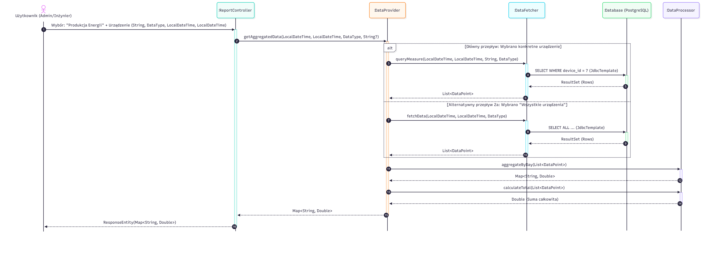
Diagram 5.


Diagram 2: Generowanie raportu produkcji energii

Ten diagram koncentruje się na różnicach w sposobie pozyskiwania danych w zależności od kryteriów wyboru urządzenia. Blok alternatywny (alt) występuje tutaj na samym początku interakcji z warstwą danych:

Konkretne urządzenie: System wywołuje metodę queryMeasure w DataFetcher, filtrując wyniki po ID urządzenia.

Wszystkie urządzenia: System używa ogólnej metody fetchData, pobierając pełen zakres danych. Niezależnie od wybranej ścieżki, uzyskana lista jest następnie przetwarzana przez DataProcessor (sumowanie, agregacja dzienna) przed finalną prezentacją użytkownikowi.

# Diagram czynności 1

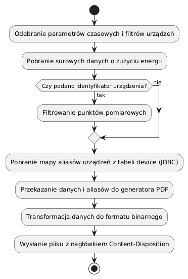
Diagram 6.

Diagram przedstawia sekwencyjny proces tworzenia dokumentu raportowego. 
Rozpoczyna się od pobrania surowych danych historycznych przez DataFetcher, 
po czym następuje opcjonalna filtracja rekordów według identyfikatorów urządzeń. 
Kluczowym elementem jest równoległe pobranie metadanych (aliasów) z bazy PostgreSQL, 
co pozwala klasie PdfReportGenerator na renderowanie czytelnych nazw urządzeń zamiast surowych kluczy technicznych 
przed wysłaniem gotowego strumienia bajtów do użytkownika.

# Diagram czynności 2

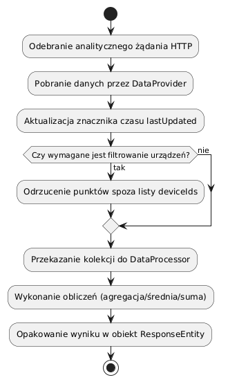
Diagram 7.

Przepływ ten ilustruje logikę obliczeniową systemu. Po odebraniu zapytania o statystyki, 
serwis DataProvider pobiera dane pomiarowe i aktualizuje znacznik czasu ostatniej aktywności. 
Dane są następnie przekazywane do DataProcessor, który w zależności od parametru czasu (godzina, dzień, rok) 
wykonuje operacje sumowania lub uśredniania przy użyciu strumieni Javy.

# Diagram maszyny stanowej

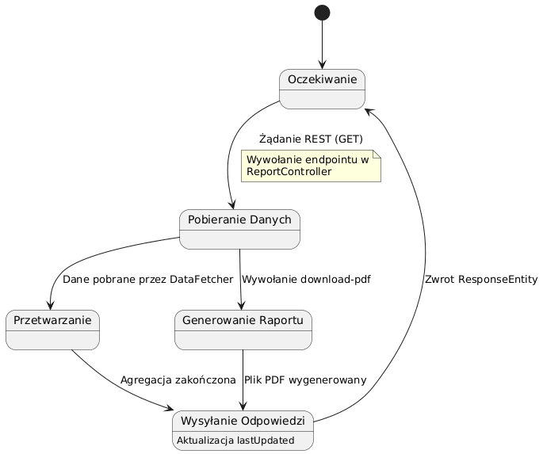
Diagram 8.

Diagram obrazuje cykl życia pojedynczego żądania analitycznego. 
Moduł znajduje się w stanie "Bezczynności" do momentu otrzymania sygnału z kontrolera API. 
Proces przechodzi przez fazy ekstrakcji danych z bazy PostgreSQL, 
aktywnego przetwarzania w procesorze lub generowania dokumentu, 
kończąc się stanem finalizacji odpowiedzi. 
Po wysłaniu danych do klienta system automatycznie powraca do stanu oczekiwania, zwalniając zajęte zasoby.

# Diagram komponentów

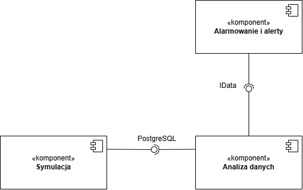
Diagram 9.

Moduł analizy danych odczytuje dane historyczne (zużycie, produkcja) zapisane przez Moduł Symulacji w bazie dancyh PostgreSQL. Stanowi to surowiec do wszelkich analiz, wykresów i raportów.
Udostępnia on również bieżące, przetworzone i zweryfikowane dane (np. zużycie z ostatniego tygodnia), umożliwiając Modułowi Alarmowania i Alertów szybkie wykrywanie anomalii i awarii (np. nagłe skoki zużycia energii przez dane urządzenie).

# Diagram pakietów

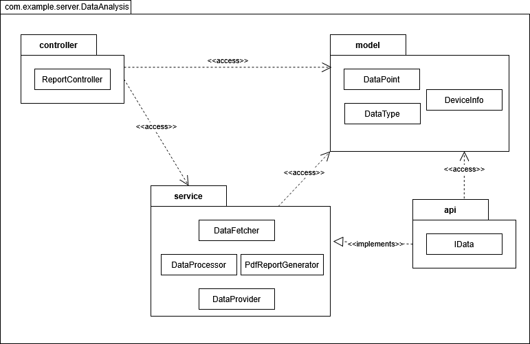
Diagram 10.

Struktura pakietów izoluje od siebie kluczowe warstwy odpowiedzialne za logikę biznesową. 
Pakiet model dostarcza wspólny język danych dla całego modułu. 
Pakiet api definiuje abstrakcyjne kontrakty (interfejsy), 
co pozwala na niezależny rozwój warstwy service (implementującej logikę) 
oraz warstwy controller (obsługującej komunikację REST), zapewniając wysoką modularność i łatwość testowania.

# Diagram przeglądu interakcji

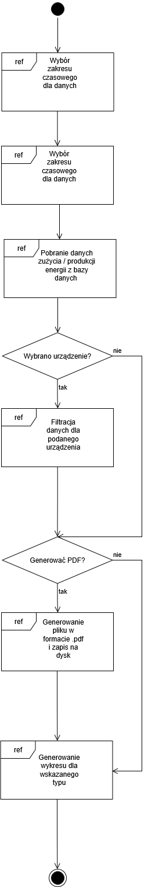
Diagram 11.

Diagram przeglądu interakcji syntetyzuje logikę biznesową modułu, 
przedstawiając przepływ sterowania pomiędzy wysokopoziomowymi fragmentami interakcji, 
oznaczonymi ramkami odniesienia (ref). Całość procesu rozpoczyna się od zdefiniowania parametrów 
wejściowych przez użytkownika (zakres czasowy oraz typ danych: produkcja/zużycie), 
co inicjuje wywołania odpowiednich endpointów w klasie ReportController. 
Pierwszym kluczowym krokiem jest odniesienie do procedury pobierania danych z bazy PostgreSQL, 
realizowanej przez DataFetcher. Następnie system przechodzi przez węzły decyzyjne:

1. Jeśli wybrano konkretne urządzenie, uruchamiany jest mechanizm filtracji strumieniowej po deviceIds.
2. System sprawdza, czy użytkownik zażądał pliku PDF; jeśli tak, sterowanie trafia do fragmentu ref:
Generowanie PDF, gdzie PdfReportGenerator renderuje dokument.
3. Niezależnie od generowania pliku, proces kończy się przygotowaniem danych do wykresu, co domyka cykl analityczny.

# Diagram strukturalny

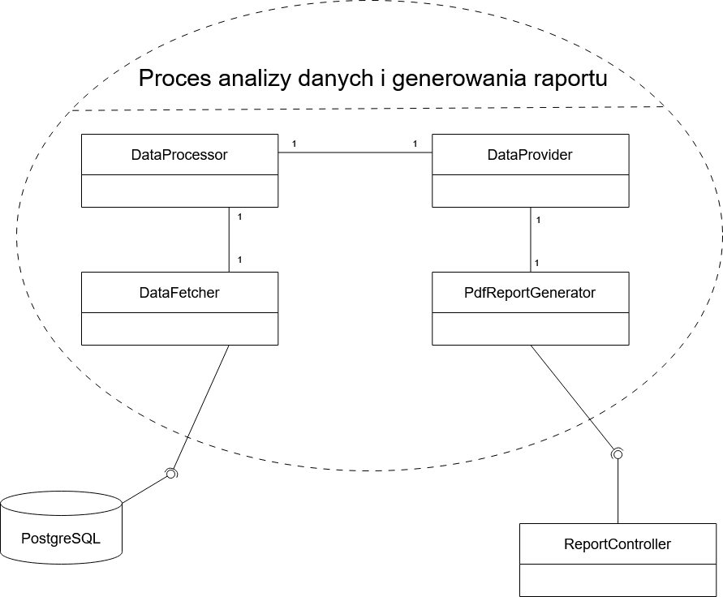
Diagram 12.

Diagram strukturalny ukazuje wewnętrzną budowę Modułu Analizy Danych jako kooperację współdziałających części, takich jak ReportController, DataProvider czy DataFetcher, niezbędnych do realizacji procesu raportowania. Przedstawia on instancje klas jako elementy połączone konektorami, które obrazują rzeczywiste ścieżki komunikacji i delegowania zadań wewnątrz systemu. Dzięki temu widoczne jest, jak poszczególne komponenty współpracują ze sobą, tworząc funkcjonalną całość, której działanie wykracza poza możliwości pojedynczego obiektu.

# Diagram harmonogramowania

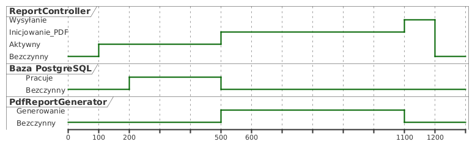
Diagram 12.

Diagram harmonogramowania precyzuje dynamikę czasową modułu, 
przedstawiając zmiany stanów poszczególnych komponentów w trakcie realizacji żądania analitycznego.
Obrazuje on sekwencyjne przejścia od stanu bezczynności, 
przez fazę intensywnej komunikacji z bazą danych PostgreSQL w celu pobrania pomiarów i metadanych, 
aż po moment renderowania binarnej zawartości raportu PDF.

# Dokumentacja użytkownika

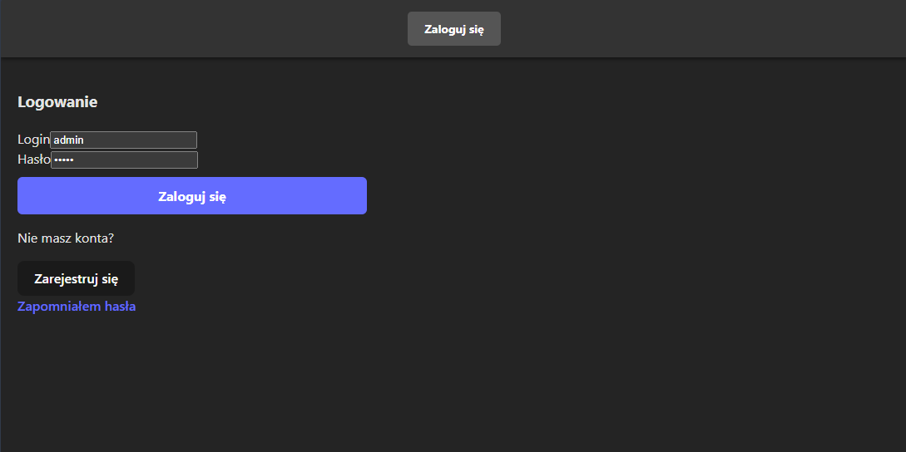
Diagram 13.

Do skorzystania z modułu analizy danych należy uwierzytelnić się w systemie jako inżynier lub administrator. Można to zrobić uruchamiając aplikację na komputerze w przeglądarce pod odpowiednim adresem URL i następnie:
1. Wpisując dane do zalogowania administratora/inżyniera.
2. Klikając przycisk "Zaloguj się"

## Przypadek użycia 1 - generowanie wykresu liniowego

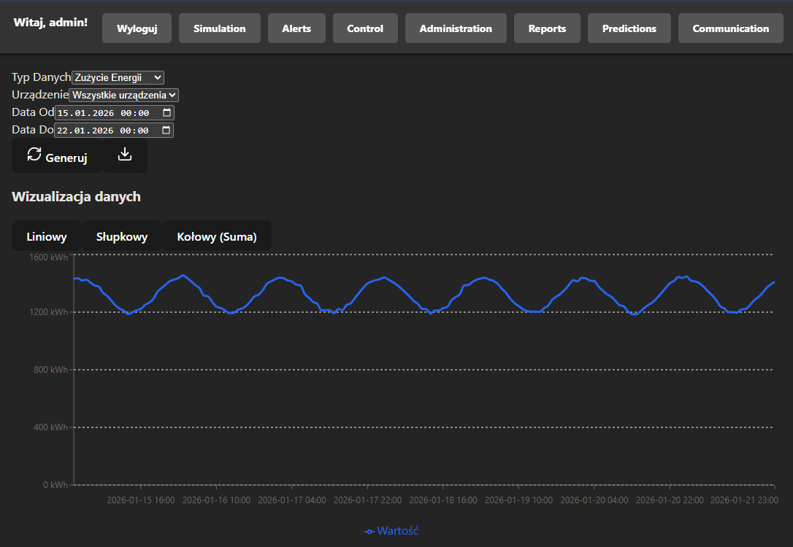
Zrzut ekranu 1.

Po zalogowaniu użytkownik z odpowiednimi uprawnieniami ma możliwość analizy historycznej danych zużycia lub produkcji energii. W następujący sposób może wygenerować raport z wykresem liniowym:
1. Z górnego menu nawigacyjnego należy wybrać sekcję "Reports".
2. W panelu bocznym skonfigurować parametry raportu:
   * Typ Danych: Wybrać z listy (np. "Zużycie Energii").
   * Urządzenie: Wybrać konkretne urządzenie lub opcję "Wszystkie urządzenia".
   * Data Od / Data Do: Ustawić pożądany przedział czasowy w kalendarzu.
3. Kliknąć przycisk "Generuj" (ikona odświeżania).
4. W sekcji "Wizualizacja danych" upewnić się, że aktywna jest zakładka "Liniowy". System wygeneruje wykres ciągły.

## Przypadek użycia 2 - generowanie wykresu słupkowego

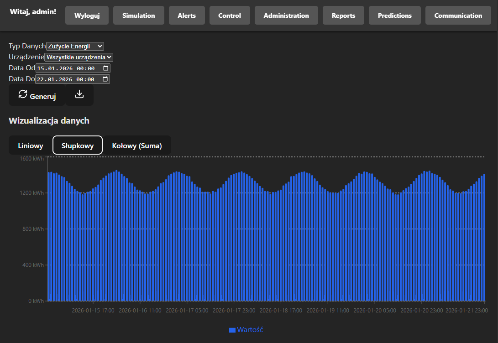
Zrzut ekranu 2.

System umożliwia dynamiczną zmianę sposobu prezentacji tych samych danych bez konieczności ponownego wysyłania zapytania do serwera. Można to zrobić w ten sposób:
1. Po wygenerowaniu danych (według kroków z Przypadku użycia 1), można przejść do sekcji "Wizualizacja danych" nad wykresem.
2. Kliknąć przycisk "Słupkowy".
3. Wykres zostanie natychmiast przerysowany w formie słupkowej, co ułatwia porównywanie wolumenu zużycia w poszczególnych interwałach czasowych dla wybranego zakresu dat.

## Obsługa błędów, sytuacji wyjątkowych
System realizuje obsługę błędów na trzech poziomach, zapewniając stabilność działania i czytelną informację zwrotną dla użytkownika:

1. Walidacja danych wejściowych:
   * Frontend: Zastosowanie dedykowanych kontrolek HTML (`<input type="datetime-local">, <select>`) eliminuje możliwość wprowadzenia danych w błędnym formacie.
   * Backend: Dane przychodzące do API są weryfikowane przez adnotacje Springa (np. @DateTimeFormat), co powoduje automatyczne odrzucenie niepoprawnych żądań (kod 400) przed uruchomieniem logiki biznesowej.
2. Zabezpieczenia logiki biznesowej:
   * W warstwie dostępu do danych (DataFetcher) zaimplementowano zabezpieczenia przed wartościami NULL zwracanymi z bazy oraz ochronę przed błędami arytmetycznymi (np. dzielenie przez zero przy obliczaniu efektywności).
   * Generowanie plików PDF jest objęte blokami try-catch, aby błędy biblioteki iText nie powodowały awarii całego serwisu.
3. Obsługa awarii i komunikacja z użytkownikiem:
   * Aplikacja kliencka przechwytuje błędy sieciowe i serwerowe (blok try-catch w ReportModule), wyświetlając użytkownikowi stosowny komunikat zamiast zawieszać interfejs.
   * System obsługuje tzw. "puste stany" – w przypadku braku danych dla wybranego okresu, wyświetlana jest informacja tekstowa zamiast pustego wykresu.

## Podsumowanie

Moduł analizy danych i raportowania stanowi kluczowy komponent systemu zarządzania energią, 
przekształcając surowe dane pomiarowe z Modułu Symulacji w wartościowe, gotowe do wykorzystania informacje. 
Dzięki precyzyjnemu przetwarzaniu i elastycznym możliwościom wizualizacji umożliwia administratorom i inżynierom 
monitorowanie oraz optymalizację zużycia i produkcji energii w budynku.

Architektura modułu, oparta na wyraźnej separacji warstw (kontrolera, serwisu, dostępu do danych) oraz zastosowaniu 
wzorca dependency injection, gwarantuje wysoką skalowalność, łatwość testowania i prostotę rozbudowy 
o nowe typy raportów czy formaty eksportu. Wszystkie komponenty od pobierania danych przez DataFetcher, 
przez przetwarzanie w DataProcessor, aż po generowanie dokumentów w PdfReportGenerator są zaprojektowane z myślą 
o niezawodności i zgodności z danymi źródłowymi.

Moduł w pełni realizuje założone wymagania funkcjonalne, oferując generowanie raportów zużycia i produkcji energii 
z możliwością filtrowania według urządzeń i okresów czasu, a także eksport do pliku PDF. Spełnia także kluczowe 
wymagania niefunkcjonalne, takie jak kontrola dostępu oparta na rolach, wydajne przetwarzanie złożonych zapytań 
oraz odporność na błędy dzięki wszechstronnej obsłudze wyjątków na każdym etapie przetwarzania.

Dzięki intuicyjnemu interfejsowi użytkownika, który umożliwia dynamiczne przełączanie między wykresami liniowymi i 
słupkowymi, oraz solidnej warstwie backendowej, system stanowi efektywne narzędzie wspierające podejmowanie decyzji 
w zarządzaniu energią w inteligentnych budynkach.
