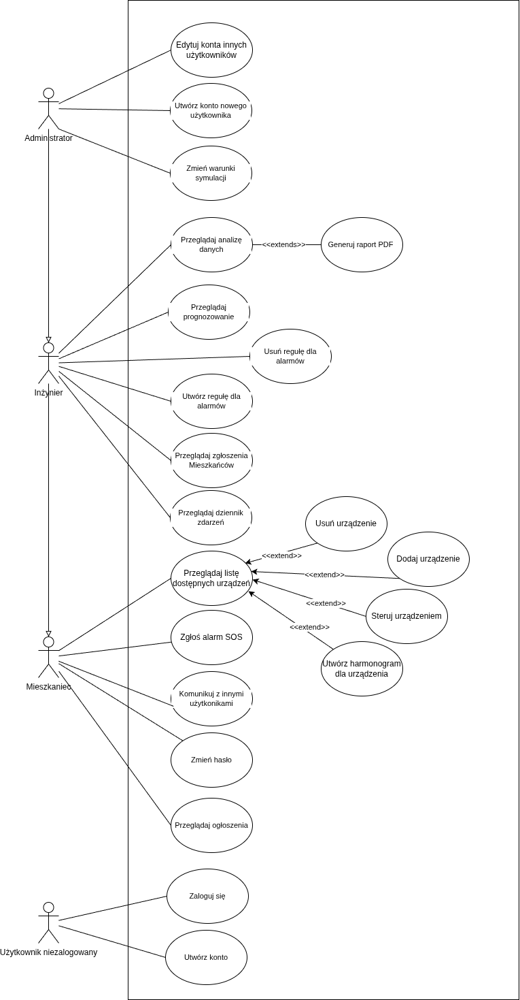
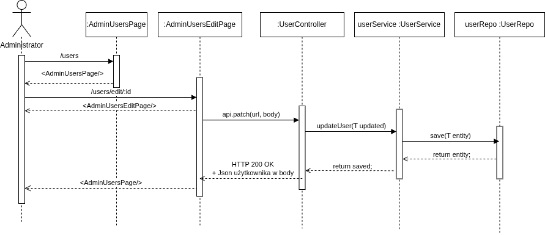
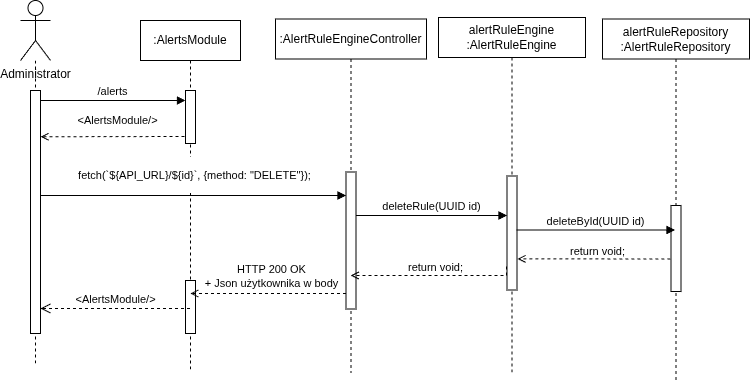
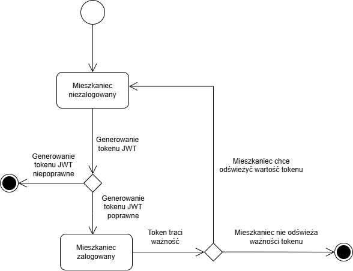
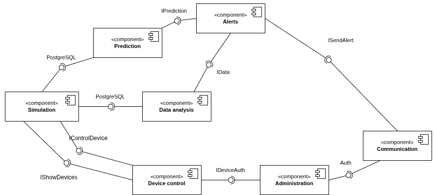
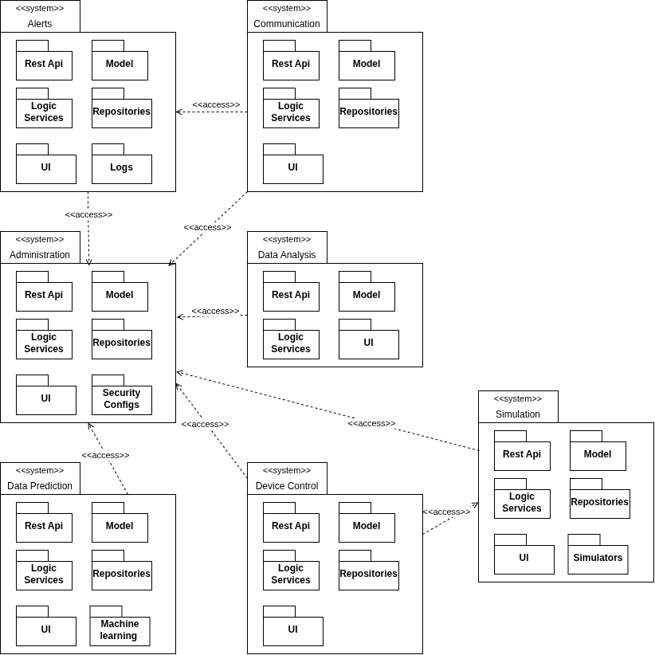
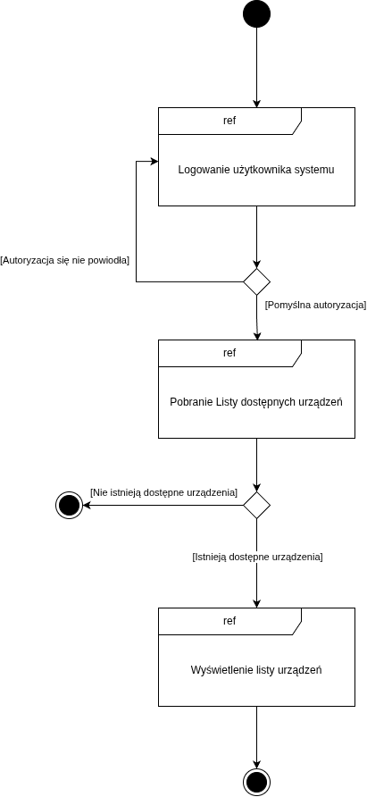
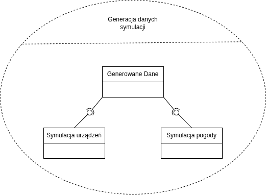
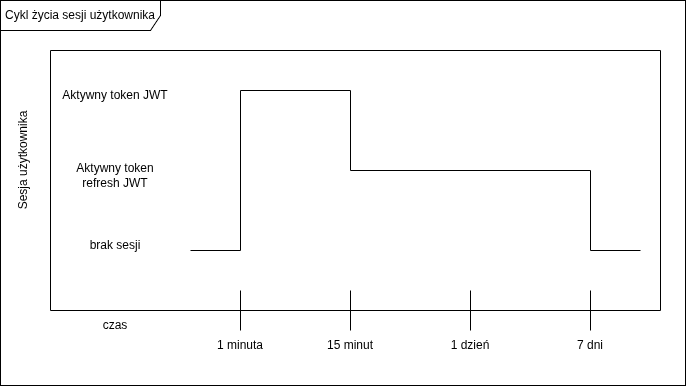

# Projekt systemu zarządzania energią w budynkach inteligentnych

## Architektci: 
```
Danylo Dobrianskyi 258668
Paweł Rajnert 251618
```
# Dokumentacja techniczna

## Opis funkcjonalny

### Opis możliwości funkcjonalnych projektu
Co realizuje dany moduł, wypunktowanie przypadków uzycia wraz z opisami, trzeba podzielic fragmentami co moze robic dany aktor
- Administrator ma możliwość sterowania każdym urządzeniem w symulacji. 
- Administrator i inżynier ma możliwość przeglądu raportu analizy danych. 
- Istnieje możliwość wygenerowania pliku PDF z raportem analizy danych. 
- Istnieje możliwość przeglądania prognozów przez użytkowników z rolą Administrator i Inżynier. 
- Istnieje możliwość przeglądania dzienniku zdarzeń przez użytkowników z rolą Administrator i Inżynier. 
- Każdy użytkownik ma możliwość komunikacji z innymi użytkownikami budynku. 
- Administrator budynku może tworzyć użytkowników o różnych rolach. 
- Każda rola użytkowników może dodawać własne urządzenia do systemu i pojawią się one w symulacji. 
- Każda rola użytkowników może usuwać urządzenia z systemu. 
- Istnieje możliwość tworzenia harmonogramu działania dla urządzeń. 
- Administrator ma dostęp do wszystkich urządzeń i może symulować awarie przez wyłączenie urządzeń. 
- Mieszkaniec może zgłosić awarię (wysłać alert SOS) swojego urządzenia.  
- Użytkownik niezalogowany systemu mają możliwość utworzyć konto z rolą mieszkaniec.
- Użytkownicy zalogowani (administrator, mieszkaniec i inżynier) mogą zmienić hasło za pomocą wysyłanego lista email. 
- Administrator może edytować dane wszystkich użytkowników. 
- Administrator może zmieniać warunki symulacji (pora dnia oraz pora roku)  
- Administrator oraz Inżynier mogą tworzyć reguły dla komunikatów w dzienniku zdarzeń. 
- Administrator oraz Inżynier mogą usuwać reguły dla komunikatów w dzienniku zdarzeń. 
- Każdy użytkownik systemu może przeglądać ogłoszenia.

### Opis możliwości niefunkcjonalnych projektu
- Generowanie danych przez moduł symulacji i zapisywanie do bazy danych co kilka minut.
- Energia wyprodukowana i spożyta zapisuje się w jednostkach (kWh).
- Moduł analizy danych rysuje wykresy zużycia/produkcji energii w określonym przez użytkownika czasie.
- Prognozowanie odbywa się na podstawie prostych mechanizmów uczenia maszynowego i wyświetlane są w dowolnej formie.
- System wykrywa awarie na podstawie reguł zdefiniowanych przez adminstratora oraz danych z różnych urządzeń.
- Automatycznie tworzone są alarmy przy wykryciu awarii w formie wpisów w dzienniku zdarzeń.
- Dziennik zdarzeń zawiera informację o wszystkich awariach, o przesyłaniu danych od symulacji do modułu analizy i o sterowaniu urządzeniami (wzorzec observer).
- Czytelny interfejs graficzny każdego z modułów. 
- Korzystanie z ustalonego stosu technologicznego: Spring Boot, React JS, PostgreSQL, Flyway.

# Diagramy przypadków użycia

## Nazwa przypadku użycia

Diagram 1.

Diagram przypadków użycia przedstawia ogólnie cały system zarządzania energią w budynkach inteligentnych. Aktorami są: Mieszkaniec, Administrator, Inżynier oraz Użytkownik niezalogowany. 
- Użytkownik niezalogowany może jedynie utworzyć konto z rolą mieszkaniec lub zalogować się.
- Mieszkaniec może sterować na różne sposoby własnymi urżądzeniami, zgłaszać alarmy SOS, komunikować się z administracją lub innymi mieszkańcami i przeglądać ogłoszenia od administracji.
- Inżynier może wykonywać te same działania co i mieszkaniec, ale także przeglądać analizy, prognozy, ma dostęp do dzienniku zdarzeń i zgłoszeń mieszkańców.
- Administrator może wykonywać te same działania co i Inżynier, ale też ma możliwość zarządzania kontami użytkowników oraz zmiany warunków symulacji.
Diagram pokazuje podstawowe funkcjonalności systemu oraz interakcje użytkowników z systemem.

# Diagramy interakcji

## Scenariusz 1

| Pole                                | Treść                                                                                                                                                                                                                                                                                                                                                                                                                                       |
| :---------------------------------- | :------------------------------------------------------------------------------------------------------------------------------------------------------------------------------------------------------------------------------------------------------------------------------------------------------------------------------------------------------------------------------------------------------------------------------------------ |
| **Nazwa:**                          | Edytuj konta innych użytkowników                                                                                                                                                                                                                                                                                                                                                                                                            |
| **Numer:**                          | 1                                                                                                                                                                                                                                                                                                                                                                                                                                           |
| **Twórca:**                         | Danylo Dobrianskyi 258668, Paweł Rajnert 251618                                                                                                                                                                                                                                                                                                                                                                                             |
| **Poziom ważności:**                | Wysoki                                                                                                                                                                                                                                                                                                                                                                                                                                      |
| **Typ przypadku użycia:**           | Szczegółowy niezbędny                                                                                                                                                                                                                                                                                                                                                                                                                       |
| **Aktorzy:**                        | Administrator                                                                                                                                                                                                                                                                                                                                                                                                                               |
| **Krótki opis:**                    | Administrator edytuje dane (imię, nazwisko, email) innego użytkownika.                                                                                                                                                                                                                                                                                                                                                                      |
| **Warunki wstępne:**                | 1. Konto Administratora istnieje w systemie, ma odpowiednią rolę i jest aktywne.<br>2. Konto edytowanego użytkownika istnieje w systemie.<br>3. Użytkownik jest zalogowany na konto administratora.                                                                                                                                                                                                                                         |
| **Warunki końcowe:**                | W koncie edytowanego użytkownika zmieniono imię, nazwisko oraz email.                                                                                                                                                                                                                                                                                                                                                                       |
| **Główny przepływ zdarzeń:**        | 1. Administrator otwiera stronę zarządzania użytkownikami, wybiera użytkownika i naciska przycisk "Edytuj". <br>2. Administrator wprowadza dane do zmiany w wyświetlonym formularzu. <br>3. Administrator naciska przycisk "Zapisz zmiany".<br>4. System zmienia pobiera dane z formularza i przesyła zmiany do bazy danych.<br>5. Administrator jest przeniesiony ponownie na stronę zarządzania użytkownikami i widzi wprowadzone zmiany. |
| **Alternatywne przepływy zdarzeń:** | -                                                                                                                                                                                                                                                                                                                                                                                                                                           |
| **Specjalne wymagania:**            | System nie weryfikuje wprowadzone dane, ponieważ zmiany są wprowadzone od administratora.                                                                                                                                                                                                                                                                                                                                                   |
| **Notatki i kwestie:**              | Scenariusz 1 odpowiada diagramowi sekwencji 1.                                                                                                                                                                                                                                                                                                                                                                                              |

## Diagram interakcji 1


Diagram 2.

Diagram interakcji (sekwencji) 1 przedstawia przypadek użycia "Edytuj konta innych użytkowników" wykonywany przez Administratora. Polega on na edycji konta jednego z użytkowników systemu przez panel administratora z zapisem do bazy danych.

## Scenariusz 2

| Pole                                | Treść                                                                                                                                                                                                                  |
| :---------------------------------- | :--------------------------------------------------------------------------------------------------------------------------------------------------------------------------------------------------------------------- |
| **Nazwa:**                          | Usuń regułe dla alarmów                                                                                                                                                                                                |
| **Numer:**                          | 2                                                                                                                                                                                                                      |
| **Twórca:**                         | Danylo Dobrianskyi 258668, Paweł Rajnert 251618                                                                                                                                                                        |
| **Poziom ważności:**                | Wysoki                                                                                                                                                                                                                 |
| **Typ przypadku użycia:**           | Szczegółowy niezbędny                                                                                                                                                                                                  |
| **Aktorzy:**                        | Administrator                                                                                                                                                                                                          |
| **Krótki opis:**                    | Administrator usuwa utworzoną regułę dla alarmów.                                                                                                                                                                      |
| **Warunki wstępne:**                | 1. Konto Administratora istnieje w systemie, ma odpowiednią rolę i jest aktywne.<br>2. Przynajmniej jedna reguła istnieje w bazie danych.<br>3. Użytkownik jest zalogowany na konto administratora.                    |
| **Warunki końcowe:**                | Reguła została usunięta z bazy danych i nie wyświetla się w widoku administratora.                                                                                                                                     |
| **Główny przepływ zdarzeń:**        | 1. Administrator otwiera stronę zarządzania regułami i dziennikiem zdarzeń, wybiera regułę i naciska przycisk "Usuń".<br>2. System usuwa wybraną regułę z bazy danych. <br>3. System odświeża komponent z listą reguł. |
| **Alternatywne przepływy zdarzeń:** | -                                                                                                                                                                                                                      |
| **Specjalne wymagania:**            | -                                                                                                                                                                                                                      |
| **Notatki i kwestie:**              | Scenariusz 2 odpowiada diagramowi sekwencji 2.                                                                                                                                                                         |

## Diagram interakcji 2


Diagram 3.

Diagram interakcji (sekwencji) 2 przedstawia przypadek użycia "Usuń regułe dla alarmów" wykonywany przez Administratora. Polega on na usuwaniu jednej z istniejących reguł z bazy danych przez panel zarządzania regułami.

# Diagram czynności 

Miejsce na diagram

Miejsce na opis diagramu

# Diagram maszyny stanowej 



Diagram maszyny stanowej przedstawia generowanie tokenu JWT podczas logowania użytkownika. Czas życia tokenu wynosi 15 minut, a po ich upływie należy zalogować się ponownie, aby móc dalej korzystać z systemu. W przypadku nieaktywności użytkownika przez wyżej opisany czas, zostanie on automatycznie wylogowany. Token nie przedłuża się automatycznie po czasie 15 minut.

# Diagram komponentów systemu


Diagram 6.

Diagram komponentów przedstawia podział systemu na oddzielne moduły oraz interfejsy przez które się komunikują.

# Diagram pakietów


Diagram 7.

Diagram pakietów przedstawia ogólny obraz całego systemu składający się z 7 podsystemów odpowiadających za różne funkcjonalności.  

# Diagram przeglądu interakcji

Diagram 8.

Diagram interakcji przedstawia połączenie kilku interakcji w systemie - od logowania do pobrania listy urządzeń.

# Diagram strukturalny

Diagram 9.

Diagram strukturalny przedstawia kooperację trzech części systemu służących do generacji danych symulacji.
# Diagram harmonogramowania

Diagram 10.

Diagram harmonogramowania przedstawia zaimplementowany cykl życia sesji użytkownika - ma aktywny token JWT do uwierzytelnienia przez 15 minut, a póżniej sesja wygasa, ale jest możliwość jej odświeżenia przez następne 7 dni, po czym sesja kompletnie się kończy.
# Dokumentacja użytkownika

## Przypadek użycia 1 - [nazwa]

Instrukcja z zrzutami ekranu jak wygląda GUI (jeśli jest):

I kroki opisane np.
Zaloguj się lub przejdź do sklepu jako gość.
Zrzut ekranu
Przeglądaj ofertę i wybierz interesujący Cię produkt.
Zrzut ekranu
Kliknij na produkt, aby zobaczyć szczegóły.
Zrzut ekranu
Wybierz ilość (oraz wariant, jeśli jest dostępny).
Zrzut ekranu
Kliknij przycisk „Dodaj do koszyka”
Zrzut ekranu
Produkt zostanie dodany do koszyka, który możesz sprawdzić, klikając ikonę koszyka.
Zrzut ekranu

[najwazniejsze przypadki uzycia wybrac ze 2/3 wystarcza]

## Obsługa błędów, sytuacji wyjątkowych
Opisać zastosowane zabezpieczenia i ewentualnie co jesli jakis blad wystapi to mozna zrobic albo np. jak sa wprowadzone dane to jak sa walidowane itp.

## Podsumowanie

[Słowa końcowe jakieś, jak to konfigurowac zarzadzac tym]

