# Nazwa modułu
Moduł Inteligentnego Sterowania i Optymalizacji
## Projektanci: 
```
Vladyslav Shpyhariev 253830
Adam Jędrzejek 251537
```
# Dokumentacja techniczna

## Opis funkcjonalny

### Opis przeznaczenia modułu
Moduł ma za zadanie sterować urządzeniami (włącz/wyłącz), dodawać je albo usuwać. Także tworzy harmonogramy (włącz/wyłącz) dla urządzeń o konkretnej porze dnia z możliwością cykliczności.

### Opis możliwości funkcjonalnych modułu
Co realizuje dany moduł, wypunktowanie przypadków uzycia wraz z opisami, trzeba podzielic fragmentami co moze robic dany aktor
Aktor: Mieszkaniec
1) Może wysłać prośbę o dodanie urządzenia ale przed tym musi wpisać nazwę, wybrać typ urządzenia i opcjonalnie wpisać pole powierzchni.
2) Może wysłać prośbę o usunięciu urządzenia.
3) Może wyłączyć urządzenie (tylko do którego ma dostęp).
4) Może włączyć urządzenie (tylko do którego ma dostęp).
5) Może stworzyć harmonogram dla urządzenia, gdzie musi wskazać czas włączenia, czas wyłączenia urządzenia.

Aktorzy: Administrator, Inżynier
1) Mogą dodać urządzenie ale przed tym muszą wpisać nazwę, wybrać typ urządzenia i opcjonalnie wpisać pole powierzchni.
2) Mogą usunąć urządzenie.
3) Mogą wyłączyć urządzenie.
4) Mogą włączyć urządzenie.
5) Mogą stworzyć harmonogram dla urządzenia, gdzie muszą wskazać czas włączenia, czas wyłączenia urządzenia.


### Opis możliwości niefunkcjonalnych modułu
System informuje w czytelny sposób o aktualnym stanie urządzeń (włączone/wyłączone) oraz komunikaty są zrozumiałe i czytelne.
Jest możliwość codziennego powtarzania się harmonogramu.
Pod każdym urządzeniem jest informacja ile zużyło/wyprodukowało energii.
Nazwa urządzenia musi być unikalna, a czas włączenia albo wyłączenia nie może być w przeszłości (w momencie tworzenia harmonogramu).
Data włączenia może być po dacie wyłączenia.

# Diagramy przypadków użycia

## Nazwa przypadku użycia
[powtórzyć dla każdego diagramu, tak samo nagłówki]

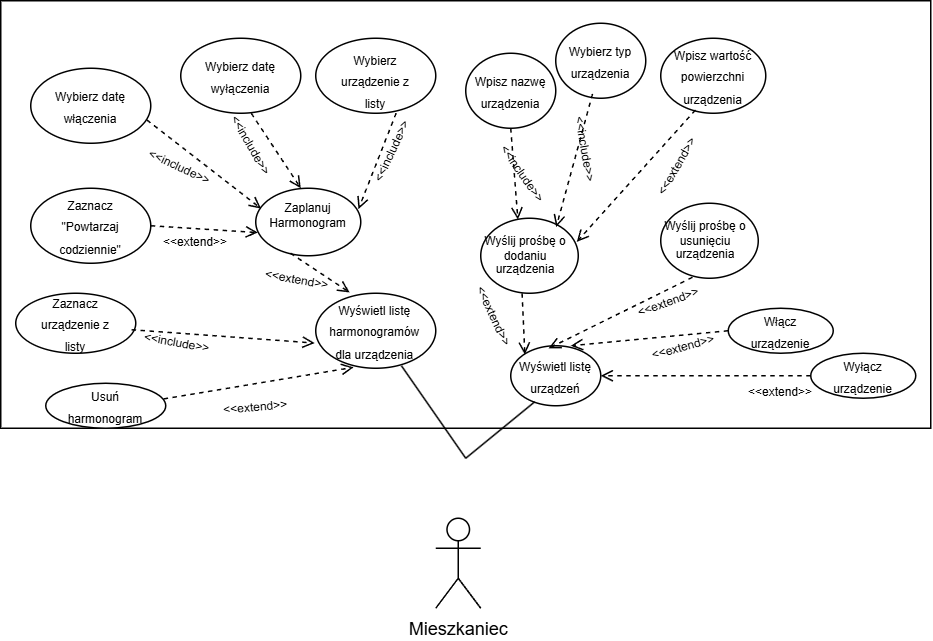
Diagram przypadków użycia przedstawia system zarządzania urządzeniami domowymi z perspektywy aktora Mieszkaniec. Mieszkaniec ten może planować harmonogramy pracy sprzętu, definiując czasy włączenia i wyłączenia, a także przeglądać i usuwać istniejące harmonogramy. Mieszkaniec wyświetla listę urządzeń oraz bezpośrednio steruje ich zasilaniem (włączanie/wyłączanie). Diagram obrazuje również proces zgłaszania próśb o dodanie nowych urządzeń (określając ich parametry) lub usunięcie istniejących z systemu.

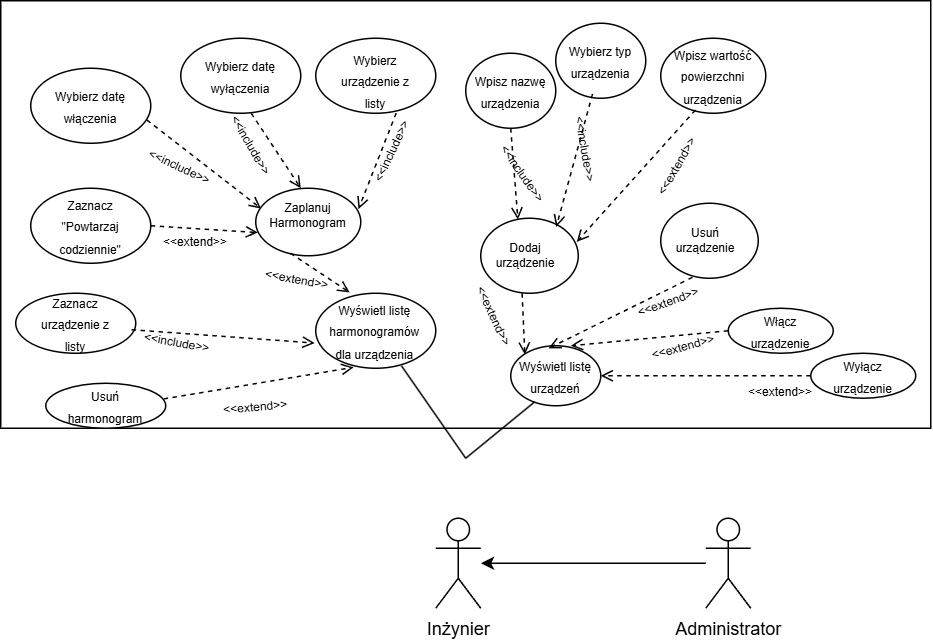
Diagram przedstawia praktycznie te same interakcje, tylko różnica jest taka, żę Inżynier/Administrator nie wysyłają prośbę o dodaniu/usunięciu urządzenia. a mają bezpośredni dostęp do tego.


# Diagramy klas
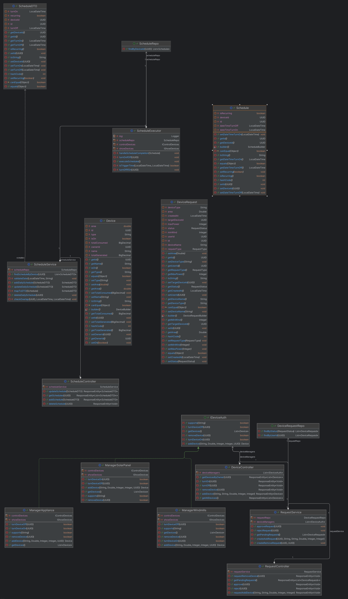

Diagram klas obrazuje kompletną strukturę backendu systemu, która łączy w sobie trzy kluczowe funkcjonalności: sterowanie urządzeniami, obsługę harmonogramów oraz obsługę wniosków. Widoczny na górze diagramu ScheduleExecutor wraz z ScheduleService polewo odpowiada za cykliczne przetwarzanie zadań czasowych, podczas gdy prawa dolna część diagramu (RequestController, RequestService) obsługuje system zgłoszeń, pozwalający użytkownikom na wysyłanie prośby  o dodanie lub usunięcie sprzętu. Całość spina warstwa kontrolerów wystawiających API oraz repozytoria zapewniające trwałość danych dla encji takich jak Device, Schedule czy DeviceRequest
# Diagramy interakcji

## Scenariusz 1


| Pole | Treść                                                                                                                                                                                                                                                                                                                                                                                                                                                                                                                                                                                                                 |
| :--- |:----------------------------------------------------------------------------------------------------------------------------------------------------------------------------------------------------------------------------------------------------------------------------------------------------------------------------------------------------------------------------------------------------------------------------------------------------------------------------------------------------------------------------------------------------------------------------------------------------------------------|
| **Nazwa:** | Włącz urządzenie                                                                                                                                                                                                                                                                                                                                                                                                                                                                                                                                                                                                      |
| **Numer:** | 1                                                                                                                                                                                                                                                                                                                                                                                                                                                                                                                                                                                                                     |
| **Twórca:** | Vladyslav Shpyhariev, Adam Jędrzejek                                                                                                                                                                                                                                                                                                                                                                                                                                                                                                                                                                                  |
| **Poziom ważności:** | Średni                                                                                                                                                                                                                                                                                                                                                                                                                                                                                                                                                                                                                |
| **Typ przypadku użycia:** | Podstawowy                                                                                                                                                                                                                                                                                                                                                                                                                                                                                                                                                                                                            |
| **Aktorzy:** | Mieszkaniec                                                                                                                                                                                                                                                                                                                                                                                                                                                                                                                                                                                                           |
| **Krótki opis:** | Wyłączone urządzenie mieszkaniec włączy                                                                                                                                                                                                                                                                                                                                                                                                                                                                                                                                                                               |
| **Warunki wstępne:** | Mieszkaniec jest zalogowany na konto, ma aktualny token,Mieszkaniec ma dostęp do tego urządzenia, urządzenie jest wyłączone                                                                                                                                                                                                                                                                                                                                                                                                                                                                                           |
| **Warunki końcowe:** | Urządzenie jest włączone                                                                                                                                                                                                                                                                                                                                                                                                                                                                                                                                                                                              |
| **Główny przepływ zdarzeń:** | 1.Użytkownik wybiera wyłączone urządzenie z listy w panelu sterowania i klika przycisk "ON".<br> 2. Aplikacja frontendowa wysyła żądanie do serwera, który deleguje zadanie do odpowiedniego menedżera sprzętu. <br> 3. System wysyła sygnał sterujący do modułu symulacji, aby fizycznie uruchomić urządzenie. <br> 4.Po potwierdzeniu włączenia przez symulację, serwer aktualizuje status urządzenia w bazie danych na aktywny. <br> 5.Backend zwraca do aplikacji potwierdzenie pomyślnego wykonania operacji. <br> 6. Interfejs użytkownika automatycznie odświeża listę, wyświetlając urządzenie jako włączone. |
| **Alternatywne przepływy zdarzeń:** | brak                                                                                                                                                                                                                                                                                                                                                                                                                                                                                                                                                                                                                  |
| **Specjalne wymagania:** | Mieszkaniec ma dostęp do tego urządzenia, urządzenie jest wyłączone                                                                                                                                                                                                                                                                                                                                                                                                                                                                                                                                                   |
| **Notatki i kwestie:** | brak                                                                                                                                                                                                                                                                                                                                                                                                                                                                                                                                                                                                                  |

## Diagram interakcji 1

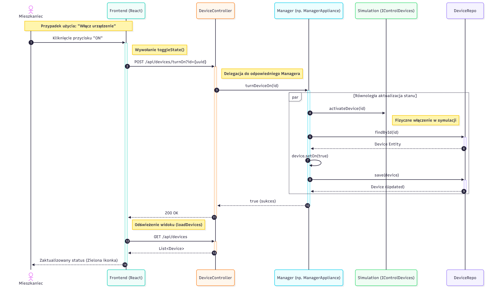
Diagram Sekwencji nr. 1

Diagram sekwencji przedstawia proces aktywacji urządzenia, w którym żądanie aktora Mieszkaniec z warstwy frontendowej jest przetwarzane przez kontroler i delegowane do odpowiedniego menedżera sprzętu. System realizuje operację dwutorowo, aktualizując status w bazie danych oraz wysyłając fizyczny sygnał do API symulacji, a następnie odświeża widok aplikacji po potwierdzeniu sukcesu.

## Scenariusz 2

| Pole | Treść                                                                                                                                                                                                                                                                                                                                                                                                                                                                                                                                                                                                                                                                             |
| :--- |:----------------------------------------------------------------------------------------------------------------------------------------------------------------------------------------------------------------------------------------------------------------------------------------------------------------------------------------------------------------------------------------------------------------------------------------------------------------------------------------------------------------------------------------------------------------------------------------------------------------------------------------------------------------------------------|
| **Nazwa:** | Dodaj urządzenie                                                                                                                                                                                                                                                                                                                                                                                                                                                                                                                                                                                                                                                                  |
| **Numer:** | 2                                                                                                                                                                                                                                                                                                                                                                                                                                                                                                                                                                                                                                                                                 |
| **Twórca:** | Vladyslav Shpyhariev, Adam Jędrzejek                                                                                                                                                                                                                                                                                                                                                                                                                                                                                                                                                                                                                                              |
| **Poziom ważności:** | Wysoki                                                                                                                                                                                                                                                                                                                                                                                                                                                                                                                                                                                                                                                                            |
| **Typ przypadku użycia:** | Podstawowy                                                                                                                                                                                                                                                                                                                                                                                                                                                                                                                                                                                                                                                                        |
| **Aktorzy:** | Administrator                                                                                                                                                                                                                                                                                                                                                                                                                                                                                                                                                                                                                                                                     |
| **Krótki opis:** | Administrator dodaje nowe urządzenie typu AGD                                                                                                                                                                                                                                                                                                                                                                                                                                                                                                                                                                                                                                     |
| **Warunki wstępne:** | Administator jest zalogowany, ma aktualny token                                                                                                                                                                                                                                                                                                                                                                                                                                                                                                                                                                                                                                   |
| **Warunki końcowe:** | Urządzenie zostanie dodane                                                                                                                                                                                                                                                                                                                                                                                                                                                                                                                                                                                                                                                        |
| **Główny przepływ zdarzeń:** | 1. Administrator wpisuje nazwę urządzenia (np. "Pralka").<br> 2.. Administrator wybiera typ "AGD (Zużywa)". <br> 3. Administrator wpisuje powierzchnię (m²) > 0. i klika przycisk Dodaj urządzenie <br> 4. System (FE) sprawdza poprawność znaków w nazwie (tylko litery, cyfry, spacje). <br> 5. System (FE)  sprawdza, czy nazwa nie jest duplikatem na liście pobranej z API. <br> 6.System (FE) sprawdza, czy powierzchnia jest liczbą dodatnią. <br> 7. System (FE) wysyła żądanie POST /api/devices. <br> 8. System (BE) weryfikuje dane i tworzy urządzenie w symulacji. <br> 9. System (FE) wyświetla komunikat "Urządzenie dodane pomyślnie!" i odświeża listę urządzeń. | 
| **Alternatywne przepływy zdarzeń:** | 4a. Administrator wpisał znaki specjale (np. "Pralka$"). Frontend przerywa proces i wyświetla alert("Nazwa zawiera niedozwolone znaki!"). <br> 5a. Administrator wpisał nazwę urządzenia która jest duplikatem i  już istnieje na liście. Frontend przerywa proces i wyświetla alert("Urządzenie o takiej nazwie już istnieje!..."). <br> 6a. Administrator wpisał "0" lub "-5". Frontend przerywa proces i wyświetla alert("Powierzchnia musi być większa od 0.").                                                                                                                                                                                                               |
| **Specjalne wymagania:** | brak                                                                                                                                                                                                                                                                                                                                                                                                                                                                                                                                                                                                                                                                              |
| **Notatki i kwestie:** | Skoro Administrator dodaje urządzenie typu AGD to system waliduje powierzchnię, gdyby dodawał urządzenie typu Wiatrak to ten krok byłby pominięty                                                                                                                                                                                                                                                                                                                                                                                                                                                                                                                                 |

## Diagram interakcji 2

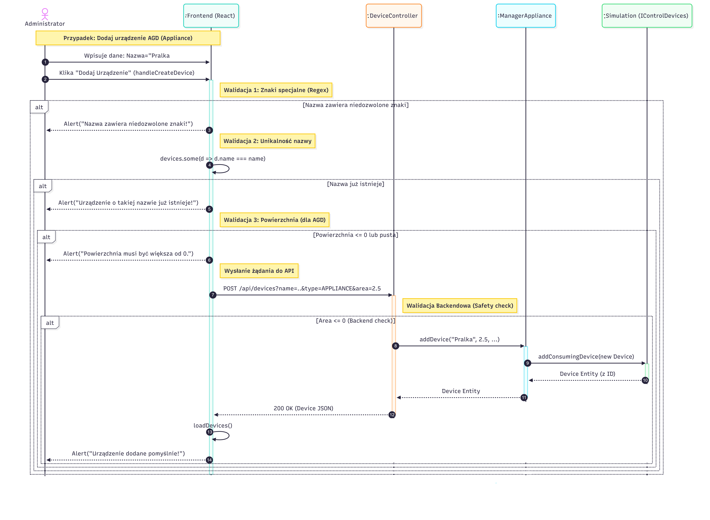

Diagram Sekwencji nr.2

Diagram przedstawia proces dodawania urządzenia przez Administratora, który rozpoczyna się od rygorystycznej walidacji danych po stronie interfejsu (sprawdzenie znaków specjalnych, unikalności nazwy oraz poprawności wartości liczbowych). 

Dopiero po pomyślnej weryfikacji frontend wysyła żądanie do serwera, gdzie kontroler deleguje zadanie utworzenia obiektu do odpowiedniego menedżera, inicjalizując sprzęt w symulacji i aktualizując bazę danych. Całość kończy się zwrotem potwierdzenia do aplikacji i automatycznym odświeżeniem listy urządzeń dla Administratora.


# Diagram czynności 

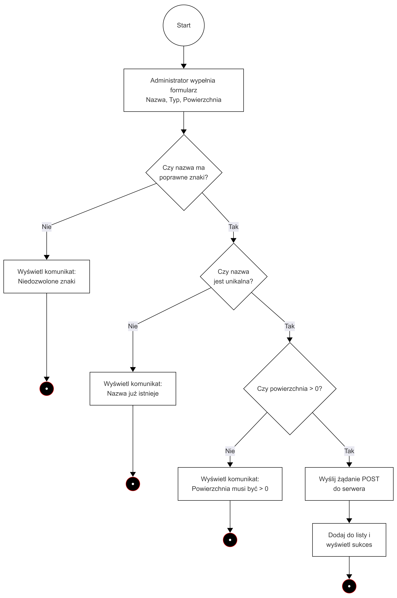
Diagram przedstawia sekwencyjny proces walidacji danych podczas dodawania urządzenia przez Administrtora, w którym niespełnienie któregokolwiek z warunków (poprawność znaków, unikalność nazwy, dodatnia powierzchnia) lub błąd serwera prowadzi do wyświetlenia odpowiedniego komunikatu i natychmiastowego zakończenia przepływu. 

Dopiero pozytywna weryfikacja na wszystkich krokach pozwala na pomyślne zakończenie operacji dodania urządzenia.

# Diagram maszyny stanowej [minimum 1]

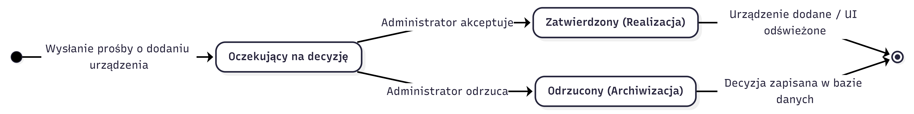

Diagram przedstawia cykl życia prośby o dodaniu urządzenia. Prośba rozpoczyna się w stanie oczekiwania, z którego pod wpływem decyzji administratora przechodzi do stanu zatwierdzenia (skutkującego zmianami w systemie) lub odrzucenia, co kończy jego proces przetwarzania.

# Diagram komponentów
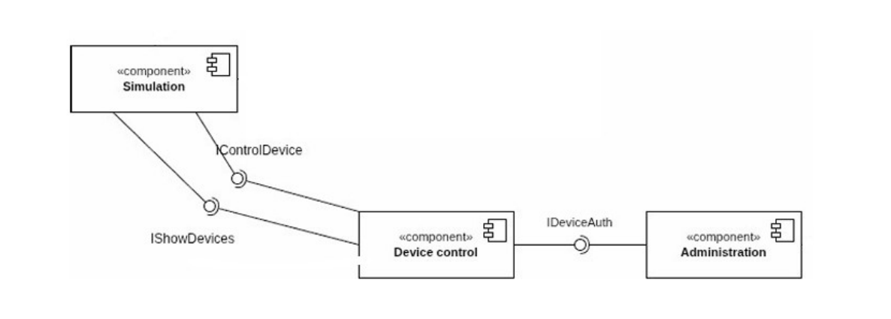

Nasz moduł komunikuje się z:

● Modułem Symulacji: Pobieranie danych o urządzeniach
symulacji.

● Modułem Administracji: Pobieranie uprawnień
użytkowników.

# Diagram pakietów

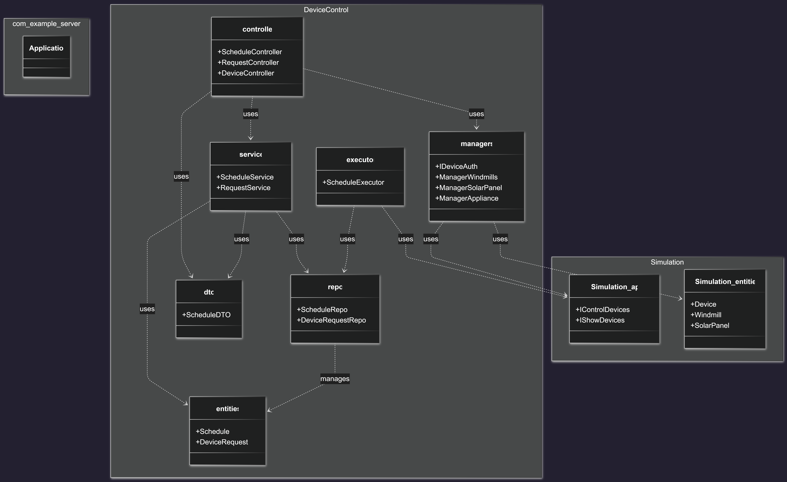

Przedstawiony diagram pakietów ilustruje modułową architekturę systemu, podzieloną na główną przestrzeń naszego modułu(DeviceControl) odpowiedzialną za logikę biznesową oraz część modułu symulacji(Simulation) obsługującą interfejsy urządzeń.

Wewnątrz głównego modułu widoczny jest podział na pakiety kontrolerów, serwisów i repozytoriów, współpracujących z dedykowanymi pakietami zarządczymi (managers) oraz pakietem zadań w tle (executor). Strzałki zależności ukazują przepływ danych i sterowania, w którym logika aplikacji wykorzystuje niższe warstwy oraz zewnętrzne API symulacji do zarządzania stanem urządzeń.

# Diagram przeglądu interakcji

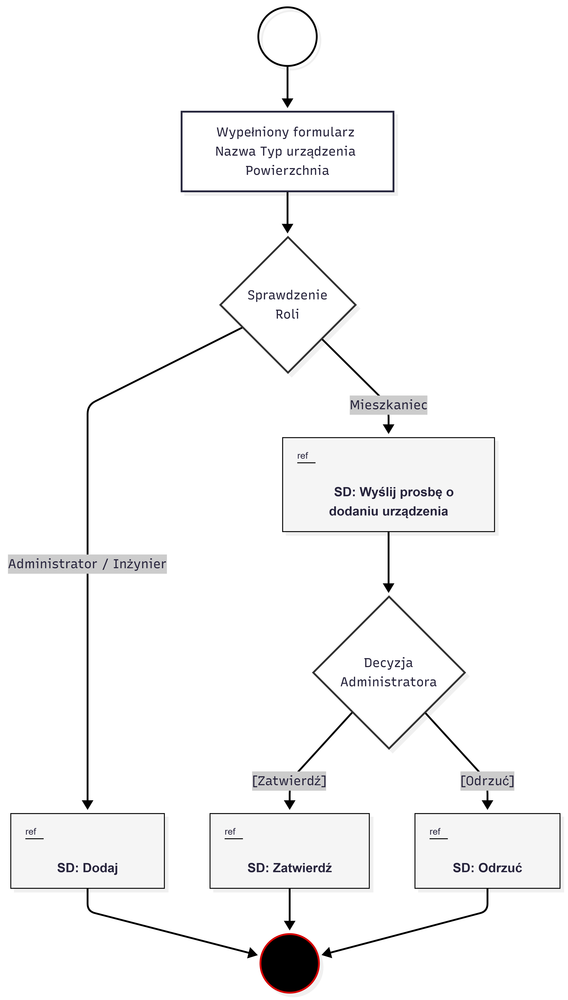
Diagram przeglądu interakcji ilustruje przepływ sterowania procesem dodawania urządzenia, w którym złożone sekwencje interakcji zostały zastąpione czytelnymi odnośnikami (ref) do osobnych diagramów.


# Diagram strukturalny

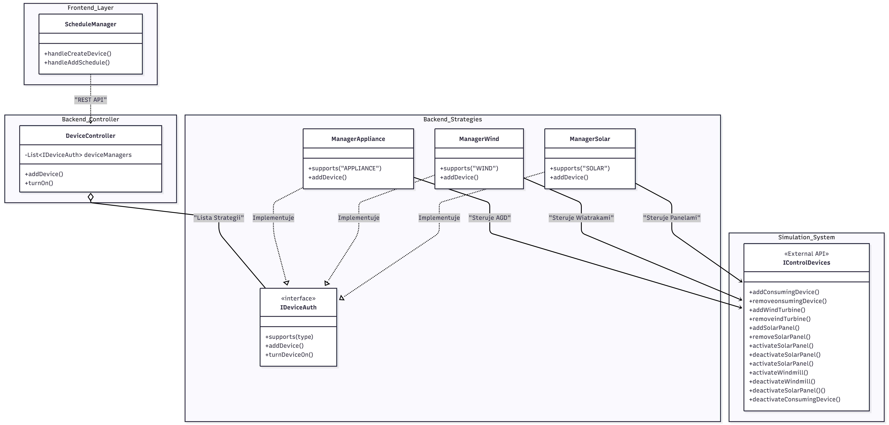

Diagram strukturalny obrazuje modułową architekturę systemu, w której DeviceController zarządza różnymi typami sprzętu (AGD, Wiatraki, Panele) wykorzystując wzorzec Strategii poprzez wspólny interfejs IDeviceAuth. Struktura ta zapewnia ścisłą separację warstwy prezentacji (ScheduleManager) od logiki biznesowej oraz zewnętrznego modułu symulacji (IControlDevices), odpowiedzialnego za fizyczne sterowanie urządzeniami.

# Diagram harmonogramowania

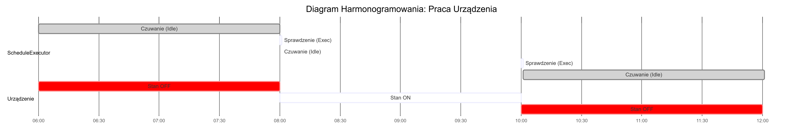
Ten diagram przedstawia stan obiektu urządzenie. Przed godziną 8 urządzenie jest wyłączone (OFF), był stworzony harmonogram Turn_On: 8:00, Turn_Off: 10:00. O godzinie 8:00 ScheduleExecutor wykrył że jest godzina o której ma sie włączyć, tak samo o 10:00 wykrył, że ma się wyłączyć urządzenie (na diagramie widoczne jako Sprawdzenie)
# Dokumentacja użytkownika

## Przypadek użycia 1 - Wyślij prośbę o dodaniu urządzenia

Żeby wysłać prośbę o dodaniu urządzenia najpierw musisz być zalogowanym na koncie z rolą Mieszkaniec i przejść do zakładki "Control"
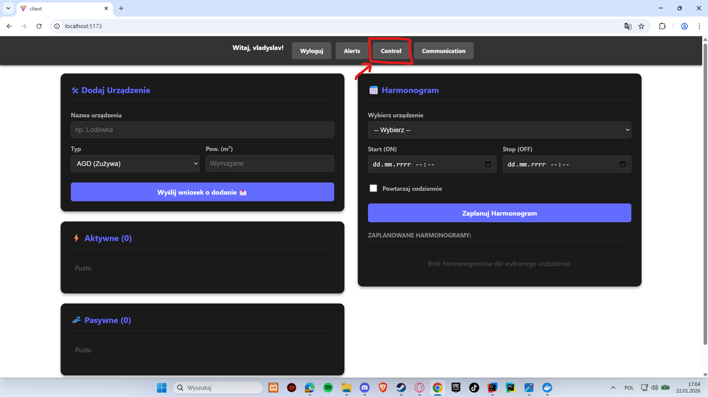

Teraz musisz wpisać nazwę w polu "Nazwa urządzenia", która może być w innym języku, zawierać cyfry ale nie może mieć specjalnych znaków (np. # @ $ itd.).
W "Typ" wybierz z listy typ urządzenia które chcesz dodać a w polu "Pow. (m^2)" musisz wpisać powierzchnię, która nie może być mniejsza od 0 albo zawierać litery, tylk cyfry musisz wpisać. Jeżeli wybrałeś typ urządzenia Wiatrak to nie możesz wpisać powierzchnię.
Sprawdź czy dobrze wszystko wpisałeś i możesz kliknąć przycisk "Wyślij wniosek o dodanie".

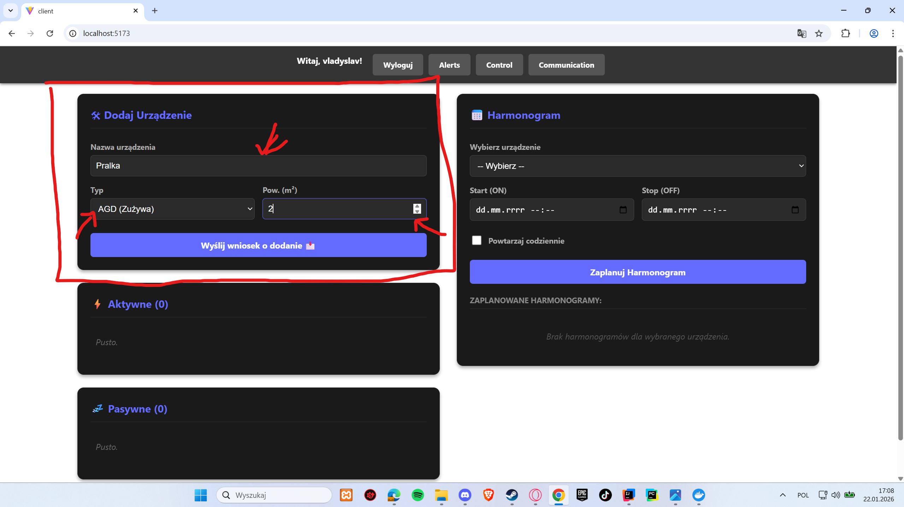

Powinieneś dostać komunikat "Wniosek o dodanie urządzenia został wysłany do Administratora"  co oznacza, że wszystko zrobiłeś dobrze. 

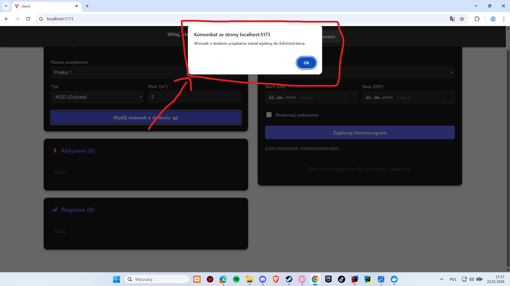

Po zatwierdzeniu przez Administratora twojego wniosku powinieneś zobaczyć nowe urządzenie na liście.

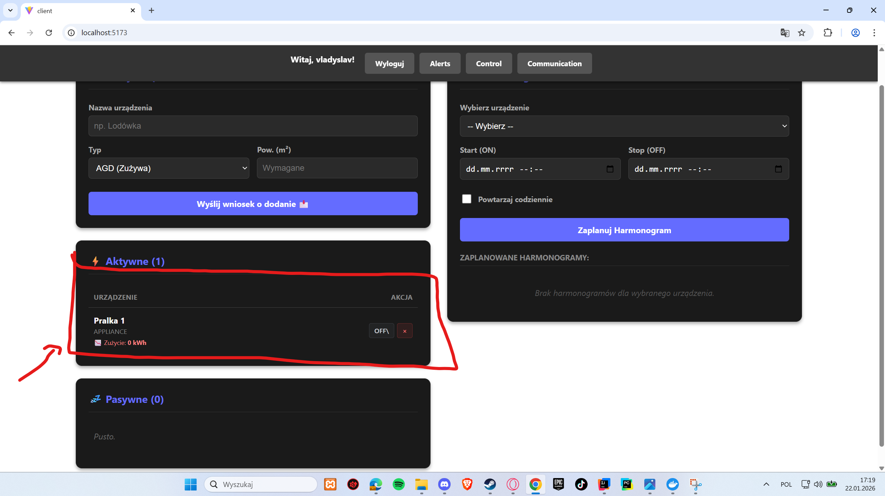

## Przypadek użycia 2 - Zaplanuj Harmonogram
Już jesteś zalogowany na koncie z rolą Mieszkaniec, masz już już dodane urządzenie i żeby zaplanować harmonogram
musisz wybrać urządzenie z listy w "Wybierz urządzenia", wybrać datę włączenia urządzenia "Start (ON)" i wyłączenia urządzenia "Stop(OFF)"
(przy czym muszą być co najmniej 1 minuta po czasie teraźniejszym).
Jeśli chcesz żeby harmonogram się powtarzał to zaznacz "Powtarzaj codziennie".
Jak wszystko już zrobiłeś kliknij "Zaplanuj Harmonogram".

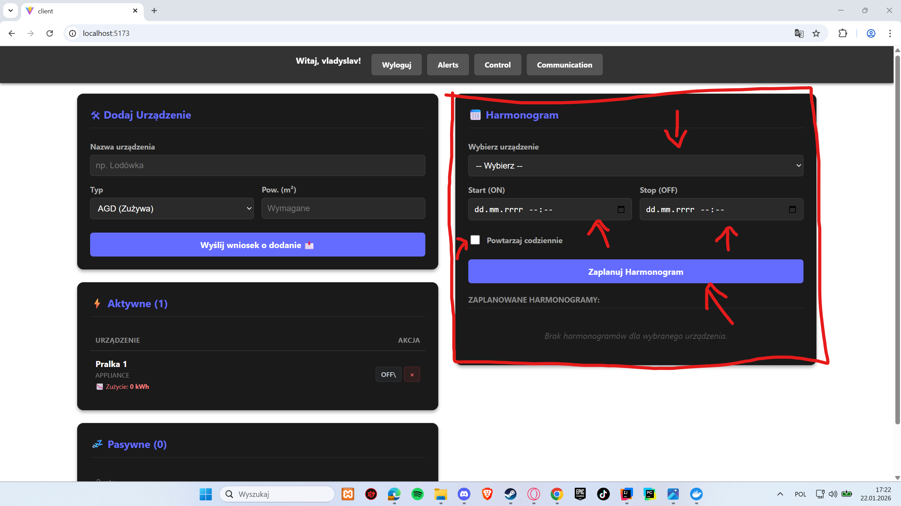

Powinieneś dostać komunikat "Zaplanowano!" co oznacza, że wszystko zrobiłeś dobrze

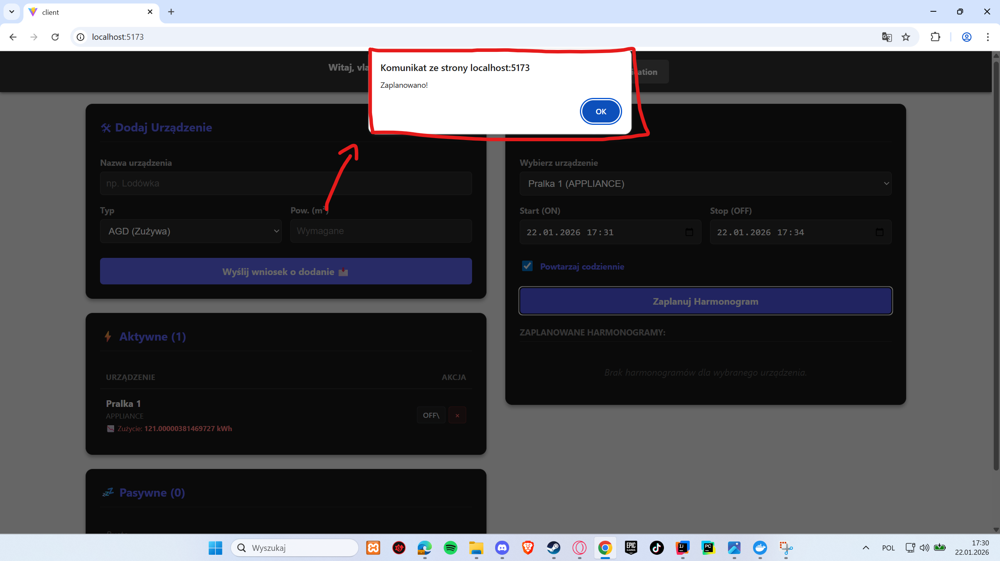

Kliknij Przycisk "OK" i zobacz że twój nowy harmonogram pojawił się na liście.

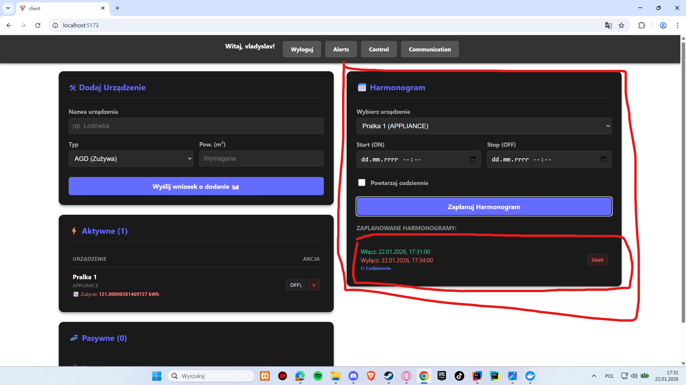


## Obsługa błędów, sytuacji wyjątkowych
System realizuje wielowarstwową obsługę błędów, walidując dane zarówno w warstwie prezentacji, jak i logiki biznesowej, co zapewnia spójność i bezpieczeństwo przetwarzanych informacji. 

Frontendowy komponent wstępnie weryfikuje poprawność formularzy, blokując wysyłkę pustych pól lub ujemnych wartości i natychmiast informując użytkownika o konieczności korekty.
Po stronie serwera wykorzystuje się bloki try-catch do przechwytywania wyjątków logicznych, zwracając klientowi czytelne komunikaty błędów zamiast awarii systemu. 

Dodatkowo serwisy backendowe dbają o integralność danych, blokując operacje naruszające logikę biznesową, np. nakładające się harmonogramy. Całość dopełnia wykorzystanie wzorca Strategii, który uniemożliwia wykonanie operacji na nieobsługiwanych typach urządzeń, chroniąc system przed niespójnym stanem.
## Podsumowanie
Wnioski: Nasz moduł spełnia wszystkie wymagania, które były założone przez architektów a nawet zrobione jest troszeczkę więcej (Obsługa wysyłania wniosków).

Uruchomienie:
Backend jest napisany w Spring Boot i się buduje razem z innymi modułami poprzez uruchomienie ServerApplication.java. 
Frontend jest napisany w React więc uruchamiamy w terminalu w folderze client "npm install" a później "npm run dev"  i z innymi modułami będzie widoczny i nasz na stronie

Rozbudowa:
Dzięki modularnej strukturze, dodanie nowego typu urządzenia 
wymaga jedynie implementacji interfejsu IDeviceAuth (czyli nowego Manager) oraz dodania odpowiedniej strategii, bez ingerencji w istniejący kod kontrolerów.


