# Moduł Komunikacji

## Projektanci: 
```
Rafał Kwaśniewski 251566
Aleksander Gencel 251517
```
# Dokumentacja techniczna

## Opis funkcjonalny

### Opis przeznaczenia modułu
Moduł komunikacji odpowiada za obsługę komunikacji między użytkownikami systemu — umożliwia tworzenie i zarządzanie ogłoszeniami oraz prowadzenie prywatnych konwersacji.

### Opis możliwości funkcjonalnych modułu

Możliwośći funkcjonalne modułu dla Mieszkańca, Inżyniera oraz Administratora

1. System musi umożliwiać każdemu użytkownikowi przeglądanie listy dostępnych ogłoszeń.
2. System musi umożliwiać każdemu użytkownikowi filtrowanie wyświetlanych ogłoszeń.
3. System musi umożliwiać wyświetlenie pełnych szczegółów ogłoszeń.
4. System musi umożliwiać każdemu użytkownikowi przeglądanie listy dostępnych dla niego konwersacji.
5. System musi wyświetlać wiadomości w ramach wybranej konwersacji.
6. System musi umożliwiać każdemu użytkownikowi rozpoczęcie nowej konwersacji.
7. System musi umożliwiać każdemu użytkownikowi wysłanie wiadomości w ramach istniejącej konwersacji do której należy.
8. System musi umożliwiać filtrowanie konwersacji tak, aby były widoczne tylko te, które są istotne dla danego użytkownika.


Dodatkowe możliwośći funkcjonalne modułu dla Inżyniera i Administratora

1. System musi umożliwiać użytkownikowi uprzywilejowanemu zamknięcie ogłoszenia.
2. System musi umożliwiać użytkownikowi uprzywilejowanemu utworzenie nowego ogłoszenia.

### Opis możliwości niefunkcjonalnych modułu
1. 99% wiadomości czatu musi zostać dostarczonych w czasie poniżej 1 sekundy od wysłania.
2. System musi obsługiwać co najmniej 10 jednoczesnych aktywnych użytkowników czatu na jeden budynek, bez znaczącego spadku
wydajności.
3. Powiadomienie o alercie SOS musi zostać wysłane do personelu w czasie poniżej 1 sekundy od jego aktywacji.
4. Interfejs czatu musi być intuicyjny i zgodny z ogólnie przyjętymi standardami.
5. Interfejs musi być dostępny na różnych urządzeniach i przeglądarkach.
6. Tylko uprawnieni użytkownicy mogą modyfikować dane (np. usuwać ogłoszenia).
7. System musi być dostępny dla użytkowników przez 99.5% czasu w ciągu miesiąca (z wyłączeniem planowanych okien konserwacyjnych).


# Diagramy przypadków użycia
## Diagram przypadków użycia dla Mieszkańca

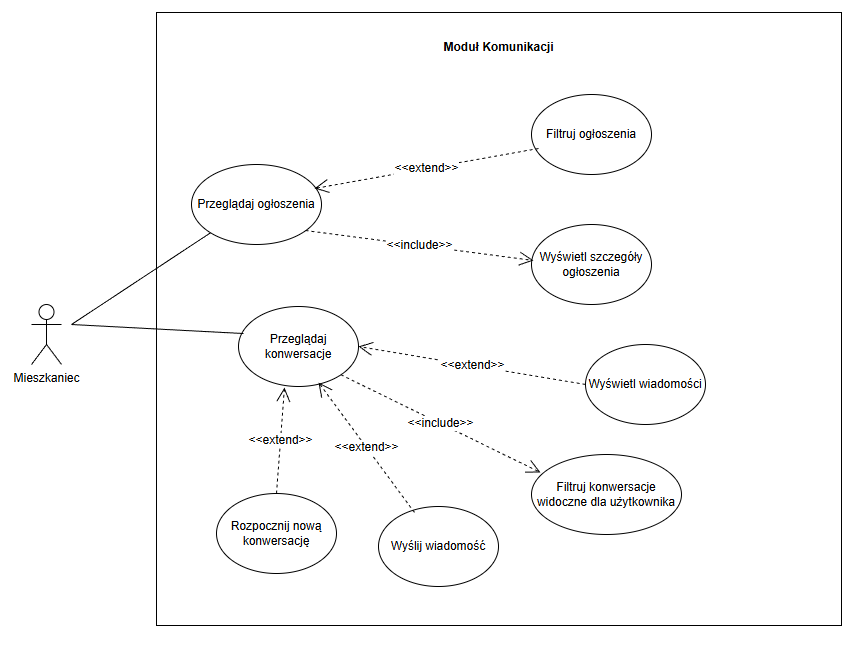
Diagram 1.

Diagram przedstawia funkcjonalności Modułu Komunikacji, z którego korzysta aktor Mieszkaniec. System umożliwia użytkownikowi dwa główne procesy: zarządzanie ogłoszeniami oraz komunikację bezpośrednią.

W obszarze ogłoszeń użytkownik może przeglądać ogłoszenia, co wiąże się z wyświetleniem ich szczegółów. Opcjonalnie Mieszkaniec może skorzystać z funkcji filtrowania ogłoszeń.

W obszarze komunikacji głównym punktem jest przypadek "Przeglądaj konwersacje". Zgodnie logiką diagramu, proces ten obejmuje obowiązkowe filtrowanie konwersacji widocznych dla użytkownika. Pozostałe działania mają charakter opcjonalny i pozwalają Mieszkańcowi na:

1. Wyświetlenie treści wiadomości,

2. Wysłanie wiadomości,

3. Rozpoczęcie nowej konwersacji.

Diagram czytelnie definiuje zakres systemu, oddzielając funkcje podstawowe od tych, które rozszerzają standardowy przepływ pracy użytkownika.


## Diagram przypadków użycia dla Administratora oraz Inżyniera
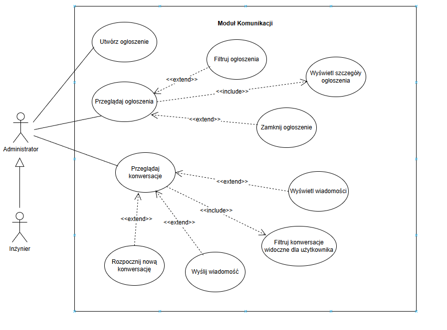
Diagram 2.

Diagram przedstawia funkcjonalności Moduł Komunikacji, w którym występują dwaj aktorzy: Administrator oraz Inżynier. Poprzez relację generalizacji wskazano, że Inżynier posiada wszystkie uprawnienia Administratora, co pozwala mu na pełną interakcję z systemem.

W ramach obsługi ogłoszeń, Administrator lub Inżynier może bezpośrednio utworzyć ogłoszenie oraz przeglądać ogłoszenia. Proces przeglądania jest powiązany z obowiązkowym wyświetleniem szczegółów ogłoszenia. Użytkownik ma także możliwość rozszerzenia tej czynności o filtrowanie ogłoszeń oraz funkcję zamknięcia ogłoszenia.

W sekcji komunikacji głównym punktem jest proces przeglądania konwersacji, który automatycznie obejmuje filtrowanie konwersacji widocznych dla użytkownika. Pozostałe działania mają charakter opcjonalny i pozwalają na:

1. Wyświetlenie treści wiadomości,

2. Wysłanie wiadomości,

3. Rozpoczęcie nowej konwersacji.

Diagram ten obrazuje kompleksowy system zarządzania informacjami i przepływem wiadomości, uwzględniając hierarchię uprawnień użytkowników technicznych.

# Diagramy klas
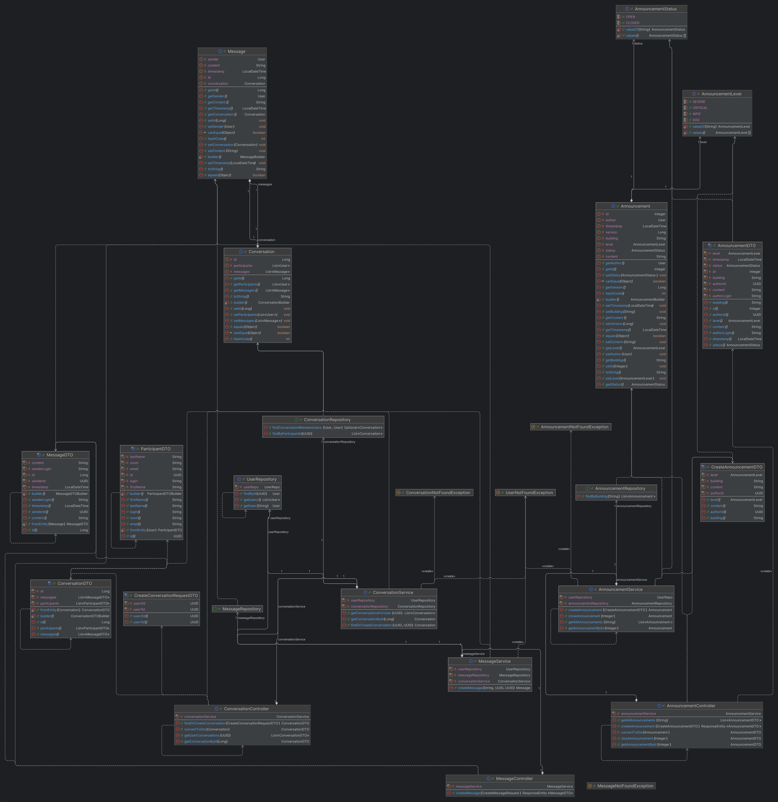
Diagram 3.

Diagram klas przedstawia strukturę backendową systemu, opartą na architekturze warstwowej Controller → Service → Repository oraz wzorcu DTO. System dzieli się na dwa główne pakiety logiczne:

1. Obsługa Ogłoszeń (Announcement)<Br>
Centralnym punktem jest klasa Announcement, która przechowuje treść, autora oraz statusy określone przez typy wyliczeniowe AnnouncementStatus i AnnouncementLevel.<Br>
AnnouncementController zarządza żądaniami zewnętrznymi, wykorzystując AnnouncementService do logiki biznesowej np. tworzenie, pobieranie ogłoszeń. Dane przesyłane są za pomocą dedykowanych obiektów, takich jak CreateAnnouncementDTO.

2. Obsługa Wiadomości i Konwersacji (Message i Conversation)<Br>
System modeluje relację między Conversation a wieloma obiektami Message. Każda konwersacja posiada listę uczestników.
Klasy ConversationService i MessageService odpowiadają za operacje takie jak rozpoczynanie nowych rozmów czy wysyłanie wiadomości.<br>
Repozytoria ConversationRepository, MessageRepository definiują metody dostępu do bazy danych, umożliwiając m.in. wyszukiwanie konwersacji przypisanych do konkretnego użytkownika.

3. Elementy Wspólne i Infrastruktura <br>
Bezpieczeństwo i Identyfikacja: System korzysta z UserRepository do weryfikacji tożsamości uczestników komunikacji.
Diagram uwzględnia dedykowane wyjątki, takie jak AnnouncementNotFoundException czy MessageNotFoundException, co zapewnia stabilność działania modułu.

# Diagramy interakcji
## Scenariusz 1


| Pole | Treść |
| :--- | :--- |
| **Nazwa:** | Przeglądaj ogłoszenia|
| **Numer:** | 1 |
| **Twórca:** | Rafał Kwaśniewski 251566, Aleksander Gencel 251517 - projektanci |
| **Poziom ważności:** | Wysoki |
| **Typ przypadku użycia:** | Niezbędny |
| **Aktorzy:** | Mieszkaniec |
| **Krótki opis:** | Umożliwia mieszkańcowi przeglądanie dostępnych ogłoszeń. |
| **Warunki wstępne:** | Mieszkaniec jest zalogowany i uwierzytelniony w aplikacji |
| **Warunki końcowe:** | Mieszkaniec widzi listę aktywnych ogłoszeń. |
| **Główny przepływ zdarzeń:** | 1.Mieszkaniec wybiera opcję „Przeglądaj ogłoszenia”. <br> 2.System filtruje ogłoszenia. <br> 3.System wyświetla listę ogłoszeń. |
| **Alternatywne przepływy zdarzeń:** | 3a.Brak ogłoszeń w budynku: System wyświetla komunikat „Brak ogłoszeń w Twoim budynku”|
| **Specjalne wymagania:** |1.System musi zapewnić szybkie ładowanie listy ogłoszeń (maks. 2 sekundy) <br> 2.System musi gwarantować, że mieszkaniec zobaczy tylko ogłoszenia przypisane do jego budynku.|

## Diagram interakcji dla scenariusza 1 - Przeglądaj ogłoszenia
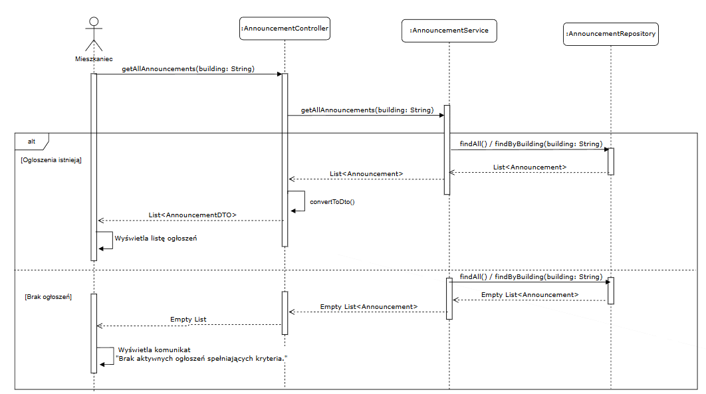
Diagram 4.

Diagram przedstawia sekwencję zdarzeń dla przypadku użycia polegającego na wyświetlaniu ogłoszeń przez mieszkańca, z uwzględnieniem podziału na logikę biznesową (Service) oraz dostęp do danych (Repository).

Diagram przedstawia proces pobierania i wyświetlania ogłoszeń. System został zaprojektowany w taki sposób, aby umożliwić użytkownikowi przeglądanie treści zarówno ogólnych, jak i filtrowanych pod kątem konkretnej lokalizacji.

Metoda `getAllAnnouncements(building: String)` została zaprojektowana tak, aby parametr building był opcjonalny. W sytuacji, gdy użytkownik nie wyspecyfikuje konkretnego budynku, system domyślnie pomija filtrowanie lokalne.
W zależności od przekazanych kryteriów, `AnnouncementRepository` wykonuje odpowiednią metodę wyszukiwania `findAll()` dla wszystkich aktywnych ogłoszeń lub `findByBuilding()` dla konkretnej lokalizacji.

Diagram przewiduje dwa scenariusze w zależności od wyniku wyszukiwania:

1. Repozytorium zwraca listę obiektów. Kontroler dokonuje konwersji danych na format transferowy (convertToDto) i przesyła listę do interfejsu użytkownika, gdzie zostaje ona wyświetlona.

2. W przypadku pustej listy z bazy danych, system zwraca pusty wynik, a użytkownikowi wyświetlany jest komunikat informacyjny: „Brak aktywnych ogłoszeń spełniających kryteria”.

## Scenariusz 2

| Pole | Treść |
| :--- | :--- |
| **Nazwa:** | Utwórz ogłoszenie |
| **Numer:** | 2 |
| **Twórca:** | Rafał Kwaśniewski 251566, Aleksander Gencel 251517 - projektanci|
| **Poziom ważności:** | Wysoki |
| **Typ przypadku użycia:** | Niezbędny |
| **Aktorzy:** | Administrator, Inżynier  |
| **Krótki opis:** | Umożliwia Administratorowi lub Inżynierowi stworzenie nowego ogłoszenia, które może zostać przypisane do wybranego budynku i będzie widoczne dla użytkowników. |
| **Warunki wstępne:** | Aktor jest zalogowany i uwierzytelniony w systemie. |
| **Warunki końcowe:** | Nowe ogłoszenie zostaje zapisane i opublikowane dla użytkowników. |
| **Główny przepływ zdarzeń:** | 1.Aktor wybiera funkcję „Panel Admina”.<br> 2.System wyświetla formularz tworzenia ogłoszenia.<br> 3.Aktor wprowadza podstawowe dane ogłoszenia. <br>4.Aktor potwierdza utworzenie ogłoszenia („Opublikuj Ogłoszenie”).<br>5.System waliduje poprawność danych<br>6.System zapisuje ogłoszenie w bazie danych.<br>7.System publikuje ogłoszenie dla mieszkańców.<br>8.System wyświetla Aktorowi komunikat o poprawnym utworzeniu ogłoszenia. |
| **Alternatywne przepływy zdarzeń:** | 5a. Walidacja ogłoszenia nie powiodła się:<br>&emsp;&emsp; 1.System wykrywa błędne dane wejściowe.<br>&emsp;&emsp;&nbsp;2.System wyświetla komunikat o błędzie.<br>&emsp;&emsp;&nbsp;3.Administrator poprawia dane i powraca do kroku 5.|
| **Specjalne wymagania:** | 1.Publikacja nowego ogłoszenia musi nastąpić maksymalnie w czasie 1–2 sekund po potwierdzeniu tworzenia.<br> 2.Administrator może dodać ogłoszenie tylko do budynków, do których ma przydzielone uprawnienia. |

## Diagram interakcji dla scenariusza 2 - Utwórz ogłoszenie
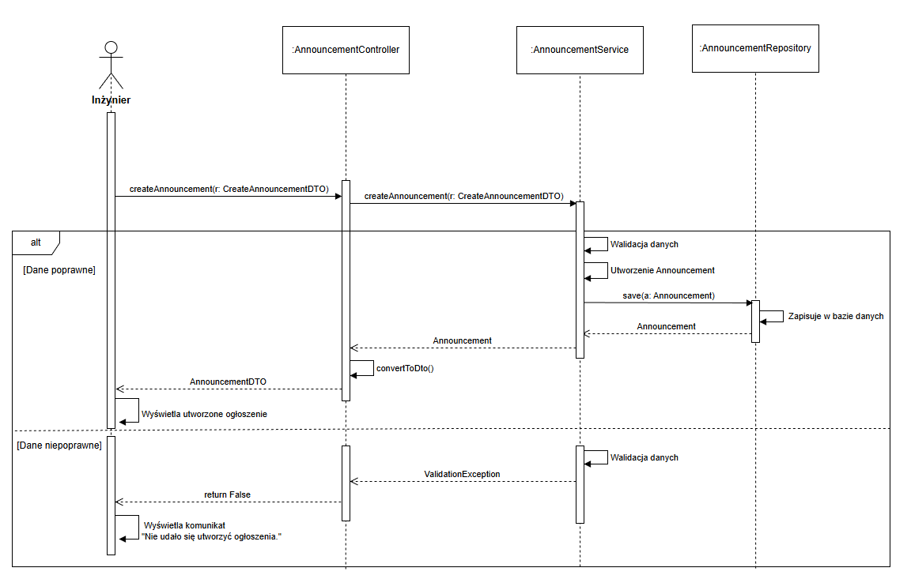
Diagram 5.

Diagram przedstawia sekwencję zdarzeń dla przypadku użycia polegającego na dodawaniu nowego ogłoszenia przez Inżyniera, z uwzględnieniem walidacji danych oraz podziału na warstwy systemowe.

Diagram ilustruje proces zapisu nowych treści w systemie. Architektura zapewnia separację danych wejściowych od obiektów bazodanowych poprzez wykorzystanie dedykowanych obiektów transferowych (DTO).

Proces rozpoczyna się od przesłania przez Inżyniera obiektu CreateAnnouncementDTO do kontrolera. Następnie żądanie trafia do `AnnouncementService`, gdzie kluczowym krokiem przed jakimkolwiek zapisem jest przeprowadzenie wewnętrznej walidacji danych pod kątem ich poprawności i kompletności.

Diagram przewiduje dwa scenariusze w zależności od wyniku walidacji:

1. Serwis tworzy obiekt encji i przekazuje go do `AnnouncementRepository`, które wykonuje operację `save(a: Announcement)` w bazie danych. Po pomyślnym zapisie, kontroler konwertuje dane na format transferowy (convertToDto), a system wyświetla użytkownikowi nowo utworzone ogłoszenie.

2. W przypadku wykrycia błędów, serwis rzuca wyjątek. Kontroler przerywa proces zapisu i zwraca wartość False, co skutkuje wyświetleniem użytkownikowi komunikatu błędu: „Nie udało się utworzyć ogłoszenia”.

# Diagram czynności dla Mieszkańca

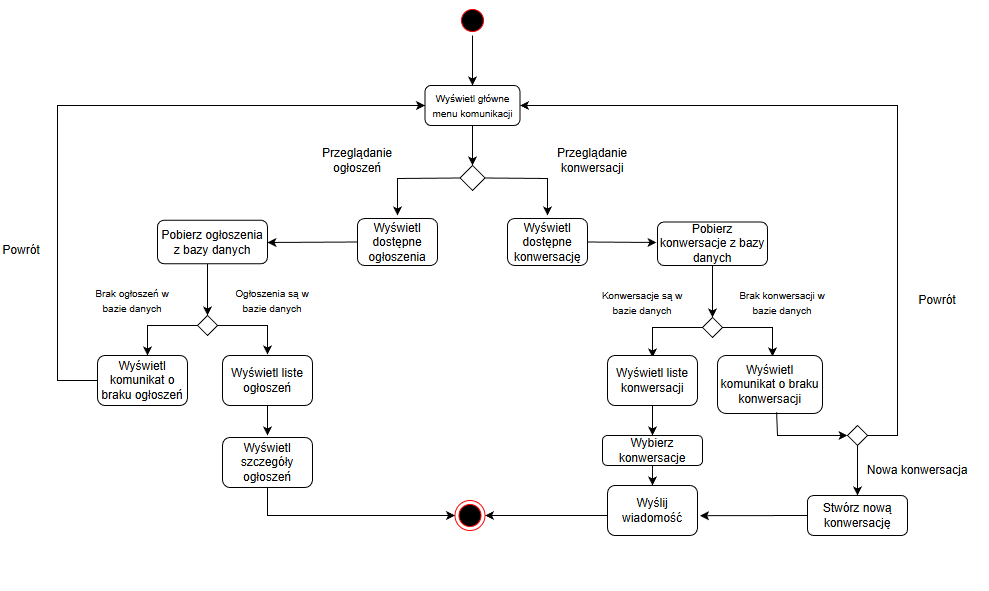
Diagram 6.

Diagram przedstawia przepływ czynności wykonywanych przez Mieszkańca w ramach modułu komunikacji. System oferuje dwie główne ścieżki interakcji: wyświetlanie ogłoszeń oraz obsługę konwersji, zapewniając użytkownikowi dostęp do informacji i narzędzi komunikacyjnych.

Proces rozpoczyna się od wyświetlenia głównego menu komunikacji, z którego użytkownik może wybrać jedną z dwóch ścieżek postępowania.

Ścieżka 1. Przeglądanie ogłoszeń: W ramach tej ścieżki system inicjuje pobieranie danych z bazy. Dalszy przebieg zależy od dostępności rekordów:

1. W przypadku braku ogłoszeń wyświetlany jest stosowny komunikat informacyjny, a użytkownik ma możliwość przejś z powrotem do menu głównego.

2. W przypadku obecności ogłoszeń: System prezentuje listę aktywnych ogłoszeń wraz z ich szczegółami co kończy proces w tym module.

Ścieżka 2. Przeglądanie konwersacji: Jeśli użytkownik wybierze sekcję wiadomości, system pobiera dostępne konwersacje z bazy danych:

1. W przypadku braku istniejących konwersacji wyświetlany jest komunikat o braku konwersacji. Użytkownik może wówczas zdecydować o powrocie do menu głównego lub wybrać opcję „Nowa konwersacja”.
 Po wybraniu opcji nowej konwersacji, system tworzy nowy wątek, co również prowadzi do etapu wysyłania wiadomości.

2. W przypadku gdy konwersacje istnieją wyświetlana jest lista aktywnych czatów. Użytkownik wybiera interesującą go konwersację a następnie ma możliwość wysłania wiadomości w ramach tej konwersacji.

Diagram kończy się w momencie wyświetlenia ogłoszeń lub wysłania wiadomości w ramach wybranej konwersacji. Całość przepływu uwzględnia mechanizmy powrotne, które pozwalają Mieszkańcowi na swobodną nawigację między funkcjami modułu w przypadku braku danych w bazie.


# Diagram maszyny stanów obiektu ogłoszenia

 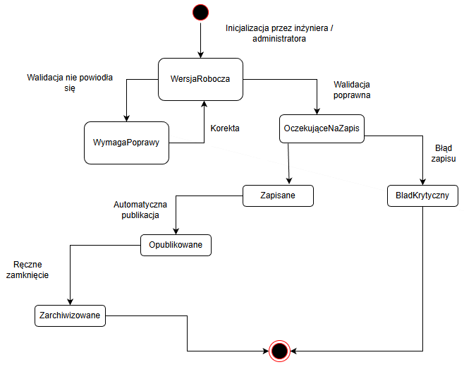
 Diagram 7.

Diagram przedstawia pełny cykl życia obiektu Ogłoszenie, od jego inicjalizacji po archiwizację lub wystąpienie błędów krytycznych.

Obiekt rozpoczyna swój cykl w stanie WersjaRobocza po utworzeniu przez Inżyniera lub Administratora.

Nieudana walidacja przenosi obiekt do stanu WymagaPoprawy, skąd po korekcie może on wrócić do wersji roboczej. Poprawna walidacja kieruje obiekt do stanu OczekująceNaZapis.

Na etapie zapisu może wystąpić BladKrytyczny kończący proces lub przejście do stanu Zapisane.

Ze stanu zapisu następuje automatyczna publikacja (Opublikowane). Zakończenie cyklu życia ogłoszenia następuje poprzez przejście do stanu Zarchiwizowane, co może być wywołane poprzez ręcze zamknięcie ogłoszenia przez uprawnioną osobę.

# Diagram komponentów

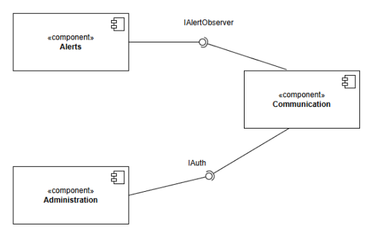
Diagram 8.

Powiązanie z Modułem Alertów: Moduł ten jest kanałem mechanizmu publikacji.
Implementujemy jego interfejs IAlertObserver i po otrzymaniu obiektu Alert, decydujemy o
jego trasie np. do kogo wysłać powiadomienie.

Powiązanie z Modułem Administracyjnym: Moduł ten udostępnia mechanizmy autoryzacji oraz
zarządzania rolami użytkowników w systemie. Nasz moduł wykorzystuje jego interfejs IAuth do
weryfikacji tożsamości i poziomu uprawnień użytkownika przed dopuszczeniem go do funkcji
komunikacyjnych.

# Diagram pakietów

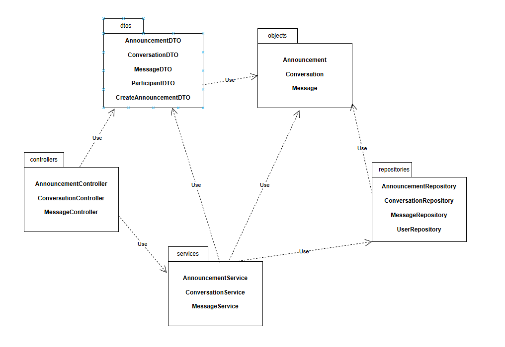
Diagram 9.

Diagram obrazuje podział systemu na pakiety funkcjonalne. Każdy pakiet stanowi niezależną warstwę odpowiedzialną za inny aspekt działania aplikacji.

# Diagram przeglądu interakcji

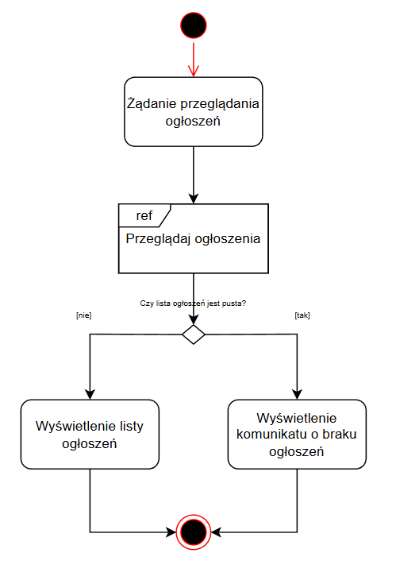
Diagram 10.

Diagram przedstawia logiczny przepływ działań podczas próby wyświetlenia ogłoszeń przez użytkownika.Element „Przeglądaj ogłoszenia” pełni funkcję odnośnika do szczegółowego diagramu interakcji o tej samej nazwie. Diagram ten opisuje techniczne kroki pobierania danych z bazy.
Po pobraniu danych system sprawdza warunek: "Czy lista ogłoszeń jest pusta?".<vr>
Jeśli lista zawiera elementy, następuje "Wyświetlenie listy ogłoszeń".<br>
Jeśli lista jest pusta, system generuje "Wyświetlenie komunikatu o braku ogłoszeń".

# Diagram strukturalny

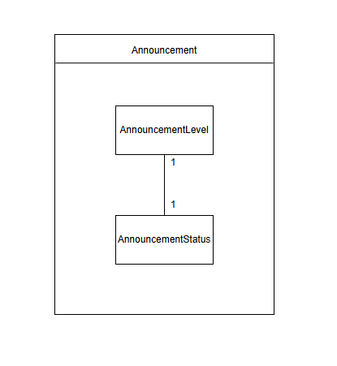
Diagram 11.

Diagram obrazuje wewnętrzną strukturę i powiązania danych w obrębie obiektu ogłoszenia Announcement.

# Diagram harmonogramowania

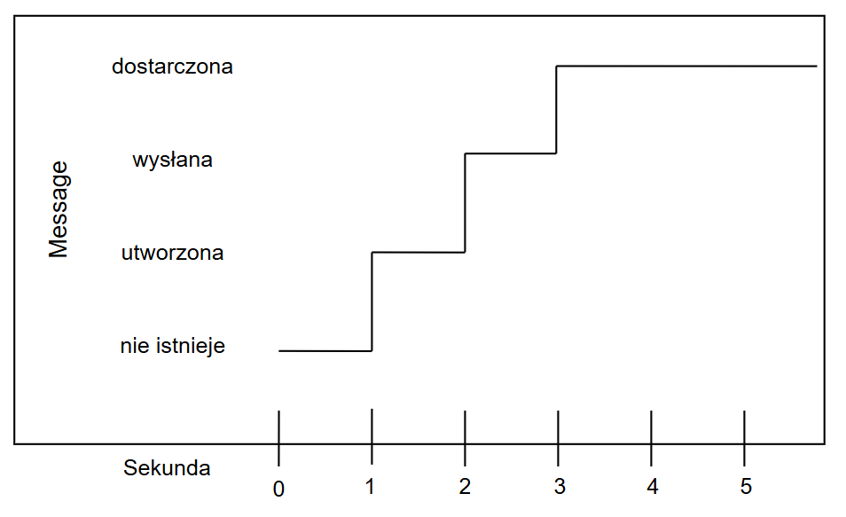
Diagram 12.

Diagram przedstawia zmiany stanów obiektu klasy Message w funkcji czasu, obrazując proces od momentu powstania wiadomości do jej finalnego doręczenia.

# Dokumentacja użytkownika

## Przypadek użycia 1 oraz 2 - Przeglądaj ogłoszenia oraz Filtruj ogłoszenia

Przypadek użycia zakłada że użytkownik posiada aktywne konto w systemie.


Zaloguj się do systemu wpisując poprawny login oraz hasło a następnie naciśnij przycisk `Zaloguj się` przedstawiony na rysunku poniżej. 

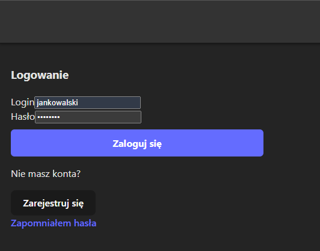
Zrzut ekranu 1.

Po uwierzytelnieniu zostanie wyświetlony główny panel kontroli urządzeń.
Następnie należy na górnym pasku nawigacyjnym nacisnąć przycisk `Communication` zaznaczony czerwoną ramką na poniższym rysunku.

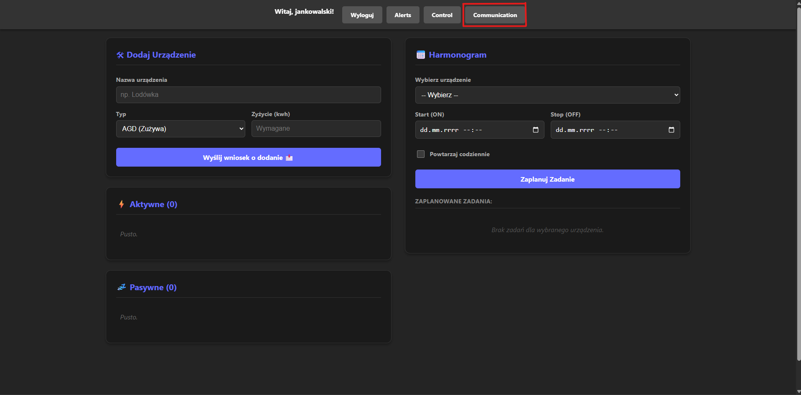
Zrzut ekranu 2.

Przycisk ten przeniesie nas do modułu komunikacji w którym zostanie wyświetlony panel przeglądania ogłoszeń widoczny na poniższym rysunku.

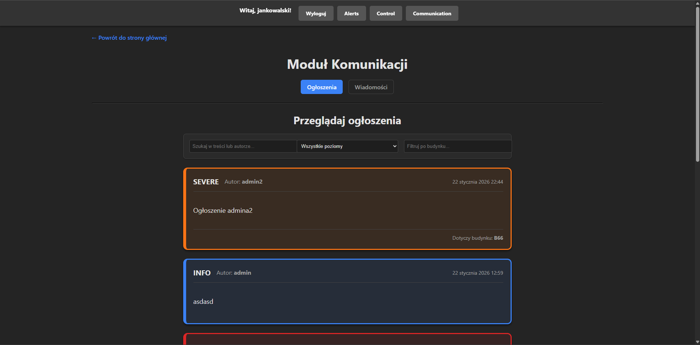
Zrzut ekranu 3.

System oferuje funkcję filtrowania ogłoszeń w oparciu o trzy kryteria: treść, stopień ważności oraz budynek, którego dotyczy informacja.

Aby przefiltrować ogłoszenia stosując kryterium treści należy w pole `Szukaj w treści lub autorze` wpisać interesującą nas frazę. Przykład takowego filtrowania zaprezentowano na rysunku poniżej.

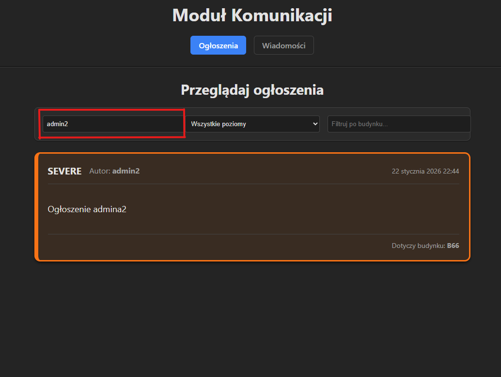
Zrzut ekranu 4.

Aby przefiltrować ogłoszenia stosując kryterium stopnia ważności należy z listy rozwijanej wybrać interesujący nas poziom ważności. Przykład takiego filtrowania zaprezentowano na rysunkach poniżej.

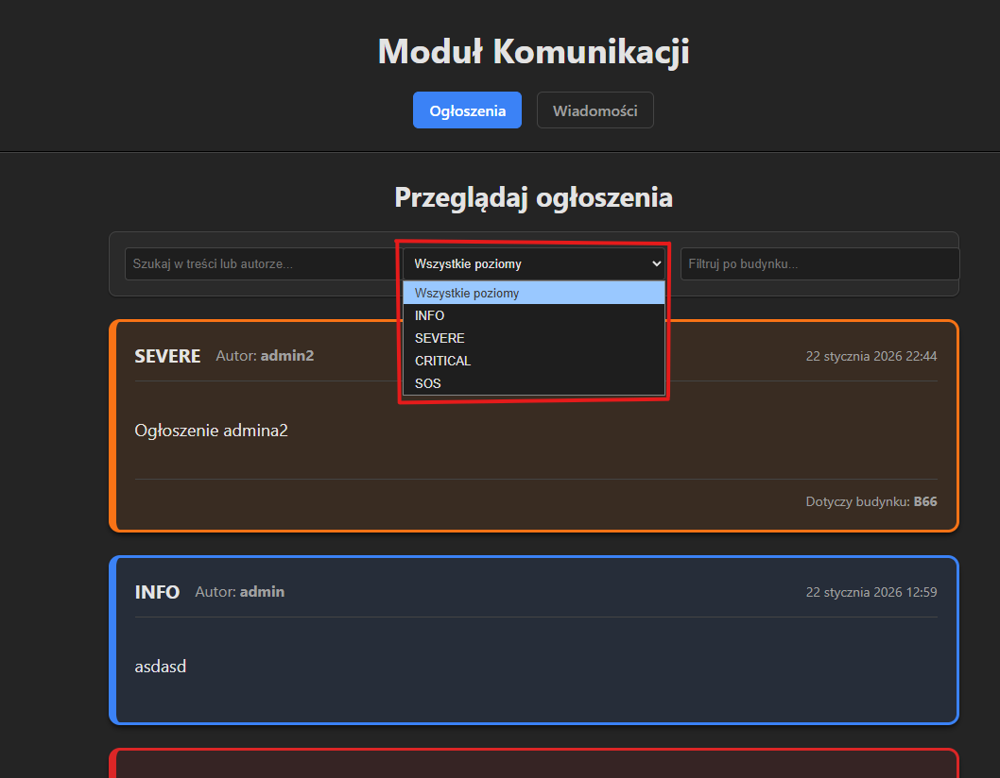
Zrzut ekranu 5.

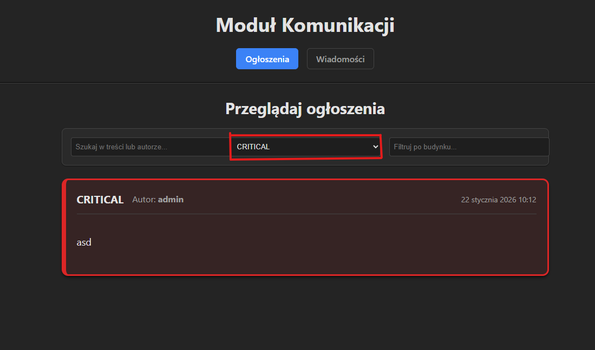
Zrzut ekranu 6.

Aby przefiltrować ogłoszenia stosując kryterium budynku należy w pole `Filtruj po budynku` wpisać interesujący nas budynek. Przykład takiego filtrowania zaprezentowano na rysunku poniżej.

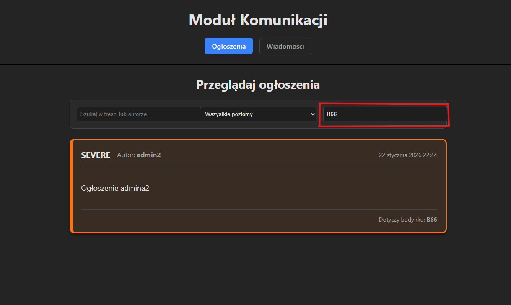
Zrzut ekranu 7.

## Przypadek użycia 3 oraz 4 - Przeglądaj konwersacje oraz Wyślij wiadomość

Przypadek użycia zakłada że użytkownik posiada aktywne konto w systemie.


Zaloguj się do systemu wpisując poprawny login oraz hasło a następnie naciśnij przycisk `Zaloguj się` przedstawiony na rysunku poniżej. 


Zrzut ekranu 8.

Po uwierzytelnieniu zostanie wyświetlony główny panel kontroli urządzeń.
Następnie należy na górnym pasku nawigacyjnym nacisnąć przycisk `Communication` zaznaczony czerwoną ramką na poniższym rysunku.


Zrzut ekranu 9.

Przycisk ten przeniesie nas do modułu komunikacji w którym zostanie wyświetlony panel przeglądania ogłoszeń widoczny na poniższym rysunku.


Zrzut ekranu 10.

Następnie klikamy przycisk `Wiadomości` znajdujący się na głównym panelu modułu komunikacji, który przedstawiono na rysunku poniżej.

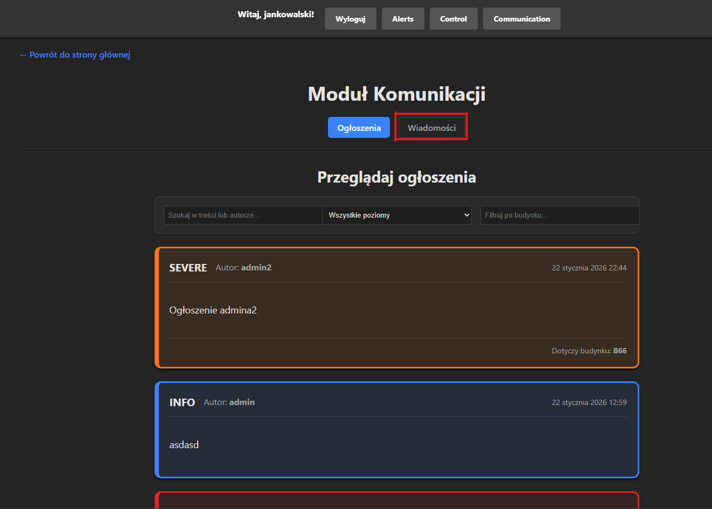
Zrzut ekranu 11.

Zostaniemy przeniesieni do widoku dostępnych konwersacji. Następnie aby wyświetlić porządaną konwersację należy wybrać ją z listy znajdującej się po lewej stronie ekranu, którą przedstawiono na rysunku poniżej. 

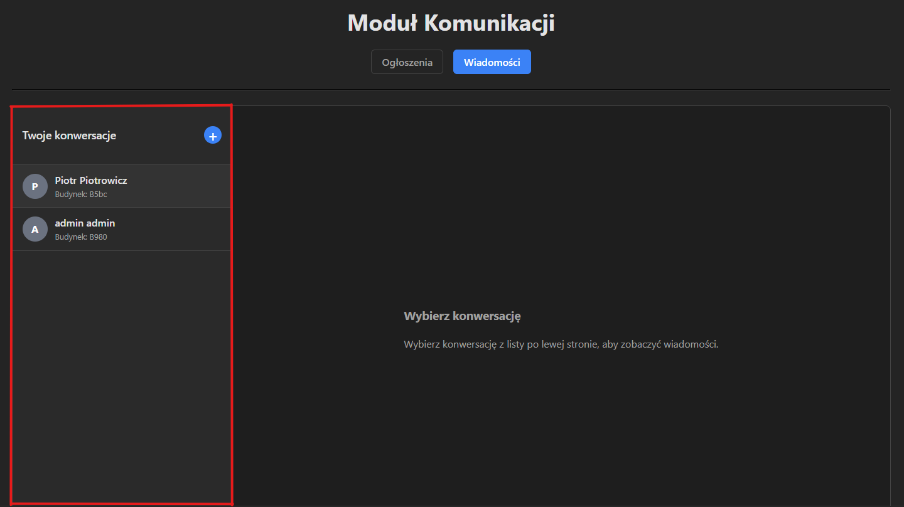
Zrzut ekranu 12.

Wybór konkretnej rozmowy powoduje przejście do okna czatu, w którym wyświetlana jest pełna historia korespondencji. Aby wysłać nową wiadomość, należy wprowadzić jej treść w polu `Napisz wiadomość...` a następnie wcisnać przycisk `Wyślij`, zaprezentowany na poniższym rysunku.

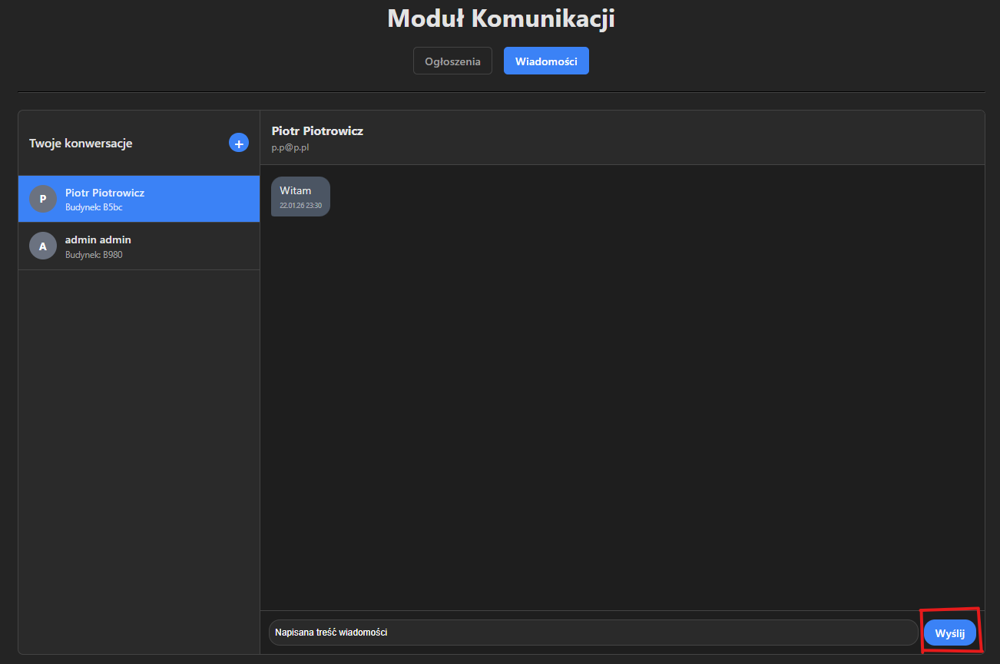
Zrzut ekranu 13.

Finalnie nasza wiadomość zostanie wysłana i wyświetli się w oknie czatu co zaprezentowano na rysunku poniżej.

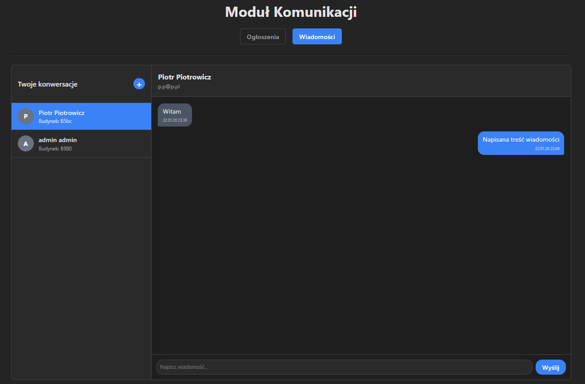
Zrzut ekranu 14.

## Obsługa błędów, sytuacji wyjątkowych
System został zaprojektowany z uwzględnieniem mechanizmów gwarantujących spójność danych oraz kontrolę dostępu do kluczowych funkcjonalności.

1. Kontrola dostępu i autoryzacja
Bezpieczeństwo modułu opiera się na hierarchii uprawnień:<br>
Tylko użytkownicy posiadający status użytkownika uprzywilejowanego (Administrator lub Inżynier) mają techniczne uprawnienie do tworzenia ogłoszeń.<br>
Każda akcja (wysłanie wiadomości, utworzenie ogłoszenia) jest powiązana z konkretnym identyfikatorem użytkownika (authorId lub sender), co zapobiega podszywaniu się pod inne osoby w systemie.

2. Walidacja wprowadzanych danych
Zastosowano reguły walidacji na poziomie warstwy biznesowej, aby zapobiec przesyłaniu niekompletnych lub błędnych informacji:<br>
System uniemożliwia wysłanie pustej wiadomości. Każdy obiekt Message musi posiadać treść przed zapisem w bazie danych.<br>
Podczas tworzenia ogłoszenia przez użytkownika uprzywilejowanego, system weryfikuje pole tekstowe sprawdzając czy zawartość ogłoszenia mieścić się w przedziale od 5 do 1000 znaków.

Wykorzystanie obiektów transferu danych, takich jak CreateAnnouncementDTO czy MessageDTO, pozwala na wstępną filtrację i formatowanie danych, zanim trafią one do logiki procesowej systemu.

## Podsumowanie

System stanowi moduł komunikacyjny aplikacji wspierającej komunikację pomiędzy użytkownikami budynku. Umożliwia on publikowanie ogłoszeń oraz prowadzenie bezpośredniej wymiany wiadomości pomiędzy użytkownikami systemu.

Użytkownicy systemu uwierzytelniają się i posiadają przypisane role (np. RESIDENT, ADMIN), które determinują dostęp do poszczególnych funkcjonalności. Każdy zalogowany użytkownik ma możliwość przeglądania aktywnych ogłoszeń, filtrowania ich według poziomu ważności, budynku oraz treści.

Administratorzy dodatkowo mogą tworzyć nowe ogłoszenia oraz zamykać istniejące, co powoduje ich archiwizację i ukrycie przed użytkownikami końcowymi.

Moduł wiadomości umożliwia prowadzenie prywatnych konwersacji pomiędzy użytkownikami. Użytkownik może:

1. Przeglądać listę swoich konwersacji,

2. Rozpocząć nową konwersację z innym użytkownikiem,

3. Wysyłać i odbierać wiadomości w czasie rzeczywistym logicznie, z zachowaniem kolejności czasowej.

Wiadomości są zapisywane w systemie wraz z informacją o nadawcy, odbiorcy oraz znaczniku czasu, a interfejs użytkownika automatycznie aktualizuje widok rozmowy.

System posiada warstwę zabezpieczeń opartą o role użytkowników, które kontrolują dostęp do poszczególnych endpointów API. Dzięki temu zapewniona jest kontrola uprawnień oraz bezpieczeństwo komunikacji.

Całość systemu została zaprojektowana w architekturze klient–serwer, gdzie frontend odpowiada za prezentację danych i interakcję z użytkownikiem, a backend realizuje logikę biznesową, walidację danych oraz trwałe przechowywanie informacji.

