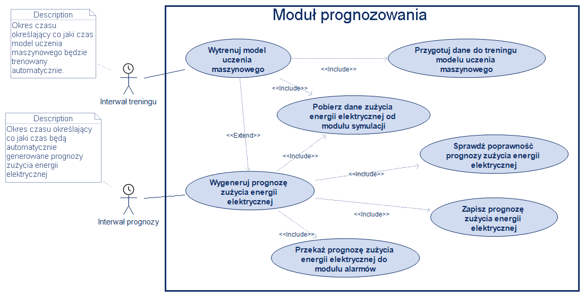
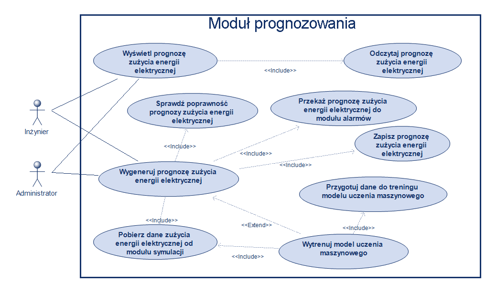
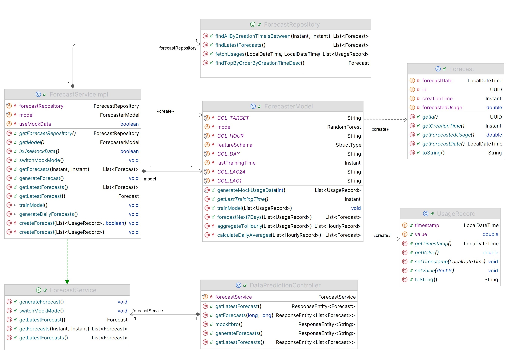
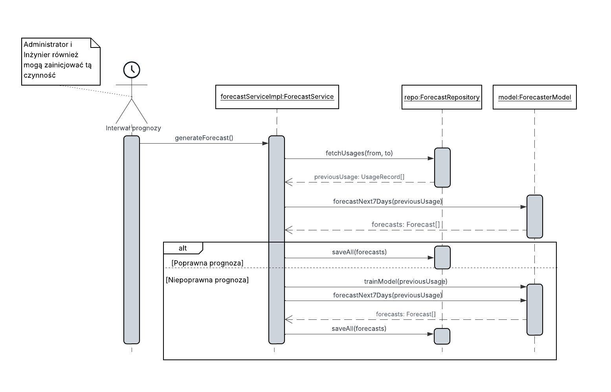
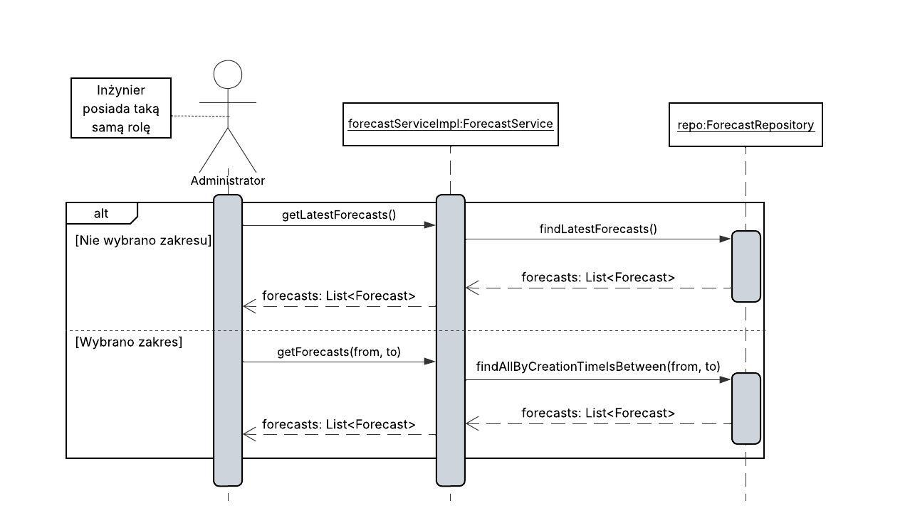
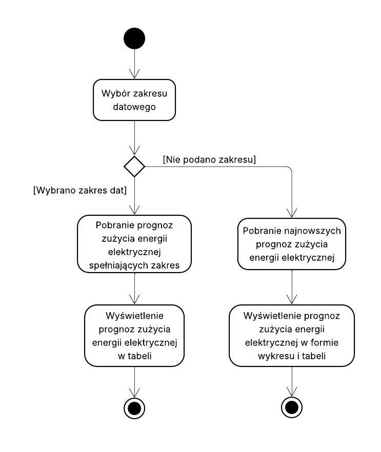
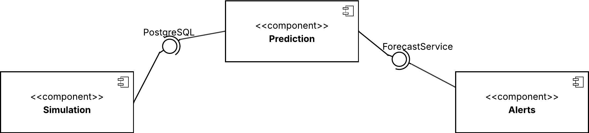
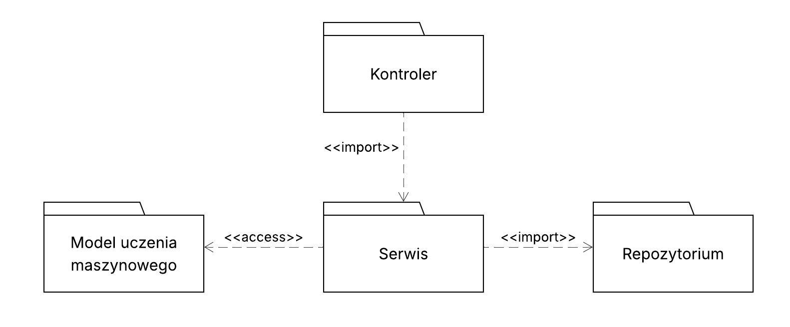

# Moduł prognozowania

## Projektanci: 
```
Michał Domagała 251505
Mikołaj Pawłoś 258681
```
# Dokumentacja techniczna

## Opis funkcjonalny

### Opis przeznaczenia modułu
Moduł prognozowania pobiera dane zużycia energii elektrycznej z poprzednich dni wygenerowane przez moduł symulacji, trenuje na ich podstawie algorytm uczenia maszynowego, a następnie generuje prognozy przyszłego zużycia energii elektrycznej w formie średniego zużycia na dzień.

### Opis możliwości funkcjonalnych modułu
Aktorzy czasowi (Interwał prognozy i Interwał treningu), Administrator oraz Inżynier mogą wykonywać następujące czynności:
- Pobierz dane zużycia energii elektrycznej od modułu symulacji — Moduł może pobierać od modułu symulacji dane zużycia energii elektrycznej z poprzednich dni
- Przygotuj dane do treningu modelu uczenia maszynowego — Moduł może odpowiednio przetwarzać pobrane od modułu symulacji dane zużycia energii elektrycznej z poprzednich dni
- Przekaż prognozę zużycia energii elektrycznej do modułu alarmów — Moduł może oferować do odczytu najnowsze prognozy modułowi alarmowania i alertów
- Wygeneruj prognozę zużycia energii elektrycznej — Moduł może prognozować prawdopodobne zużycie energii elektrycznej na kolejne 7 dni automatycznie co określony czas lub po otrzymaniu polecenia od administratora bądź inżyniera
- Zapisz prognozę zużycia energii elektrycznej — Moduł może zapisywać wygenerowane prognozy zużycia energii elektrycznej do bazy danych
- Wytrenuj model uczenia maszynowego — Moduł może automatycznie co określony czas trenować algorytm uczenia maszynowego 
- Sprawdź poprawność prognozy zużycia energii elektrycznej — Moduł może, w przypadku wytworzenia prognozy wybiegającej znacznie poza akceptowalny przedział, ponownie wytrenować algorytm uczenia maszynowego i jeszcze raz wygenerować prognozę

Dodatkowo Administrator i Inżynier mogą jeszcze:
- Odczytaj prognozę zużycia energii elektrycznej — Moduł może odczytywać zapisane wcześniej prognozy
- Wyświetl prognozę zużycia energii elektrycznej — Moduł może wyświetlać prognozę zużycia energii elektrycznej na kolejne 7 dni w czytelnej formie administratorowi i inżynierowi


### Opis możliwości niefunkcjonalnych modułu

- Użyty do prognozowania model uczenia maszynowego to algorytm RandomForest zaimplementowany w używanej przez moduł bibliotece Smile
- Przetwarzanie danych zużycia energii elektrycznej z poprzednich dni polega na agregacji danych zużycia do pełnych godzin
- Najnowsze prognozy zużycia energii elektrycznej mogą zostać wyświetlone w formie wykresu liniowego oraz tabeli
- Można przeglądać poprzednie prognozy zużycia energii elektrycznej podając zakres dat wygenerowania
- Wartość prognozy zużycia energii elektrycznej to średnie dzienne zużycie energii elektrycznej na określony dzień

# Diagramy przypadków użycia

## Okresowe generowanie prognoz zużycia energii elektrycznej oraz trenowanie modelu uczenia maszynowego.


Diagram 1

Ten diagram przypadków użycia przedstawia automatyczne generowanie prognozy zużycia energii elektrycznej oraz trening modelu uczenia maszynowego.
Głównymi aktorami w tym diagramie są interwał prognozy oraz interwał treningu, które to odpowiadają odpowiednio za częstotliwość generowania prognozy zużycia energii elektrycznej i częstotliwość wykonywania treningu modelu uczenia maszynowego.

## Generowanie i wyświetlanie prognoz zużycia energii elektrycznej.


Diagram 2

Powyższy diagram przypadków użycia przedstawia generowanie prognozy zużycia energii elektrycznej na żądanie oraz wyświetlanie jej.
Główni aktorzy tego diagramu to Inżynier oraz Administrator. 
Mogą oni wygenerować prognozę, co wiąże się z pobraniem danych zużycia energii elektrycznej z poprzednich dni, przetworzeniem ich i zapisaniem wygenerowanej prognozy zużycia energii elektrycznej.
Gdy podczas sprawdzania poprawności prognozy zużycia energii elektrycznej dojdzie do wykrycia nieprawidłowości, zostanie przeprowadzony trening modelu uczenia maszynowego.
Inna czynności dostępna dla tych aktorów to wyświetlenie prognozy zużycia energii elektrycznej, co wiąże się z odczytaniem poprzednio wygenerowanych i zapisanych prognoz.

# Diagramy klas


Diagram 3

Na przedstawionym diagramie zostały uwidocznione klasy związane z modułem prognozowania
Najistotniejszą klasą w tym module jest klasa **ForecastServiceImpl** implementująca interfejs **ForecastService**.
Steruje ona przepływem danych pomiędzy repozytorium **ForecastRepository**, a algorytmem uczenia maszynowego zdefiniowanym w **ForecasterModel**.
Klasy pomocnicze **UsageRecord** i **Forecast** służą do przechowywania odpowiednio przeszłego i prognozowanego zużycia energii elektrycznej.
**DataPredictionController** zapewnia komunikację modułu prognozowania z warstwą prezentacji.

# Diagramy interakcji
[diagramy interakcji (sekwencji lub komunikacji) dla wybranych przypadków użycia z diagramu(ów) przypadków użycia, dla których zdefiniowano wcześniej scenariusze]

## Scenariusz 1

| Pole                                | Treść                                                                                                                                                                                                                                                                                                                                 |
|:------------------------------------|:--------------------------------------------------------------------------------------------------------------------------------------------------------------------------------------------------------------------------------------------------------------------------------------------------------------------------------------|
| **Nazwa:**                          | Generowanie prognozy zużycia energii elektrycznej                                                                                                                                                                                                                                                                                     |
| **Numer:**                          | 1                                                                                                                                                                                                                                                                                                                                     |
| **Twórca:**                         | Projektanci: Michał Domagała 251505, Mikołaj Pawłoś 258681                                                                                                                                                                                                                                                                            |
| **Poziom ważności:**                | Wysoki                                                                                                                                                                                                                                                                                                                                |
| **Typ przypadku użycia:**           | Istotny                                                                                                                                                                                                                                                                                                                               |
| **Aktorzy:**                        | Interwał prognozy, Administrator, Inżynier                                                                                                                                                                                                                                                                                            |
| **Krótki opis:**                    | Wygenerowanie prognozy na podstawie danych zużycia energii elektrycznej z poprzednich dni                                                                                                                                                                                                                                             |
| **Warunki wstępne:**                | 1. Model uczenia maszynowego jest wytrenowany <br> 2. Istnieją dane zużycia energii elektrycznej sprzed przynajmniej 7 dni                                                                                                                                                                                                            |
| **Warunki końcowe:**                | System zapisuje wygenerowaną prognozę zużycia energii elektrycznej                                                                                                                                                                                                                                                                    |
| **Główny przepływ zdarzeń:**        | 1. Pobranie danych zużycia energii elektrycznej z przeszłości <br/> 2. Przetworzenie danych zużycia energii elektrycznej <br/> 3. Wygenerowanie prognozy zużycia energii elektrycznej na następne 7 dni <br> 4. Sprawdzenie poprawności prognozy zużycia energii elektrycznej <br> 5. Zapisanie prognozy zużycia energii elektrycznej |
| **Alternatywne przepływy zdarzeń:** | 4a. Zidentyfikowanie wygenerowanej prognozy zużycia energii elektrycznej jako niepoprawnej. Następuje ponowna próba wygenerowania prognozy po wytrenowaniu na nowo modelu uczenia maszynowego.                                                                                                                                        |
| **Specjalne wymagania:**            | Istnieją dane zużycia energii elektrycznej z poprzednich dni.                                                                                                                                                                                                                                                                         |
| **Notatki i kwestie:**              | brak                                                                                                                                                                                                                                                                                                                                  |

## Diagram interakcji 1


Diagram 3

Diagram przedstawia przepływ informacji między poszczególnymi klasami modułu w celu wygenerowania prognozy zużycia energii elektrycznej.

## Scenariusz 2

| Pole                                | Treść                                                                                                                                                                                                                                                     |
|:------------------------------------|:----------------------------------------------------------------------------------------------------------------------------------------------------------------------------------------------------------------------------------------------------------|
| **Nazwa:**                          | Wyświetlanie prognozy zużycia energii elektrycznej                                                                                                                                                                                                        |
| **Numer:**                          | 2                                                                                                                                                                                                                                                         |
| **Twórca:**                         | Projektanci: Michał Domagała 251505, Mikołaj Pawłoś 258681                                                                                                                                                                                                |
| **Poziom ważności:**                | Średni                                                                                                                                                                                                                                                    |
| **Typ przypadku użycia:**           | Przeciętnie istotny                                                                                                                                                                                                                                       |
| **Aktorzy:**                        | Administrator, Inżynier                                                                                                                                                                                                                                   |
| **Krótki opis:**                    | Wyświetlenie prognozy zużycia energii elektrycznej                                                                                                                                                                                                        |
| **Warunki wstępne:**                | Zostały wcześniej wygenerowane i zapisane prognozy zużycia energii elektrycznej                                                                                                                                                                           |
| **Warunki końcowe:**                | W graficznym interfejsie użytkownika zostaje wyświetlona prognoza zużycia energii elektrycznej w formie wykresu oraz tabeli                                                                                                                               |
| **Główny przepływ zdarzeń:**        | 1. Pobranie zapisanych wcześniej najnowszych prognoz zużycia energii elektrycznej <br> 2. Wyświetlenie najnowszych prognoz zużycia energii elektrycznej na wykresie oraz w tabeli                                                                         |
| **Alternatywne przepływy zdarzeń:** | 1a. W przypadku wybrania w odpowiedniej kontrolce w graficznym interfejsie użytkownika zakresu datowego, zostaną pobrane, a następnie wyświetlone w tabeli tylko te prognozy zużycia energii elektrycznej, które zostały wygenerowane w podanym zakresie. |
| **Specjalne wymagania:**            | Istnieją zapisane wygenerowane wcześniej prognozy                                                                                                                                                                                                         |
| **Notatki i kwestie:**              | Brak                                                                                                                                                                                                                                                      |

## Diagram interakcji 2



Diagram 4

Na diagramie został uwidoczniony przepływ informacji między klasami związany z pobraniem, a następnie wyświetleniem prognoz.

# Diagram czynności [minimum 1]



Diagram przedstawia czynności wykonywane w przypadku wyświetlenia prognoz zużycia energii elektrycznej.

# Diagram maszyny stanowej


Diagram przedstawia stany, w których znajduje się system, gdy wyświetla prognozy zużycia energii elektrycznej.

# Diagram komponentów [z czym dany moduł się łączy (wycinek)]



Moduł prognozowania łączy się z modułem symulacji poprzez bazę danych i pobiera z niej dane zużycia energii elektrycznej z poprzednich dni.
Moduł alarmowania i alertów łączy się z modułem prognozowania poprzez wystawiony interfejs **ForecastService**, dzięki czemu moduł może dokładnie weryfikować poprawność najnowszych prognoz zużycia energii elektrycznej. 

# Diagram pakietów



Na diagramie zostały zaprezentowane relacje pomiędzy poszczególnymi pakietami modułu prognozowania.

# Diagram przeglądu interakcji

Miejsce na diagram

Miejsce na opis diagramu

# Diagram strukturalny

Miejsce na diagram

Miejsce na opis diagramu

# Diagram harmonogramowania

Miejsce na diagram

Miejsce na opis diagramu

# Dokumentacja użytkownika

## Przypadek użycia 1 - [nazwa]

Instrukcja z zrzutami ekranu jak wygląda GUI (jeśli jest):

I kroki opisane np.
Zaloguj się lub przejdź do sklepu jako gość.
Zrzut ekranu
Przeglądaj ofertę i wybierz interesujący Cię produkt.
Zrzut ekranu
Kliknij na produkt, aby zobaczyć szczegóły.
Zrzut ekranu
Wybierz ilość (oraz wariant, jeśli jest dostępny).
Zrzut ekranu
Kliknij przycisk „Dodaj do koszyka”
Zrzut ekranu
Produkt zostanie dodany do koszyka, który możesz sprawdzić, klikając ikonę koszyka.
Zrzut ekranu

[najwazniejsze przypadki uzycia wybrac ze 2/3 wystarcza]

## Obsługa błędów, sytuacji wyjątkowych
Opisać zastosowane zabezpieczenia i ewentualnie co jesli jakis blad wystapi to mozna zrobic albo np. jak sa wprowadzone dane to jak sa walidowane itp.

## Podsumowanie

[Słowa końcowe jakieś, jak to konfigurowac zarzadzac tym]

