# Nazwa modułu
[usuńcie wszystkie wpisy w kwadratowych nawiasach! sa to dodatkowe pomocnicze opisy]
[wpisy bez nawiasów są do zastąpienia zawartością]

## Projektanci: 
```
Jędrzej Bartoszewski 251482
Kacper Maziarz 251586
```
# Dokumentacja techniczna

## Opis funkcjonalny

### Opis przeznaczenia modułu
Celem modułu jest generowanie danych dotyczących produkcji energii przez odnawialne źródła oraz zużycia energii przez sprzęt.

### Opis możliwości funkcjonalnych modułu
Administrator:
* Ma możliwość pobrania aktualnych parametrów symulacji.
* Ma możliwość zmiany pory roku oraz dnia.

Moduł Zarządzania:
* Ma możliwość pobrania danych o wszystkich urządzeniach lub tylko o konkretnym typie bądź identyfikatorze.
* Ma możliwość dodawania, usuwania, włączania oraz wyłączania wszystkich urządzeń bądź o zadanym identyfikatorze.

### Opis możliwości niefunkcjonalnych modułu
* Dane będą generowane w czasie rzeczywistym co T = 5 min.
* Generowanie danych dotyczących zużycia i generowania energii(w kWh) na podstawie czynników takich jak pora dnia, pora roku, warunki atmosferyczne.
* Zapis wygenerowanych danych do bazy danych PostgreSQL.
* Możliwość zmiany ustawień symulacji (pora roku, pora dnia) musi być ściśle ograniczona i dostępna wyłącznie dla roli Administrator.
* Możliwość zmiany ustawień, dodawania i usuwania urządzeń musi być ściśle ograniczona i udostępniona tylko dla modułu zarządzania poprzez odpowiedni interfejs.

# Diagramy przypadków użycia

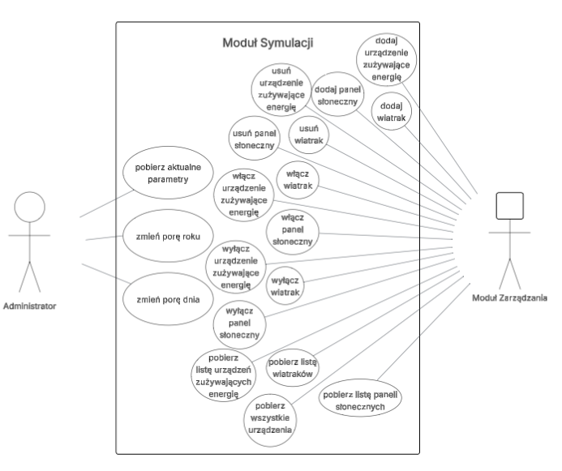

Diagram 1

Diargram przypadków użycia przedstawia moduł symulacji. Aktorami są użytkownika z rolą Administrator, który może zmieniać porę roku i dnia i pobierać aktualne parametry, oraz Moduł Zarządzania, który może dodawać, usuwać, włączać, wyłączać wszystkoe urządzenia oraz pobierać wszystkie urządzenia lub listę konkretnych urządzeń.

[powtórzyć dla każdego diagramu, tak samo nagłówki]

# Diagramy klas
[diagram(y) klas (obejmują wszystkie klasy)]


Diagram X.Y.Z Pierwsza część diagramu klas

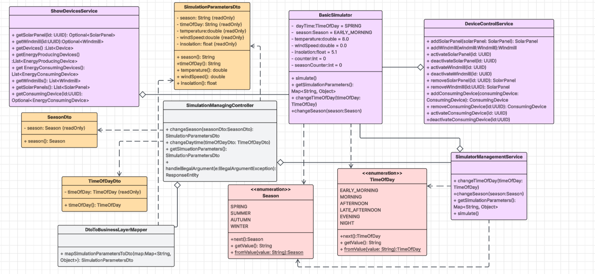
Diagram X.Y.Z Pierwsza część diagramu klas


# Diagramy interakcji

## Scenariusz 1

| Pole                                | Treść                                                                                                                                                                                                                                                                                                                                                                                                                                                                                                           |
|:------------------------------------|:----------------------------------------------------------------------------------------------------------------------------------------------------------------------------------------------------------------------------------------------------------------------------------------------------------------------------------------------------------------------------------------------------------------------------------------------------------------------------------------------------------------|
| **Nazwa:**                          | Zmień porę roku                                                                                                                                                                                                                                                                                                                                                                                                                                                                                                 |
| **Numer:**                          | 1                                                                                                                                                                                                                                                                                                                                                                                                                                                                                                               |
| **Twórca:**                         | Jędrzej Bartoszewski 251482, Kacper Maziarz 251586                                                                                                                                                                                                                                                                                                                                                                                                                                                              |
| **Poziom ważności:**                | średni                                                                                                                                                                                                                                                                                                                                                                                                                                                                                                          |
| **Typ przypadku użycia:**           | szczegółowy, przeciętnie istotny                                                                                                                                                                                                                                                                                                                                                                                                                                                                                |
| **Aktorzy:**                        | Administrator                                                                                                                                                                                                                                                                                                                                                                                                                                                                                                   |
| **Krótki opis:**                    | Zmiana pory roku przez aktora powodująca zmianę w parametrach symulacji.                                                                                                                                                                                                                                                                                                                                                                                                                                        |
| **Warunki wstępne:**                | Aktor jest uwierzytelniony w systemie oraz posiada odpowiedni poziom dostępu (Administrator).                                                                                                                                                                                                                                                                                                                                                                                                                   |
| **Warunki końcowe:**                | Poprawnie dokonano zmiany pory roku, nowa pora roku wraz z pozostałymi, zaktualizowanymi parametrami symulacji są widoczne w GUI.                                                                                                                                                                                                                                                                                                                                                                               |
| **Główny przepływ zdarzeń:**        | 1. Aktor dokonuje wyboru nowej pory roku w GUI i zatwierdza wybór.<br/> 2. System przyjmuje żądanie HTTP oraz dokonuje walidacji otrzymanych danych (nazwy pory roku). <br> 3. Dokonana zostaje zmiana pory roku w obiekcie symulacji na nową wartość. <br/> 4. Licznik odpowiadający za zliczanie iteracji i zmianę pory roku zostaje wyzerowany. <br/> 5. System zwraca kod odpowiedzi 200. oraz aktualny stan symulacji. <br/> 6. GUI dostosowuje widok na podstawie zaktualizowanych danych dot. symulacji. |
| **Alternatywne przepływy zdarzeń:** | 3a. System wychwytuje niepoprawne dane. <br/> 3b. System zwraca kod błędu 400.                                                                                                                                                                                                                                                                                                                                                                                                                                  |
| **Specjalne wymagania:**            | nie dotyczy                                                                                                                                                                                                                                                                                                                                                                                                                                                                                                     |
| **Notatki i kwestie:**              | Zmiana pory roku nie wpływa na harmonogram generowania zużycia/produkcji energii - nowe parametry będą uwzględnione przy najbliższej iteracji.                                                                                                                                                                                                                                                                                                                                                                  |

## Diagram interakcji 1

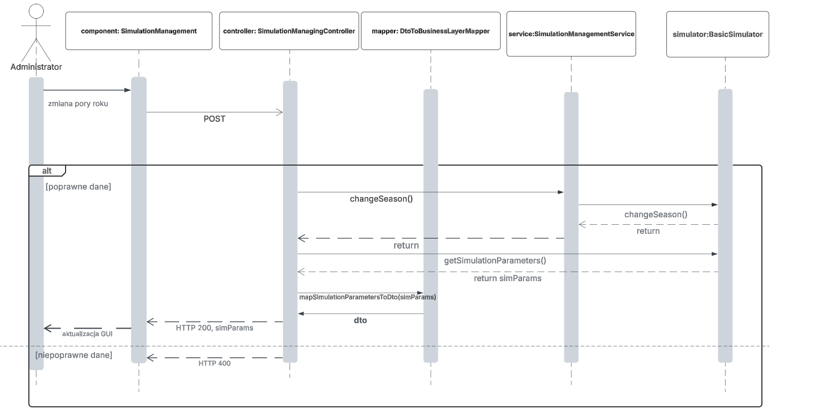

Miejsce na podpis

Miejsce na opis diagramu

## Scenariusz 2

| Pole                                | Treść                                                                                                                                                                                                                              |
|:------------------------------------|:-----------------------------------------------------------------------------------------------------------------------------------------------------------------------------------------------------------------------------------|
| **Nazwa:**                          | Wyłącz wiatrak                                                                                                                                                                                                                     |
| **Numer:**                          | 2                                                                                                                                                                                                                                  |
| **Twórca:**                         | Jędrzej Bartoszewski 251482, Kacper Maziarz 251586                                                                                                                                                                                 |
| **Poziom ważności:**                | średni                                                                                                                                                                                                                             |
| **Typ przypadku użycia:**           | ogólny, przeciętnie istotny                                                                                                                                                                                                        |
| **Aktorzy:**                        | Moduł  zarządzania                                                                                                                                                                                                                 |
| **Krótki opis:**                    | Aktywacja konkretnego wiatraka przez aktualizację danych w bazie danych                                                                                                                                                            |
| **Warunki wstępne:**                | Wiatrak jest obecny w systemie                                                                                                                                                                                                     |
| **Warunki końcowe:**                | Urządzenie(wiatrak) zostało wyłączone (zaktualizowany rekord w bazie)                                                                                                                                                              |
| **Główny przepływ zdarzeń:**        | 1.Wywołanie przez aktora odpowiedniej metody z interfejsu IControlDevices. <br/> 2.Weryfikacja obecności urządzenia w bazie. <br> 3. Wywołanie metody dla serwisu obsługującego wiatrak <br/>4. Aktualizacja rekordu  bazie danych |
| **Alternatywne przepływy zdarzeń:** | 3a. Brak odpowiedniego rekordu w bazie danych 3b. rzucenie wyjątku.                                                                                                                                                                |
| **Specjalne wymagania:**            | brak                                                                                                                                                                                                                               |
| **Notatki i kwestie:**              | brak                                                                                                                                                                                                                               |

## Diagram interakcji 2

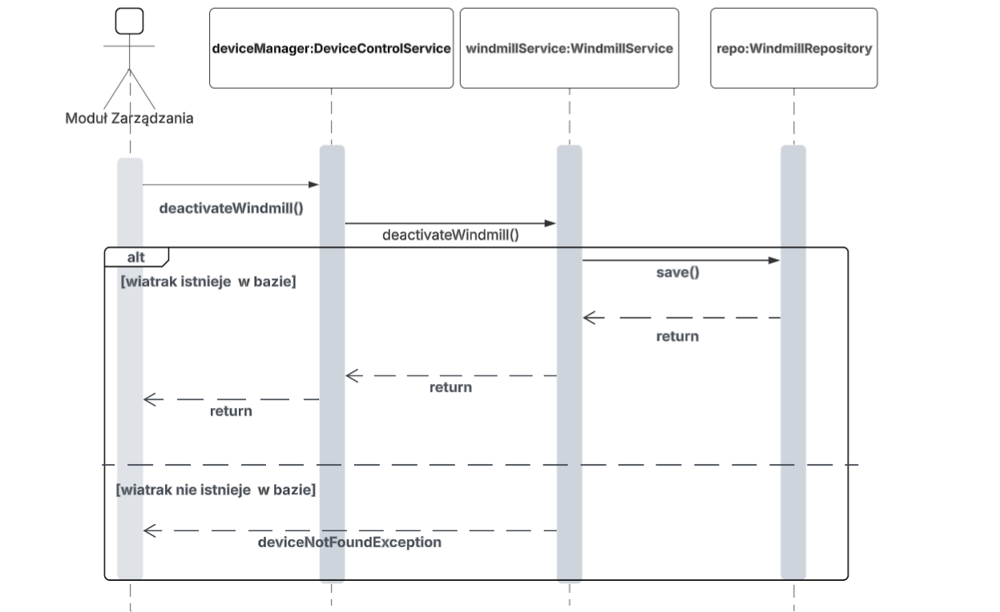

Miejsce na podpis

Miejsce na opis diagramu

# Diagram czynności 

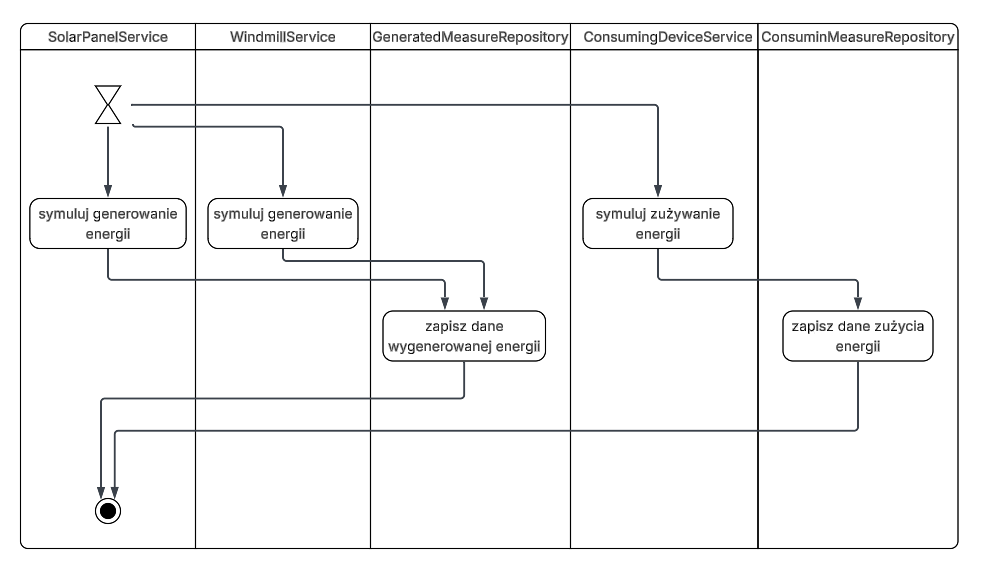

Diagram 5

Diagram przedstawia kolejne czynności będące częścią cyklu generowania danych produkcji i zużycia energii oraz zapisania ich do bazy danych. Czynnikiem rozpoczynającym cały przebieg jest w tym wypadku określony odstęp czasu, który musi upłynąć między kolejnymi cyklami (5 minut).

# Diagram maszyny stanowej 

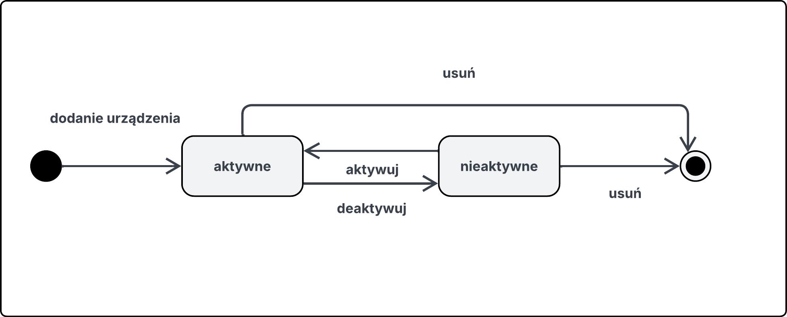

Diagram 6
Diagram maszyny stanów opisuje cykl życia obiektu reprezentującego użącenie zużywające energię.

# Diagram komponentów 

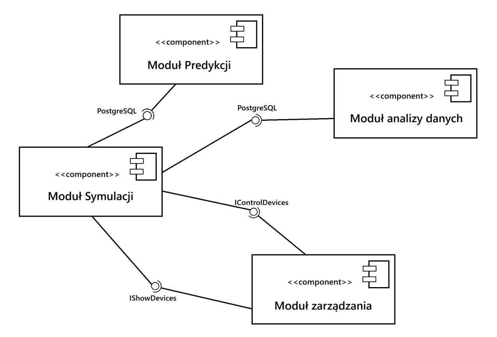

Diagram 7

Diagram komponentów przedstawia powiązania z 3 innymi modułami (zarządzania, alalizy danych, predykcji) oraz interfejsy, za pomocą których te powiązania są realizowane.

# Diagram pakietów

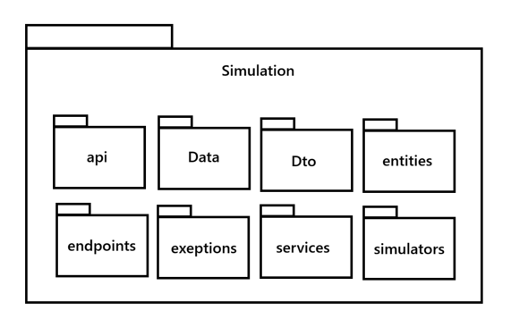

Diagram 8

Diagram pakietów przedstawia jakie pakiety zawiera pakiet Symulacji.

# Diagram przeglądu interakcji

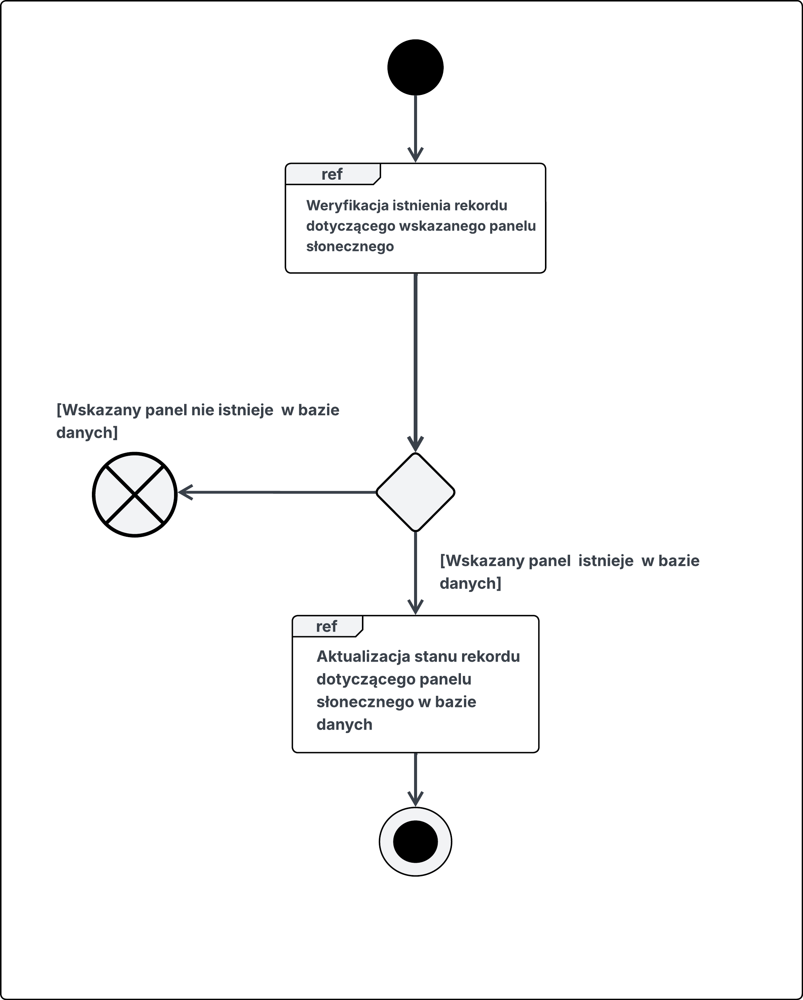

Diagram 9

Diagram obrazowuje przepływ sterowania dla pżypadku użycia dotyczącego włączenia/aktywacji panelu słonecznego o wskazanym identyfikatorze.

# Diagram strukturalny

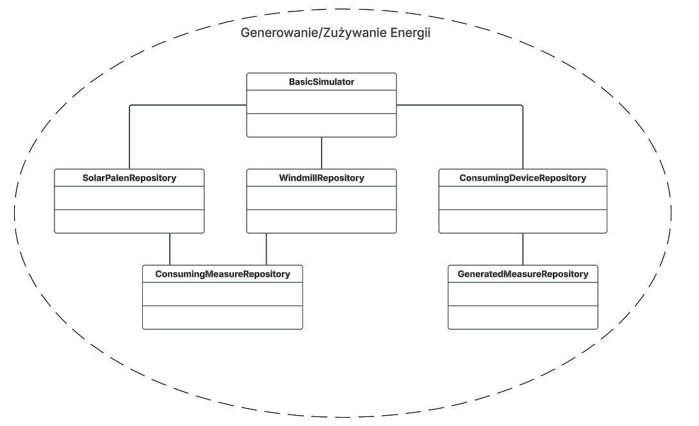

Diagram 10

Diagram pokazuje powiązanie między obiektami uczestniczącymi w procesie generowania danych o produkcji i zużyciu energii.

# Diagram harmonogramowania

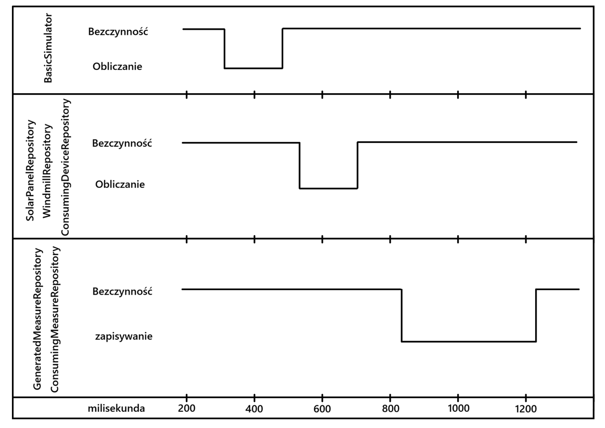

Diagram 11

Diagram przedstawia szacunkowy czas, w jakim przebiegają kolejne etapy symulowania produkcji oraz zużycia energii.

# Dokumentacja użytkownika

## Przypadek użycia 1 - Zmiana pory dnia


Instrukcja z zrzutami ekranu jak wygląda GUI (jeśli jest):

I kroki opisane np.
Zaloguj się lub przejdź do sklepu jako gość.
Zrzut ekranu
Przeglądaj ofertę i wybierz interesujący Cię produkt.
Zrzut ekranu
Kliknij na produkt, aby zobaczyć szczegóły.
Zrzut ekranu
Wybierz ilość (oraz wariant, jeśli jest dostępny).
Zrzut ekranu
Kliknij przycisk „Dodaj do koszyka”
Zrzut ekranu
Produkt zostanie dodany do koszyka, który możesz sprawdzić, klikając ikonę koszyka.
Zrzut ekranu

[najwazniejsze przypadki uzycia wybrac ze 2/3 wystarcza]

## Obsługa błędów, sytuacji wyjątkowych
Dzięki ograniczeniu możliwości wyboru pór roku i dnia do listy konkretnych opcji, zamiast wpisywania dowolnej wartości, nie ma możliwośći wystąpienia błędów w tym zakresie.


## Podsumowanie

Zarządzanie modułem symulacji sprowadza się do nadzorowania generowanych danych i ewentualnych zmian parametrów(pory roku i dnia) w celu zmiany zmiany wyliczanych wartości.
Należy również kontrolować stan bazy danych gdyż ilość generowanych danych przy braku kontroli może doprowadzić do przepełnienia. W takim wypadku może być potrzebne wyczyszczenie lub zwiększenie zasobów pamięci przydzielonych dla naszej bazy.
