# Nazwa modułu
Moduł Symulacji

## Projektanci: 
```
Jędrzej Bartoszewski 251482
Kacper Maziarz 251586
```
# Dokumentacja techniczna

## Opis funkcjonalny

### Opis przeznaczenia modułu
Celem modułu jest generowanie danych dotyczących produkcji energii przez odnawialne źródła oraz zużycia energii przez sprzęt.

### Opis możliwości funkcjonalnych modułu
Administrator:
* Ma możliwość pobrania aktualnych parametrów symulacji.
* Ma możliwość zmiany pory roku oraz dnia.

Moduł Zarządzania:
* Ma możliwość pobrania danych o wszystkich urządzeniach lub tylko o konkretnym typie bądź identyfikatorze.
* Ma możliwość dodawania, usuwania, włączania oraz wyłączania wszystkich urządzeń bądź o zadanym identyfikatorze.

### Opis możliwości niefunkcjonalnych modułu
* Dane będą generowane w czasie rzeczywistym co T = 5 min.
* Generowanie danych dotyczących zużycia i generowania energii(w kWh) na podstawie czynników takich jak pora dnia, pora roku, warunki atmosferyczne.
* Zapis wygenerowanych danych do bazy danych PostgreSQL.
* Możliwość zmiany ustawień symulacji (pora roku, pora dnia) musi być ściśle ograniczona i dostępna wyłącznie dla roli Administrator.
* Możliwość zmiany ustawień, dodawania i usuwania urządzeń musi być ściśle ograniczona i udostępniona tylko dla modułu zarządzania poprzez odpowiedni interfejs.

# Diagramy przypadków użycia


Diagram 1

Diagram przypadków użycia przedstawia moduł symulacji. Aktorami są: użytkownik z rolą Administrator, który może zmieniać porę roku i dnia oraz pobierać aktualne parametry, oraz Moduł Zarządzania, który może dodawać, usuwać, włączać, wyłączać wszystkoe urządzenia oraz pobierać wszystkie urządzenia lub listę konkretnych urządzeń.


# Diagramy klas
Ze względu na ilość klas podzielono diagram klas na trzy części.
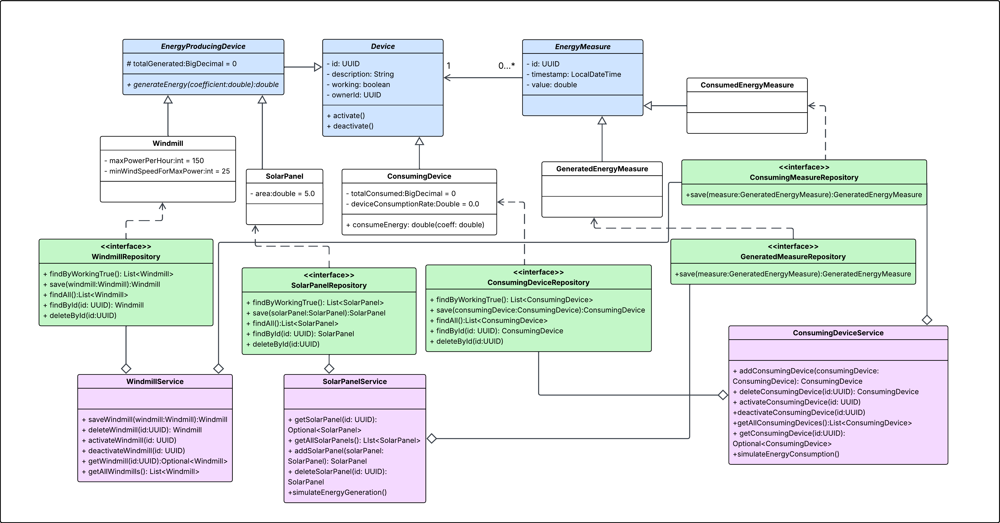
Diagram 2. Pierwsza część diagramu klas

Pierwsza częśc diagramu klas pokazuje hierarchię klas encyjnych, wykorzystyanych do mapowania obirktowo relacyjnego oraz klas tzw. repozytoriów, obsługujących operacje na bazie danych.
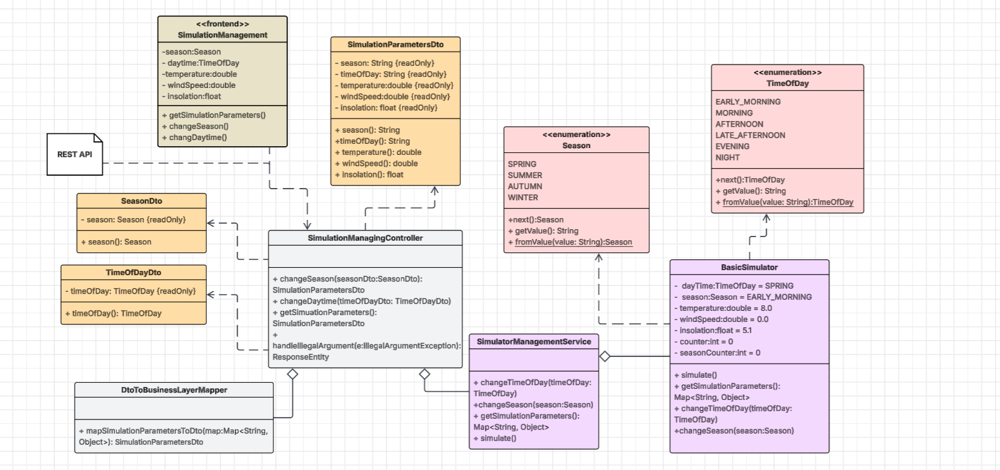
Diagram 3. Druga część diagramu klas
Drugi diagram obrazuje część modułu odpowiadającą za zarządzanie obiektem symulacji oraz obsługą żądań z aplikacji klienckiej.
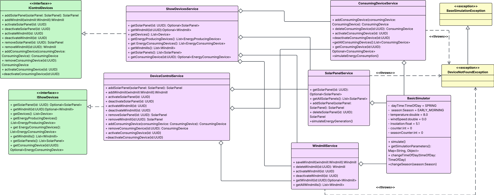
Diagram 4. Trzecia część diagramu klas
Trzeci diagram klas pokazuje hierarchię klas odpowiedzialnych za zarządzanie urządzeniami oraz okresowe generowanie zużycia/produkcji energii.
# Diagramy interakcji

## Scenariusz 1

| Pole                                | Treść                                                                                                                                                                                                                                                                                                                                                                                                                                                                                                           |
|:------------------------------------|:----------------------------------------------------------------------------------------------------------------------------------------------------------------------------------------------------------------------------------------------------------------------------------------------------------------------------------------------------------------------------------------------------------------------------------------------------------------------------------------------------------------|
| **Nazwa:**                          | Zmień porę roku                                                                                                                                                                                                                                                                                                                                                                                                                                                                                                 |
| **Numer:**                          | 1                                                                                                                                                                                                                                                                                                                                                                                                                                                                                                               |
| **Twórca:**                         | Jędrzej Bartoszewski 251482, Kacper Maziarz 251586                                                                                                                                                                                                                                                                                                                                                                                                                                                              |
| **Poziom ważności:**                | średni                                                                                                                                                                                                                                                                                                                                                                                                                                                                                                          |
| **Typ przypadku użycia:**           | szczegółowy, przeciętnie istotny                                                                                                                                                                                                                                                                                                                                                                                                                                                                                |
| **Aktorzy:**                        | Administrator                                                                                                                                                                                                                                                                                                                                                                                                                                                                                                   |
| **Krótki opis:**                    | Zmiana pory roku przez aktora powodująca zmianę w parametrach symulacji.                                                                                                                                                                                                                                                                                                                                                                                                                                        |
| **Warunki wstępne:**                | Aktor jest uwierzytelniony w systemie oraz posiada odpowiedni poziom dostępu (Administrator).                                                                                                                                                                                                                                                                                                                                                                                                                   |
| **Warunki końcowe:**                | Poprawnie dokonano zmiany pory roku, nowa pora roku wraz z pozostałymi, zaktualizowanymi parametrami symulacji są widoczne w GUI.                                                                                                                                                                                                                                                                                                                                                                               |
| **Główny przepływ zdarzeń:**        | 1. Aktor dokonuje wyboru nowej pory roku w GUI i zatwierdza wybór.<br/> 2. System przyjmuje żądanie HTTP oraz dokonuje walidacji otrzymanych danych (nazwy pory roku). <br> 3. Dokonana zostaje zmiana pory roku w obiekcie symulacji na nową wartość. <br/> 4. Licznik odpowiadający za zliczanie iteracji i zmianę pory roku zostaje wyzerowany. <br/> 5. System zwraca kod odpowiedzi 200. oraz aktualny stan symulacji. <br/> 6. GUI dostosowuje widok na podstawie zaktualizowanych danych dot. symulacji. |
| **Alternatywne przepływy zdarzeń:** | 3a. System wychwytuje niepoprawne dane. <br/> 3b. System zwraca kod błędu 400.                                                                                                                                                                                                                                                                                                                                                                                                                                  |
| **Specjalne wymagania:**            | nie dotyczy                                                                                                                                                                                                                                                                                                                                                                                                                                                                                                     |
| **Notatki i kwestie:**              | Zmiana pory roku nie wpływa na harmonogram generowania zużycia/produkcji energii - nowe parametry będą uwzględnione przy najbliższej iteracji.                                                                                                                                                                                                                                                                                                                                                                  |

## Diagram interakcji 1


Diagram 5. Diagram sekwencji ukazujący przepływ sterowania i wywołań dla przypadku użycia "zmień porę roku".


## Scenariusz 2

| Pole                                | Treść                                                                                                                                                                                                                              |
|:------------------------------------|:-----------------------------------------------------------------------------------------------------------------------------------------------------------------------------------------------------------------------------------|
| **Nazwa:**                          | Wyłącz wiatrak                                                                                                                                                                                                                     |
| **Numer:**                          | 2                                                                                                                                                                                                                                  |
| **Twórca:**                         | Jędrzej Bartoszewski 251482, Kacper Maziarz 251586                                                                                                                                                                                 |
| **Poziom ważności:**                | średni                                                                                                                                                                                                                             |
| **Typ przypadku użycia:**           | ogólny, przeciętnie istotny                                                                                                                                                                                                        |
| **Aktorzy:**                        | Moduł  zarządzania                                                                                                                                                                                                                 |
| **Krótki opis:**                    | Aktywacja konkretnego wiatraka przez aktualizację danych w bazie danych                                                                                                                                                            |
| **Warunki wstępne:**                | Wiatrak jest obecny w systemie                                                                                                                                                                                                     |
| **Warunki końcowe:**                | Urządzenie(wiatrak) zostało wyłączone (zaktualizowany rekord w bazie)                                                                                                                                                              |
| **Główny przepływ zdarzeń:**        | 1.Wywołanie przez aktora odpowiedniej metody z interfejsu IControlDevices. <br/> 2.Weryfikacja obecności urządzenia w bazie. <br> 3. Wywołanie metody dla serwisu obsługującego wiatrak <br/>4. Aktualizacja rekordu  bazie danych |
| **Alternatywne przepływy zdarzeń:** | 3a. Brak odpowiedniego rekordu w bazie danych 3b. rzucenie wyjątku.                                                                                                                                                                |
| **Specjalne wymagania:**            | brak                                                                                                                                                                                                                               |
| **Notatki i kwestie:**              | brak                                                                                                                                                                                                                               |

## Diagram interakcji 2


Diagram 6. Diagram sekwencji obrazujący przepływ sterowania i wywołań dla przypadku użycia "Wyłącz wiatrak".

# Diagram czynności 


Diagram 7

Diagram przedstawia kolejne czynności będące częścią cyklu generowania danych produkcji i zużycia energii oraz zapisania ich do bazy danych. Czynnikiem rozpoczynającym cały przebieg jest w tym wypadku określony odstęp czasu, który musi upłynąć między kolejnymi cyklami (5 minut).

# Diagram maszyny stanowej 


Diagram 8.
Diagram maszyny stanów opisuje cykl życia obiektu reprezentującego urządzenie zużywające energię.

# Diagram komponentów 


Diagram 9

Diagram komponentów przedstawia powiązania z 3 innymi modułami (zarządzania, alalizy danych, predykcji) oraz interfejsy, za pomocą których te powiązania są realizowane.

# Diagram pakietów


Diagram 10

Diagram pakietów przedstawia jakie pakiety zawiera pakiet Symulacji.

# Diagram przeglądu interakcji


Diagram 11

Diagram obrazowuje przepływ sterowania dla pżypadku użycia dotyczącego włączenia/aktywacji panelu słonecznego o wskazanym identyfikatorze.

# Diagram strukturalny


Diagram 12

Diagram pokazuje powiązanie między obiektami uczestniczącymi w procesie generowania danych o produkcji i zużyciu energii.

# Diagram harmonogramowania


Diagram 13

Diagram przedstawia szacunkowy czas, w jakim przebiegają kolejne etapy symulowania produkcji oraz zużycia energii.

# Dokumentacja użytkownika

## Przypadek użycia 1 - Zmiana pory dnia
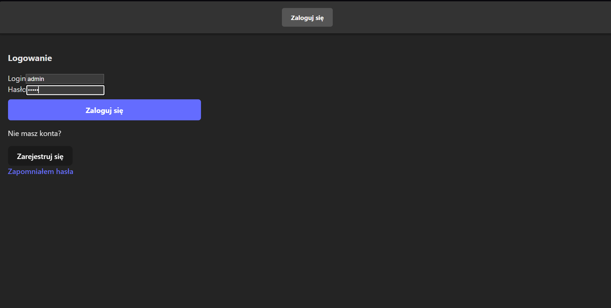
Aby przejść do widoku symulacji, należy się zalogować do konta z poziomem dostępu Administrator.

Login i hasło do domyślnego konta administratora to `admin`.
Następnie ukaże się panel główny aplikacji.

Należy przejść do zakładki `Simulation` (zaznaczone na rysunku powyżej.)
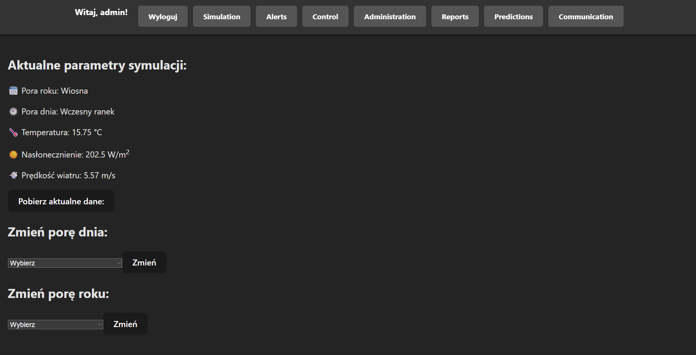
Wyświetli się okno z aktualnymi parametrami symulacji.
Aby zmienić porę dnia, należy wybrać jedną z wartości z pierwszej rozwijanej listy i kliknąć znajdujący się obok przycisk "Zmień".
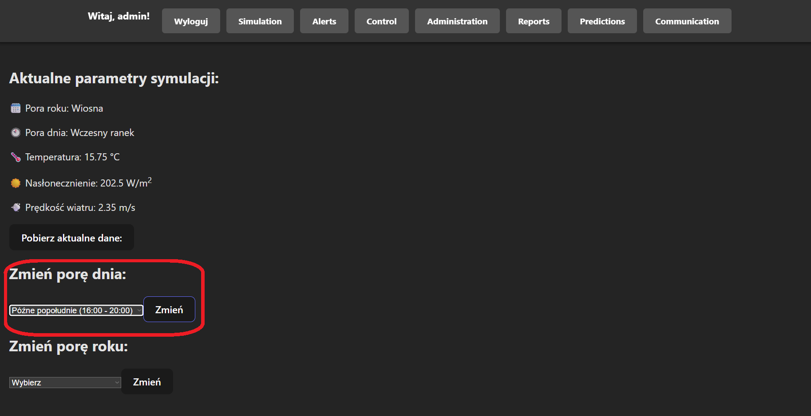
Po zatwierdzeniu powinny pojawić się w panelu zaktualizowane samoistnie parametry: 
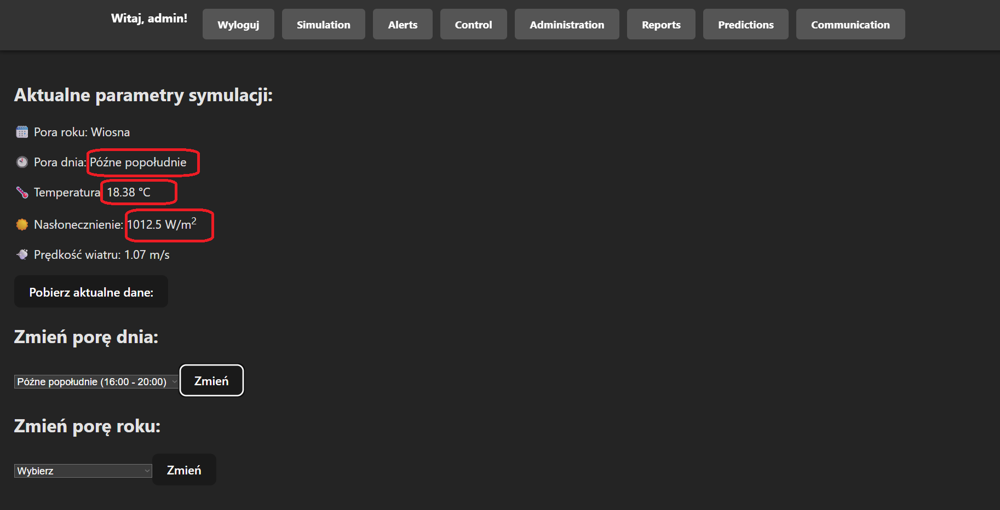
W razie próby wysłania "pustej" pory dnia (klikając "Zmień" bez wybrania żadnej opcji) wyświetli się okno powiadamiające o nieprawidłowej akcji.
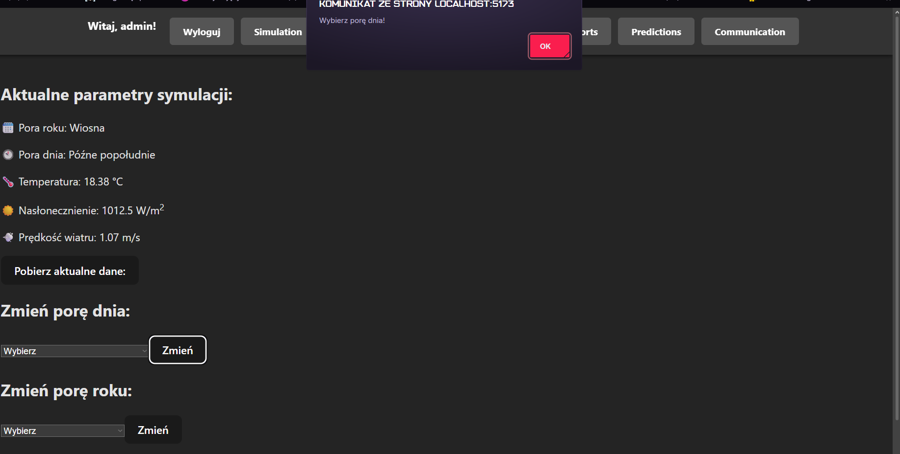

## Przypadek użycia 2 - Zmiana pory roku
Analogicznie jak zmiana pory roku jest dostępna tylko dla użytkowników z poziomem dostępu Administrator.
Po uwierzytelnieniu się należy przejść do panelu symulacji.

Aby zmienić porę, roku należy wybrać jedną z opcji z drugiej rozwijanej listy, a następnie użyć znajdującego się obok niej (w tym samym wierszu) przycisku Zmień.
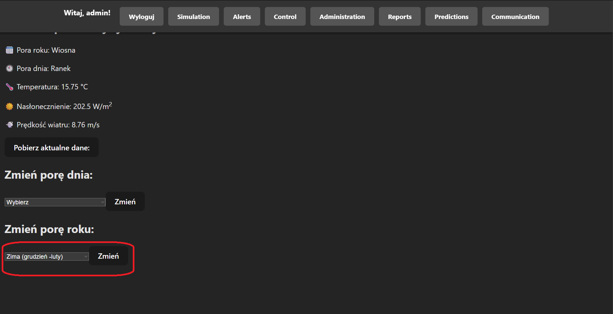
Po zatwierdzeniu akcji powinny samoistnie zaktualizować parametry symulacji. Jak można zauażyć, pora roku ma znacząco większy wpływ na warunki pogodowe niż pora dnia.
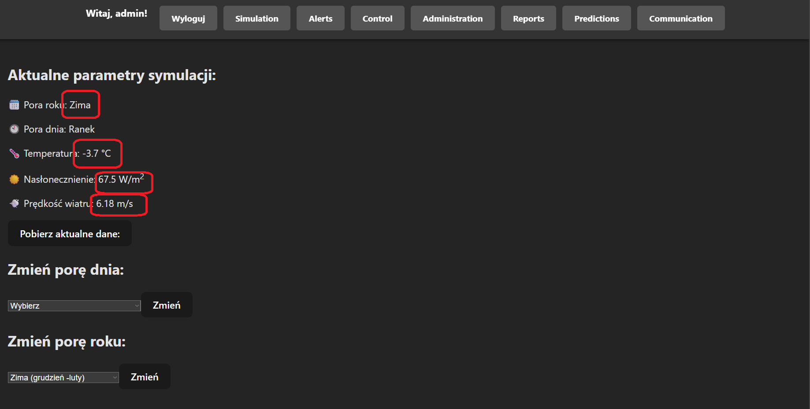
W razie próby dodania pory roku bez wybrania opcji pojawi się okno informujące o nieprawidłowej akcji:
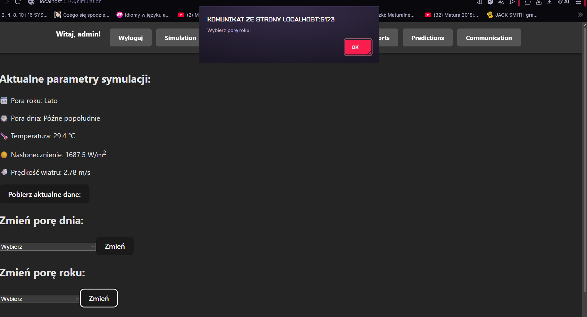
## Obsługa błędów, sytuacji wyjątkowych
Dzięki ograniczeniu możliwości wyboru pór roku i dnia do listy konkretnych opcji, zamiast wpisywania dowolnej wartości, nie ma możliwośći wystąpienia błędów w tym zakresie.


## Podsumowanie
Zarządzanie modułem symulacji sprowadza się do nadzorowania generowanych danych i ewentualnych zmian parametrów(pory roku i dnia) w celu zmiany zmiany wyliczanych wartości.
Należy również kontrolować stan bazy danych, gdyż ilość generowanych danych przy braku kontroli może doprowadzić do przepełnienia. W takim wypadku może być potrzebne wyczyszczenie lub zwiększenie zasobów pamięci przydzielonych dla naszej bazy.
