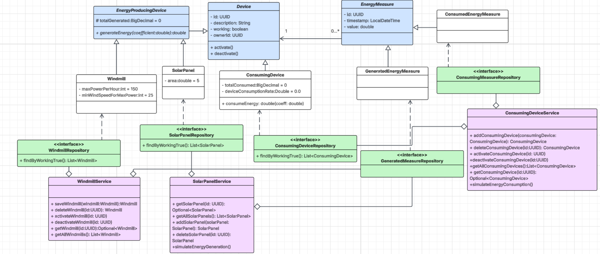

# Nazwa modułu
[usuńcie wszystkie wpisy w kwadratowych nawiasach! sa to dodatkowe pomocnicze opisy]
[wpisy bez nawiasów są do zastąpienia zawartością]

## Projektanci: 
```
imie, nazwisko numer indeksu
imie, nazwisko numer indeksu
```
# Dokumentacja techniczna

## Opis funkcjonalny

### Opis przeznaczenia modułu
1/2 zdania co moduł w ogóle robi

### Opis możliwości funkcjonalnych modułu
Co realizuje dany moduł, wypunktowanie przypadków uzycia wraz z opisami, trzeba podzielic fragmentami co moze robic dany aktor

### Opis możliwości niefunkcjonalnych modułu
Opisac wymagania niefunkcjonalne

# Diagramy przypadków użycia
[Diagramy przypadków użycia (obejmują wszystkie przypadki użycia!)]
## Nazwa przypadku użycia

Tutaj miejsce na diagram

Podpis z numeracją (wystarczy diagram 1,2,3...)

Opis diagramu

np.:
Diagram przypadków użycia przedstawia system sklepu internetowego. Aktorem jest Klient, który może przeglądać ofertę, dodawać produkty do koszyka oraz składać zamówienie. Dodatkowym aktorem jest Administrator, odpowiedzialny za zarządzanie produktami i realizację zamówień. Diagram pokazuje podstawowe funkcjonalności systemu oraz interakcje użytkowników z systemem.

[powtórzyć dla każdego diagramu, tak samo nagłówki]

# Diagramy klas
[diagram(y) klas (obejmują wszystkie klasy)]



# Diagramy interakcji
[diagramy interakcji (sekwencji lub komunikacji) dla wybranych przypadków użycia z diagramu(ów) przypadków użycia, dla których zdefiniowano wcześniej scenariusze]

## Scenariusz 1

[do wypełnienia szablon scenariusza]

| Pole | Treść |
| :--- | :--- |
| **Nazwa:** | |
| **Numer:** | |
| **Twórca:** | |
| **Poziom ważności:** | |
| **Typ przypadku użycia:** | |
| **Aktorzy:** | |
| **Krótki opis:** | |
| **Warunki wstępne:** | |
| **Warunki końcowe:** | |
| **Główny przepływ zdarzeń:** | 1. <br> 2. <br> 3. |
| **Alternatywne przepływy zdarzeń:** | 1a. <br> 1b. <br> 3a.|
| **Specjalne wymagania:** | |
| **Notatki i kwestie:** | |

## Diagram interakcji 1

Miejsce na diagram interakcji

Miejsce na podpis

Miejsce na opis diagramu

## Scenariusz 2

| Pole | Treść |
| :--- | :--- |
| **Nazwa:** | |
| **Numer:** | |
| **Twórca:** | |
| **Poziom ważności:** | |
| **Typ przypadku użycia:** | |
| **Aktorzy:** | |
| **Krótki opis:** | |
| **Warunki wstępne:** | |
| **Warunki końcowe:** | |
| **Główny przepływ zdarzeń:** | 1. <br> 2. <br> 3. |
| **Alternatywne przepływy zdarzeń:** | 1a. <br> 1b. <br> 3a.|
| **Specjalne wymagania:** | |
| **Notatki i kwestie:** | |

## Diagram interakcji 2

Miejsce na diagram interakcji

Miejsce na podpis

Miejsce na opis diagramu

# Diagram czynności [minimum 1]

Miejsce na diagram

Miejsce na opis diagramu

# Diagram maszyny stanowej [minimum 1]

Miejsce na diagram

Miejsce na opis diagramu

# Diagram komponentów [z czym dany moduł się łączy (wycinek)]

Miejsce na diagram

Miejsce na opis diagramu

# Diagram pakietów

Miejsce na diagram

Miejsce na opis diagramu

# Diagram przeglądu interakcji

Miejsce na diagram

Miejsce na opis diagramu

# Diagram strukturalny

Miejsce na diagram

Miejsce na opis diagramu

# Diagram harmonogramowania

Miejsce na diagram

Miejsce na opis diagramu

# Dokumentacja użytkownika

## Przypadek użycia 1 - [nazwa]

Instrukcja z zrzutami ekranu jak wygląda GUI (jeśli jest):

I kroki opisane np.
Zaloguj się lub przejdź do sklepu jako gość.
Zrzut ekranu
Przeglądaj ofertę i wybierz interesujący Cię produkt.
Zrzut ekranu
Kliknij na produkt, aby zobaczyć szczegóły.
Zrzut ekranu
Wybierz ilość (oraz wariant, jeśli jest dostępny).
Zrzut ekranu
Kliknij przycisk „Dodaj do koszyka”
Zrzut ekranu
Produkt zostanie dodany do koszyka, który możesz sprawdzić, klikając ikonę koszyka.
Zrzut ekranu

[najwazniejsze przypadki uzycia wybrac ze 2/3 wystarcza]

## Obsługa błędów, sytuacji wyjątkowych
Opisać zastosowane zabezpieczenia i ewentualnie co jesli jakis blad wystapi to mozna zrobic albo np. jak sa wprowadzone dane to jak sa walidowane itp.

## Podsumowanie

[Słowa końcowe jakieś, jak to konfigurowac zarzadzac tym]

